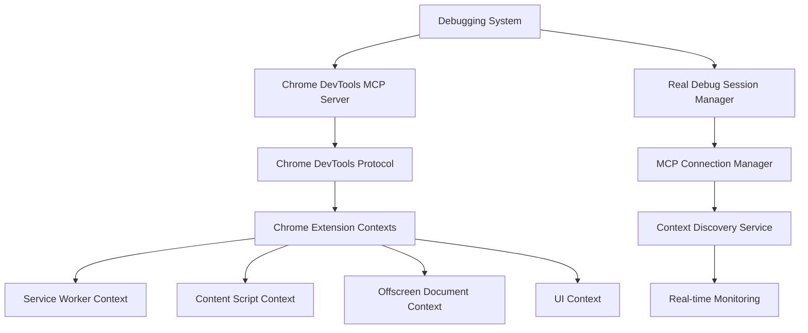

# Chrome Extension Debugging Completion Design

## Overview

This design document outlines the implementation strategy for completing the chrome-extension-debugging system by replacing mock implementations with real chrome-devtools MCP integration. The focus is on establishing actual debugging connections, implementing functional monitoring, and providing real debugging data.

## Architecture

### MCP Integration Architecture



### Implementation Strategy

1. **MCP Server Configuration**: Configure chrome-devtools MCP server in mcp-config.json
2. **Connection Management**: Implement robust MCP connection handling with error recovery
3. **Context Discovery**: Replace mock context discovery with real page enumeration
4. **Real Data Capture**: Replace all mock data with actual MCP function calls
5. **Error Handling**: Implement proper error handling for MCP connection failures

## Components and Interfaces

### MCP Connection Manager

**Purpose**: Manage connection to chrome-devtools MCP server and handle MCP function calls

**Key Methods**:

- `initializeMCPConnection()`: Establish connection to chrome-devtools MCP server
- `verifyMCPFunctions()`: Verify availability of required MCP functions
- `handleMCPError()`: Handle MCP connection errors and implement fallbacks
- `reconnectMCP()`: Reconnect to MCP server if connection is lost

**Implementation Strategy**:

```typescript
class MCPConnectionManager {
  private mcpConnected: boolean = false;
  private availableFunctions: Set<string> = new Set();

  async initializeMCPConnection(): Promise<boolean> {
    try {
      // Test MCP server availability
      await this.testMCPConnection();

      // Verify required functions are available
      const requiredFunctions = [
        'mcp_chrome_devtools_list_pages',
        'mcp_chrome_devtools_select_page',
        'mcp_chrome_devtools_navigate_page',
        'mcp_chrome_devtools_evaluate_script',
        'mcp_chrome_devtools_list_console_messages',
        'mcp_chrome_devtools_list_network_requests',
        'mcp_chrome_devtools_take_snapshot',
        'mcp_chrome_devtools_click',
      ];

      for (const func of requiredFunctions) {
        if (await this.verifyMCPFunction(func)) {
          this.availableFunctions.add(func);
        }
      }

      this.mcpConnected =
        this.availableFunctions.size === requiredFunctions.length;
      return this.mcpConnected;
    } catch (error) {
      console.error('MCP connection failed:', error);
      return false;
    }
  }
}
```

### Real Service Worker Debugger

**Purpose**: Replace mock service worker debugging with actual MCP-based functionality

**Key Changes**:

- Replace `listPages()` mock with real `mcp_chrome_devtools_list_pages()`
- Replace `selectPage()` mock with real `mcp_chrome_devtools_select_page()`
- Replace mock console messages with real `mcp_chrome_devtools_list_console_messages()`
- Replace mock network requests with real `mcp_chrome_devtools_list_network_requests()`
- Replace mock script injection with real `mcp_chrome_devtools_evaluate_script()`

**Implementation Strategy**:

```typescript
async connectToServiceWorker(): Promise<boolean> {
  try {
    // Get real list of available pages
    const pages = await mcp_chrome_devtools_list_pages();
    const serviceWorkerPage = this.findServiceWorkerPage(pages);

    if (!serviceWorkerPage) {
      throw new Error('Service worker page not found');
    }

    // Select the actual service worker page
    await mcp_chrome_devtools_select_page({ pageIdx: serviceWorkerPage.pageIdx });

    // Initialize real debug session
    this.currentSession = {
      sessionId: `sw-debug-${Date.now()}`,
      serviceWorkerPageIndex: serviceWorkerPage.pageIdx,
      isConnected: true,
      startTime: new Date(),
      capturedData: {
        consoleMessages: [],
        networkRequests: [],
        storageOperations: [],
        messageEvents: [],
      },
    };

    return true;
  } catch (error) {
    console.error('Failed to connect to service worker:', error);
    return false;
  }
}
```

### Real Content Script Debugger

**Purpose**: Replace mock content script debugging with actual page navigation and script evaluation

**Key Changes**:

- Replace mock navigation with real `mcp_chrome_devtools_navigate_page()`
- Replace mock script evaluation with real `mcp_chrome_devtools_evaluate_script()`
- Replace mock DOM tracking with real MutationObserver injection
- Replace mock highlighting validation with real element manipulation testing

**Implementation Strategy**:

```typescript
async connectToContentScript(testUrl: string): Promise<boolean> {
  try {
    // Navigate to real test page
    await mcp_chrome_devtools_navigate_page({ url: testUrl });

    // Get updated page list after navigation
    const pages = await mcp_chrome_devtools_list_pages();
    const contentScriptPage = this.findContentScriptPage(pages, testUrl);

    if (!contentScriptPage) {
      throw new Error('Content script page not found after navigation');
    }

    // Select the content script page
    await mcp_chrome_devtools_select_page({ pageIdx: contentScriptPage.pageIdx });

    // Verify content script injection with real evaluation
    const injectionStatus = await mcp_chrome_devtools_evaluate_script({
      function: `() => ({
        isInjected: typeof chrome !== 'undefined' && !!chrome.runtime,
        extensionId: chrome?.runtime?.id,
        availableFunctions: Object.keys(window).filter(key => key.startsWith('extension'))
      })`
    });

    this.currentSession = {
      sessionId: `cs-debug-${Date.now()}`,
      pageUrl: testUrl,
      pageIndex: contentScriptPage.pageIdx,
      isConnected: true,
      startTime: new Date(),
      injectionStatus,
      capturedData: {
        extractionResults: [],
        domOperations: [],
        highlightingEvents: [],
        injectionStatus: [injectionStatus],
        compatibilityChecks: [],
      },
    };

    return true;
  } catch (error) {
    console.error('Failed to connect to content script:', error);
    return false;
  }
}
```

### Real Offscreen Document Debugger

**Purpose**: Replace mock AI processing monitoring with actual offscreen document debugging

**Key Changes**:

- Replace mock offscreen connection with real page selection
- Replace mock AI metrics with real performance monitoring
- Replace mock service availability with real API testing
- Replace mock memory monitoring with real performance.memory data

### Real UI Component Debugger

**Purpose**: Replace mock UI debugging with actual extension UI testing

**Key Changes**:

- Replace mock UI navigation with real chrome-extension:// URL navigation
- Replace mock component validation with real DOM inspection
- Replace mock interaction simulation with real click events via `mcp_chrome_devtools_click()`
- Replace mock state monitoring with real component state evaluation

## Data Models

### MCP Configuration

```typescript
interface MCPConfiguration {
  serverName: string;
  command: string;
  args: string[];
  connectionTimeout: number;
  retryAttempts: number;
  requiredFunctions: string[];
}

interface MCPConnectionStatus {
  isConnected: boolean;
  serverVersion?: string;
  availableFunctions: string[];
  lastConnectionTime: Date;
  connectionErrors: string[];
}
```

### Real Debug Session State

```typescript
interface RealDebugSessionState {
  sessionId: string;
  mcpConnectionStatus: MCPConnectionStatus;
  startTime: Date;
  activeContexts: RealExtensionContext[];
  realCapturedData: {
    consoleMessages: RealConsoleMessage[];
    networkRequests: RealNetworkRequest[];
    performanceMetrics: RealPerformanceMetric[];
    errorLogs: RealErrorLog[];
  };
  executedTestScenarios: RealTestScenario[];
  generatedReports: RealDebugReport[];
}

interface RealExtensionContext {
  type: 'service-worker' | 'content-script' | 'offscreen' | 'ui';
  pageIndex: number;
  url: string;
  title: string;
  isActive: boolean;
  lastActivity: Date;
  mcpPageData: any; // Raw data from mcp_chrome_devtools_list_pages
}
```

## Error Handling

### MCP Connection Error Recovery

```typescript
interface MCPErrorRecovery {
  errorType:
    | 'connection_failed'
    | 'function_unavailable'
    | 'timeout'
    | 'invalid_response';
  recoveryStrategy:
    | 'retry'
    | 'fallback'
    | 'graceful_degradation'
    | 'user_notification';
  maxRetries: number;
  fallbackBehavior: string;
}
```

**Error Recovery Strategies**:

1. **Connection Failed**: Retry connection with exponential backoff
2. **Function Unavailable**: Use alternative MCP functions or graceful degradation
3. **Timeout**: Increase timeout and retry with longer intervals
4. **Invalid Response**: Validate response format and request retry

## Testing Strategy

### Real Test Scenarios

```typescript
interface RealTestScenario {
  name: string;
  description: string;
  requiredMCPFunctions: string[];
  setup: () => Promise<void>;
  execute: () => Promise<RealTestResult>;
  validate: (result: any) => Promise<boolean>;
  cleanup: () => Promise<void>;
}

// Example: Real Content Extraction Test
const realContentExtractionTest: RealTestScenario = {
  name: 'Real Content Extraction Validation',
  description: 'Test actual content extraction on live web pages',
  requiredMCPFunctions: [
    'mcp_chrome_devtools_navigate_page',
    'mcp_chrome_devtools_evaluate_script',
  ],
  setup: async () => {
    await mcp_chrome_devtools_navigate_page({
      url: 'https://example.com/test-article',
    });
  },
  execute: async () => {
    // Inject real content extraction script
    const extractionResult = await mcp_chrome_devtools_evaluate_script({
      function: `() => {
        // Real content extraction logic
        const extractor = window.extensionContentExtractor;
        if (!extractor) {
          throw new Error('Content extractor not found');
        }
        
        const startTime = performance.now();
        const content = extractor.extractContent();
        const endTime = performance.now();
        
        return {
          content,
          processingTime: endTime - startTime,
          timestamp: new Date().toISOString(),
          success: !!content && content.length > 0
        };
      }`,
    });

    return {
      passed: extractionResult.success,
      data: extractionResult,
      timestamp: new Date(),
    };
  },
  validate: async result => {
    return (
      result.passed && result.data.content && result.data.processingTime < 5000
    );
  },
  cleanup: async () => {
    // Clean up any injected scripts or modified DOM
    await mcp_chrome_devtools_evaluate_script({
      function: '() => window.extensionContentExtractor?.cleanup?.()',
    });
  },
};
```

### Integration Testing

1. **MCP Connection Testing**: Verify all required MCP functions are available
2. **Context Discovery Testing**: Test real extension context enumeration
3. **Real Data Capture Testing**: Validate actual debugging data collection
4. **Cross-Context Communication Testing**: Test real message passing between contexts
5. **Performance Impact Testing**: Measure debugging overhead on extension performance

## Implementation Phases

### Phase 1: MCP Server Configuration and Connection

- Configure chrome-devtools MCP server in mcp-config.json
- Implement MCP connection manager
- Verify MCP function availability
- Implement connection error handling

### Phase 2: Service Worker Real Debugging

- Replace mock page listing with real MCP calls
- Implement real console message capture
- Implement real network request monitoring
- Implement real storage operation debugging

### Phase 3: Content Script Real Debugging

- Replace mock navigation with real page navigation
- Implement real script injection verification
- Implement real DOM manipulation tracking
- Implement real highlighting system validation

### Phase 4: Offscreen and UI Real Debugging

- Implement real offscreen document connection
- Implement real AI processing monitoring
- Implement real UI component validation
- Implement real user interaction simulation

### Phase 5: Integration and Testing

- Implement real cross-component debugging
- Replace mock test scenarios with functional tests
- Implement real debugging report generation
- Validate complete debugging workflow

This design provides a comprehensive roadmap for transforming the current mock debugging system into a fully functional chrome-devtools MCP-based debugging solution.
