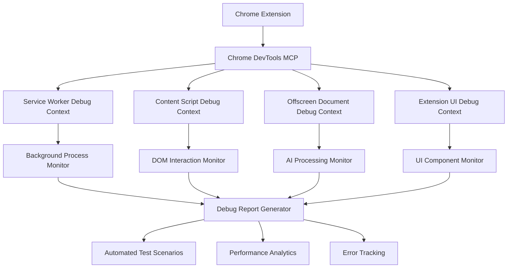

# Chrome Extension Debugging Design

## Overview

This design document outlines a comprehensive debugging strategy for the Language Learning Chrome Extension using the chrome-devtools MCP. The system will provide real-time inspection, automated testing, and systematic troubleshooting across all extension contexts. The debugging approach leverages Chrome DevTools Protocol through the MCP to create reproducible debugging workflows and comprehensive issue identification.

## Architecture

### Debugging Architecture Components



### Extension Context Debugging Strategy

1. **Service Worker Context**: Debug background processing, message routing, and storage operations
2. **Content Script Context**: Monitor DOM manipulation, content extraction, and page interaction
3. **Offscreen Document Context**: Track AI processing, memory usage, and API communications
4. **UI Context**: Inspect component rendering, user interactions, and state management

## Components and Interfaces

### Debug Session Manager

**Purpose**: Orchestrate debugging sessions across multiple extension contexts

**Key Methods**:

- `initializeDebugSession()`: Set up debugging for all extension contexts
- `switchContext(contextType)`: Switch between service worker, content script, offscreen, and UI contexts
- `captureExtensionState()`: Take comprehensive snapshot of extension state
- `generateDebugReport()`: Create structured debugging reports

### Service Worker Debugger

**Purpose**: Debug background script functionality and inter-component communication

**Debug Capabilities**:

- Monitor chrome.storage API operations
- Track message passing between components
- Capture background task execution
- Analyze extension lifecycle events
- Debug chrome.offscreen API usage

**Implementation Strategy**:

```typescript
// Connect to service worker context
await mcp_chrome_devtools_select_page(serviceWorkerPageIndex);

// Monitor console messages for background processing
const consoleMessages = await mcp_chrome_devtools_list_console_messages({
  types: ['error', 'warn', 'log'],
  includePreservedMessages: true,
});

// Track network requests for AI API calls
const networkRequests = await mcp_chrome_devtools_list_network_requests({
  resourceTypes: ['xhr', 'fetch'],
});
```

### Content Script Debugger

**Purpose**: Debug DOM interaction, content extraction, and page-level functionality

**Debug Capabilities**:

- Monitor content extraction pipeline
- Validate DOM manipulation operations
- Track highlighting system performance
- Debug content script injection and execution
- Analyze page compatibility issues

**Implementation Strategy**:

```typescript
// Navigate to test page with extension active
await mcp_chrome_devtools_navigate_page({
  url: 'https://example-article.com',
});

// Take snapshot to verify content script injection
const pageSnapshot = await mcp_chrome_devtools_take_snapshot();

// Monitor content extraction process
const extractionScript = `
  () => {
    return {
      extractedContent: window.extensionContentExtractor?.getContent(),
      highlightedElements: document.querySelectorAll('.extension-highlight').length,
      processingTime: window.extensionPerformance?.contentExtractionTime
    };
  }
`;
const extractionResults = await mcp_chrome_devtools_evaluate_script({
  function: extractionScript,
});
```

### Offscreen Document Debugger

**Purpose**: Debug AI processing, memory management, and heavy computational tasks

**Debug Capabilities**:

- Monitor AI API request/response cycles
- Track memory usage during processing
- Debug AI service fallback chains
- Analyze processing performance metrics
- Validate AI response quality

**Implementation Strategy**:

```typescript
// Connect to offscreen document context
await mcp_chrome_devtools_select_page(offscreenPageIndex);

// Monitor AI processing performance
const aiProcessingScript = `
  () => {
    return {
      activeAIServices: window.aiServiceCoordinator?.getActiveServices(),
      processingQueue: window.aiServiceCoordinator?.getQueueStatus(),
      memoryUsage: performance.memory,
      cacheHitRate: window.cacheManager?.getHitRate()
    };
  }
`;
const aiMetrics = await mcp_chrome_devtools_evaluate_script({
  function: aiProcessingScript,
});
```

### UI Component Debugger

**Purpose**: Debug learning interface, user interactions, and component state management

**Debug Capabilities**:

- Validate component rendering and layout
- Monitor user interaction event handling
- Debug state management and data flow
- Analyze TTS functionality and audio processing
- Track UI performance and responsiveness

**Implementation Strategy**:

```typescript
// Navigate to extension UI
await mcp_chrome_devtools_navigate_page({
  url: 'chrome-extension://[extension-id]/ui/learning-interface.html',
});

// Test UI component interactions
await mcp_chrome_devtools_click({
  element: 'vocabulary highlight button',
  ref: 'button[data-mode="vocabulary"]',
});

// Validate UI state changes
const uiStateScript = `
  () => {
    return {
      currentMode: window.learningInterface?.getCurrentMode(),
      highlightedWords: document.querySelectorAll('.vocabulary-highlight').length,
      activeCards: document.querySelectorAll('.learning-card.active').length,
      ttsStatus: window.ttsService?.getStatus()
    };
  }
`;
const uiState = await mcp_chrome_devtools_evaluate_script({
  function: uiStateScript,
});
```

## Data Models

### Debug Session State

```typescript
interface DebugSessionState {
  sessionId: string;
  startTime: Date;
  activeContexts: ExtensionContext[];
  capturedData: {
    consoleMessages: ConsoleMessage[];
    networkRequests: NetworkRequest[];
    performanceMetrics: PerformanceMetric[];
    errorLogs: ErrorLog[];
  };
  testScenarios: TestScenario[];
  debugReports: DebugReport[];
}

interface ExtensionContext {
  type: 'service-worker' | 'content-script' | 'offscreen' | 'ui';
  pageIndex: number;
  url?: string;
  isActive: boolean;
  lastActivity: Date;
}
```

### Debug Report Structure

```typescript
interface DebugReport {
  reportId: string;
  timestamp: Date;
  context: ExtensionContext;
  findings: DebugFinding[];
  recommendations: string[];
  performanceMetrics: {
    memoryUsage: number;
    processingTime: number;
    networkLatency: number;
    errorCount: number;
  };
  testResults: TestResult[];
}

interface DebugFinding {
  severity: 'critical' | 'warning' | 'info';
  category: 'performance' | 'functionality' | 'compatibility' | 'security';
  description: string;
  location: string;
  suggestedFix?: string;
}
```

## Error Handling

### Error Detection Strategy

1. **Console Message Analysis**: Parse console messages for errors, warnings, and debug information
2. **Network Request Monitoring**: Track failed API calls and network timeouts
3. **Performance Threshold Monitoring**: Detect performance degradation and memory leaks
4. **State Validation**: Verify extension state consistency across contexts

### Error Recovery Procedures

```typescript
interface ErrorRecoveryProcedure {
  errorType: string;
  detectionMethod: string;
  recoverySteps: string[];
  preventionStrategy: string;
  testValidation: string;
}
```

**Example Recovery Procedures**:

- **AI Service Failure**: Switch to fallback service, validate response quality
- **Content Extraction Failure**: Try alternative extraction methods, validate content structure
- **Storage Corruption**: Trigger data migration, validate schema integrity
- **UI Component Failure**: Reset component state, validate rendering

## Testing Strategy

### Automated Test Scenarios

1. **Extension Loading Test**: Verify all contexts load correctly
2. **Content Extraction Test**: Test extraction on various article types
3. **AI Processing Test**: Validate AI service responses and fallbacks
4. **UI Interaction Test**: Test all user interaction flows
5. **Storage Operation Test**: Verify data persistence and retrieval
6. **Performance Stress Test**: Test under high load conditions

### Test Scenario Implementation

```typescript
interface TestScenario {
  name: string;
  description: string;
  setup: () => Promise<void>;
  execute: () => Promise<TestResult>;
  cleanup: () => Promise<void>;
  expectedOutcome: string;
}

// Example: Content Extraction Test
const contentExtractionTest: TestScenario = {
  name: 'Content Extraction Validation',
  description: 'Test article content extraction across different website types',
  setup: async () => {
    await mcp_chrome_devtools_navigate_page({
      url: 'https://test-article-site.com/sample-article',
    });
  },
  execute: async () => {
    // Trigger content extraction
    await mcp_chrome_devtools_evaluate_script({
      function: '() => window.extensionContentExtractor.extractContent()',
    });

    // Validate extraction results
    const results = await mcp_chrome_devtools_evaluate_script({
      function: `() => ({
        contentLength: window.extractedContent?.length || 0,
        hasTitle: !!window.extractedContent?.title,
        hasBody: !!window.extractedContent?.body,
        processingTime: window.extractionMetrics?.processingTime
      })`,
    });

    return {
      passed: results.contentLength > 0 && results.hasTitle && results.hasBody,
      metrics: results,
      timestamp: new Date(),
    };
  },
  cleanup: async () => {
    await mcp_chrome_devtools_evaluate_script({
      function: '() => window.extensionContentExtractor.cleanup()',
    });
  },
  expectedOutcome:
    'Content extracted with title, body, and reasonable processing time',
};
```

### Performance Monitoring

**Key Performance Indicators**:

- Content extraction time (< 2 seconds)
- AI processing latency (< 5 seconds)
- Memory usage (< 100MB per context)
- UI responsiveness (< 100ms interaction response)
- Cache hit rate (> 80% for repeated content)

### Debugging Workflow Integration

1. **Pre-Development**: Set up debugging environment and test scenarios
2. **Development**: Continuous debugging during feature implementation
3. **Testing**: Automated debugging validation during test runs
4. **Production**: Monitoring and debugging in production environment
5. **Issue Resolution**: Systematic debugging for reported issues

This design provides a comprehensive framework for debugging the Chrome extension using chrome-devtools MCP, enabling systematic issue identification, performance optimization, and quality assurance across all extension contexts.
