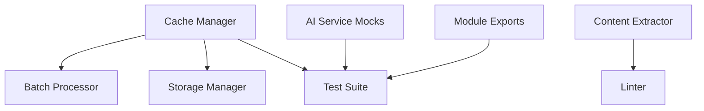

# Design Document

## Overview

This design addresses critical code quality issues through a systematic approach that prioritizes interface compatibility, test reliability, and code standards compliance. The solution enhances the existing cache manager with missing methods, fixes module resolution issues, and resolves linting problems while maintaining backward compatibility.

## Architecture

### Component Relationships



### Design Principles

1. **Backward Compatibility**: All existing functionality must remain intact
2. **Interface Consistency**: New methods follow existing patterns
3. **Type Safety**: Replace `any` types with proper TypeScript interfaces
4. **Test Reliability**: Ensure deterministic test behavior
5. **Code Quality**: Maintain high standards while fixing issues

## Components and Interfaces

### Enhanced Cache Manager

#### New Interface Definition

```typescript
export interface ProcessedContentCache {
  contentHash: string;
  type: 'summary' | 'rewrite' | 'vocabulary';
  difficulty?: number;
  maxLength?: number;
  content: string;
  timestamp: number;
  ttl: number;
}

export interface CacheManager {
  // Existing methods
  get(key: string): Promise<unknown>;
  set(key: string, value: unknown): Promise<void>;
  clear(): Promise<void>;

  // New methods for processed content
  getCachedProcessedContent(
    contentHash: string,
    type: 'summary' | 'rewrite' | 'vocabulary',
    parameter: number
  ): Promise<string | null>;

  cacheProcessedContent(
    contentHash: string,
    type: 'summary' | 'rewrite' | 'vocabulary',
    parameter: number,
    content: string
  ): Promise<void>;
}
```

#### Cache Key Strategy

- **Summary**: `processed:${contentHash}:summary:${maxLength}`
- **Rewrite**: `processed:${contentHash}:rewrite:${difficulty}`
- **Vocabulary**: `processed:${contentHash}:vocabulary:${contextLength}`

### Module Export Strategy

#### Explicit Named Exports

```typescript
// Primary exports
export { CacheManager };
export { getCacheManager };
export { createCacheManager };
export { generateContentHash };
export { isCachingAvailable };

// Type exports
export type { CacheConfig, ProcessedContentCache };
```

#### Import Pattern Standardization

```typescript
// Recommended import pattern for tests
import {
  createCacheManager,
  getCacheManager,
  isCachingAvailable,
  generateContentHash,
} from '../src/utils/cache-manager';
```

### Test Mock Improvements

#### AI Service Mock Data Structures

```typescript
// Language Detection Mock
mockGeminiClient.detectLanguage.mockResolvedValue('es');

// Translation Mock
mockGeminiClient.translateText.mockResolvedValue('Bonjour le monde');

// Vocabulary Analysis Mock
mockGeminiClient.analyzeVocabulary.mockResolvedValue([
  { word: 'hello', difficulty: 'beginner', definition: 'greeting' },
]);
```

#### Error Simulation Strategy

```typescript
// Proper error chain simulation
mockChromeAI.detectLanguage.mockRejectedValue(new Error('Chrome AI failed'));
mockGeminiClient.detectLanguage.mockRejectedValue(new Error('Gemini failed'));
```

## Data Models

### Cache Entry Model

```typescript
interface CacheEntry {
  key: string;
  value: unknown;
  timestamp: number;
  ttl: number;
}

interface ProcessedContentEntry extends CacheEntry {
  contentHash: string;
  type: 'summary' | 'rewrite' | 'vocabulary';
  parameter: number;
  value: string;
}
```

### Test Mock Models

```typescript
interface MockAIService {
  detectLanguage: jest.Mock;
  translateText: jest.Mock;
  analyzeVocabulary: jest.Mock;
  destroy: jest.Mock;
}

interface MockServiceCoordinator {
  destroy: jest.Mock;
  services: MockAIService[];
}
```

## Error Handling

### Cache Manager Error Handling

- **Storage Unavailable**: Graceful degradation to memory-only caching
- **Quota Exceeded**: Implement LRU eviction strategy
- **Invalid Keys**: Sanitize and validate cache keys
- **Serialization Errors**: Handle non-serializable content gracefully

### Test Error Handling

- **Mock Setup Failures**: Provide default mock implementations
- **Async Test Timeouts**: Implement proper timeout handling
- **Resource Cleanup**: Ensure all mocks are properly reset

### Batch Processor Error Handling

- **Cache Miss**: Proceed with API call and cache result
- **Cache Error**: Log error and continue without caching
- **Invalid Content Hash**: Generate new hash and retry

## Testing Strategy

### Unit Test Coverage

1. **Cache Manager Methods**: Test all new methods with various inputs
2. **Module Imports**: Verify all export patterns work correctly
3. **Error Scenarios**: Test graceful handling of storage errors
4. **Type Safety**: Ensure TypeScript compilation succeeds

### Integration Test Coverage

1. **Batch Processor Integration**: Test with real cache manager instance
2. **Storage Manager Integration**: Verify no circular dependencies
3. **Mock Service Integration**: Test complete fallback chains

### Test Reliability Improvements

1. **Deterministic Mocks**: Ensure consistent mock behavior
2. **Proper Cleanup**: Reset all mocks between tests
3. **Timeout Handling**: Set appropriate timeouts for async operations
4. **Error Simulation**: Test both success and failure scenarios

## Implementation Phases

### Phase 1: Core Interface Fixes (Critical)

- Extend cache manager with missing methods
- Fix TypeScript type issues
- Resolve formatting problems

### Phase 2: Module Resolution (High Priority)

- Fix export statements
- Verify import patterns in tests
- Resolve circular dependencies

### Phase 3: Test Mock Improvements (High Priority)

- Update AI service mocks
- Fix error simulation
- Improve resource cleanup

### Phase 4: Integration Validation (Medium Priority)

- Test batch processor integration
- Verify end-to-end functionality
- Performance validation

## Performance Considerations

### Cache Performance

- **Key Generation**: Optimize hash generation for large content
- **Storage Efficiency**: Use compression for large cached content
- **Memory Usage**: Implement size limits and eviction policies

### Test Performance

- **Mock Efficiency**: Minimize mock setup overhead
- **Parallel Execution**: Ensure tests can run concurrently
- **Resource Management**: Proper cleanup to prevent memory leaks

## Security Considerations

### Cache Security

- **Key Sanitization**: Prevent injection attacks through cache keys
- **Content Validation**: Validate cached content before use
- **Storage Isolation**: Ensure proper Chrome extension storage isolation

### Test Security

- **Mock Isolation**: Prevent test mocks from affecting production code
- **Data Sanitization**: Use safe test data in mocks
- **Resource Limits**: Prevent test resource exhaustion

## Monitoring and Validation

### Success Metrics

- **Test Pass Rate**: Target >95% test success rate
- **Lint Errors**: Reduce to <5 total warnings
- **Performance**: Maintain existing cache performance
- **Type Safety**: Zero TypeScript compilation errors

### Validation Criteria

- All cache manager methods work with batch processor
- Test suite runs without import/export errors
- Linting passes with minimal warnings
- AI service mocks return expected data structures
- No regression in existing functionality
