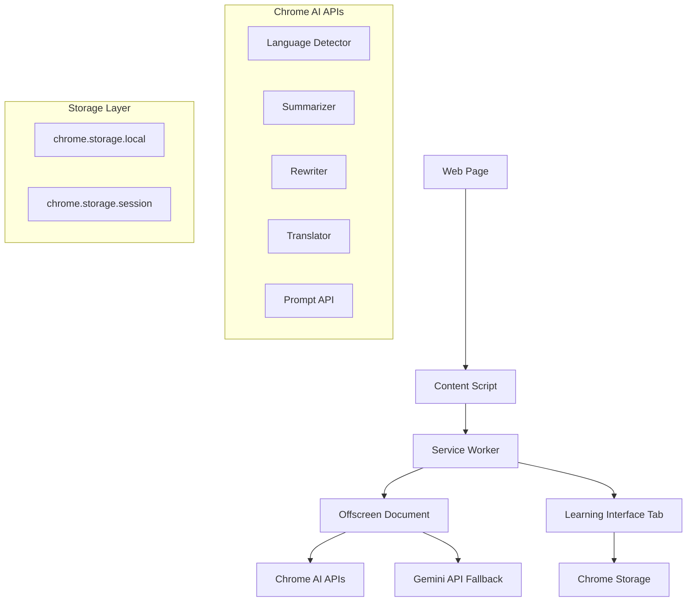

# Design Document

## Overview

The Language Learning Chrome Extension is a Manifest V3 extension that transforms web articles into interactive language learning experiences. The system uses Chrome's built-in AI APIs for local processing, with Gemini API as fallback. The architecture emphasizes privacy, performance, and user experience through a card-based interface that opens in a new tab.

## Architecture

### High-Level System Architecture



### Component Architecture

The extension follows a modular architecture with clear separation of concerns:

1. **Content Extraction Layer**: Handles web page content extraction
2. **AI Processing Layer**: Manages Chrome AI and fallback API interactions
3. **UI Layer**: Manages the learning interface and user interactions
4. **Storage Layer**: Handles data persistence and caching
5. **Service Layer**: Coordinates between components

## Components and Interfaces

### 1. Content Extraction Pipeline

**Purpose**: Extract clean article content from web pages

**Components**:

- `ReadabilityExtractor`: Primary content extraction using Readability.js
- `JinaReaderExtractor`: Fallback extraction using Jina Reader API
- `DOMExtractor`: Basic DOM parsing as final fallback
- `ContentSanitizer`: Clean and validate extracted content

**Interface**:

```typescript
interface ContentExtractor {
  extract(document: Document): Promise<ExtractedContent>;
  validate(content: string): boolean;
  sanitize(content: string): string;
}

interface ExtractedContent {
  title: string;
  content: string;
  url: string;
  language?: string;
  wordCount: number;
  paragraphCount: number;
}
```

### 2. AI Processing Engine

**Purpose**: Handle all AI-related processing with fallback mechanisms

**Components**:

- `ChromeAIManager`: Manages Chrome built-in AI APIs
- `GeminiAPIManager`: Handles Gemini API fallback
- `AIServiceCoordinator`: Orchestrates AI service selection and fallback
- `BatchProcessor`: Optimizes API calls through batching

**Interface**:

```typescript
interface AIProcessor {
  detectLanguage(text: string): Promise<string>;
  summarizeContent(text: string, options: SummaryOptions): Promise<string>;
  rewriteContent(text: string, difficulty: number): Promise<string>;
  translateText(text: string, from: string, to: string): Promise<string>;
  analyzeVocabulary(
    words: string[],
    context: string
  ): Promise<VocabularyAnalysis>;
}

interface AIServiceManager {
  isAvailable(): Promise<boolean>;
  processWithFallback<T>(task: AITask, data: any): Promise<T>;
  handleError(error: AIError): Promise<void>;
}
```

### 3. Learning Interface System

**Purpose**: Provide interactive learning interface in new tab

**Components**:

- `ArticleRenderer`: Displays article content in card format
- `VocabularyManager`: Handles vocabulary highlighting and cards
- `SentenceManager`: Manages sentence highlighting and translation
- `NavigationController`: Controls article part navigation
- `LearningModeController`: Manages different learning modes

**Interface**:

```typescript
interface LearningInterface {
  renderArticle(article: ProcessedArticle): void;
  createVocabularyCard(word: string, translation: string): VocabularyCard;
  createSentenceCard(sentence: string, translation: string): SentenceCard;
  switchMode(mode: LearningMode): void;
  navigateToArticlePart(partIndex: number): void;
}

interface HighlightManager {
  highlightVocabulary(selection: Selection): Promise<VocabularyCard>;
  highlightSentence(selection: Selection): Promise<SentenceCard>;
  mergeOverlappingHighlights(highlights: Highlight[]): Highlight[];
  removeHighlight(highlightId: string): void;
}
```

### 4. Storage Management System

**Purpose**: Handle data persistence with versioning and migration

**Components**:

- `StorageManager`: Main storage interface
- `DataMigrator`: Handles schema migrations
- `CacheManager`: Manages article and processing cache
- `ExportManager`: Handles data export/import

**Interface**:

```typescript
interface StorageManager {
  saveVocabulary(vocab: VocabularyItem): Promise<void>;
  saveSentence(sentence: SentenceItem): Promise<void>;
  saveArticle(article: ProcessedArticle): Promise<void>;
  getUserSettings(): Promise<UserSettings>;
  exportData(format: ExportFormat): Promise<string>;
  importData(data: string): Promise<void>;
}

interface DataMigrator {
  getCurrentVersion(): Promise<string>;
  migrateToVersion(targetVersion: string): Promise<void>;
  validateSchema(data: any): boolean;
}
```

### 5. Extension Lifecycle Manager

**Purpose**: Coordinate extension components and handle lifecycle events

**Components**:

- `ServiceWorker`: Background script coordination
- `ContentScriptManager`: Manages content script injection
- `OffscreenManager`: Handles offscreen document for AI processing
- `TabManager`: Manages learning interface tabs

**Interface**:

```typescript
interface ExtensionManager {
  initialize(): Promise<void>;
  processCurrentTab(): Promise<void>;
  openLearningInterface(articleData: ExtractedContent): Promise<void>;
  handleTabClosed(tabId: number): void;
  checkSystemRequirements(): Promise<SystemCapabilities>;
}
```

## Data Models

### Core Data Structures

```typescript
// User Settings
interface UserSettings {
  nativeLanguage: string;
  learningLanguage: string;
  difficultyLevel: number; // 1-10
  autoHighlight: boolean;
  darkMode: boolean;
  fontSize: number;
  apiKeys: {
    gemini?: string;
    jinaReader?: string;
  };
  keyboardShortcuts: KeyboardShortcuts;
}

// Article Data
interface ProcessedArticle {
  id: string;
  url: string;
  title: string;
  originalLanguage: string;
  processedAt: Date;
  parts: ArticlePart[];
  processingStatus: 'processing' | 'completed' | 'failed';
  cacheExpires: Date;
}

interface ArticlePart {
  id: string;
  content: string;
  originalContent: string;
  vocabulary: string[]; // vocabulary IDs
  sentences: string[]; // sentence IDs
  partIndex: number;
}

// Learning Items
interface VocabularyItem {
  id: string;
  word: string;
  phrase?: string;
  translation: string;
  context: string;
  exampleSentences: string[];
  articleId: string;
  partId: string;
  createdAt: Date;
  lastReviewed: Date;
  reviewCount: number;
  difficulty: number;
}

interface SentenceItem {
  id: string;
  content: string;
  translation: string;
  articleId: string;
  partId: string;
  createdAt: Date;
}

// Processing Queue
interface ProcessingTask {
  type: 'article_processing' | 'vocabulary_analysis' | 'translation';
  articleId: string;
  status: 'pending' | 'processing' | 'completed' | 'failed';
  createdAt: Date;
  data: any;
}
```

### Storage Schema

The storage system uses a versioned schema stored in `chrome.storage.local`:

```typescript
interface StorageSchema {
  schema_version: string;
  user_settings: UserSettings;
  articles: Record<string, ProcessedArticle>;
  vocabulary: Record<string, VocabularyItem>;
  sentences: Record<string, SentenceItem>;
  processing_queue: ProcessingTask[];
  statistics: {
    articlesProcessed: number;
    vocabularyLearned: number;
    sentencesHighlighted: number;
    lastActivity: Date;
  };
}
```

## Error Handling

### Error Classification and Recovery

```typescript
enum ErrorType {
  CONTENT_EXTRACTION_FAILED = 'content_extraction_failed',
  AI_SERVICE_UNAVAILABLE = 'ai_service_unavailable',
  INSUFFICIENT_HARDWARE = 'insufficient_hardware',
  NETWORK_ERROR = 'network_error',
  STORAGE_QUOTA_EXCEEDED = 'storage_quota_exceeded',
  INVALID_API_KEY = 'invalid_api_key',
  RATE_LIMITED = 'rate_limited',
}

interface ErrorHandler {
  handleError(error: ExtensionError): Promise<ErrorResolution>;
  retryWithBackoff(
    operation: () => Promise<any>,
    maxRetries: number
  ): Promise<any>;
  suggestFallback(errorType: ErrorType): FallbackSuggestion;
}
```

### Error Recovery Strategies

1. **Content Extraction Failures**:
   - Readability.js → Jina Reader API → Basic DOM parsing → Manual paste option

2. **AI Processing Failures**:
   - Chrome AI → Gemini API → Show original content with error message

3. **Storage Failures**:
   - Auto-export to Downloads → Clear old data → Notify user

4. **Network Issues**:
   - Use cached content → Queue requests → Offline mode indication

## Testing Strategy

### Unit Testing

**Components to Test**:

- Content extraction pipeline
- AI service managers
- Storage operations
- Data migration logic
- Error handling mechanisms

**Testing Framework**: Jest with Chrome Extension testing utilities

**Key Test Cases**:

```typescript
describe('ContentExtractor', () => {
  test('should extract article content using Readability.js');
  test('should fallback to Jina Reader when Readability fails');
  test('should sanitize extracted content');
  test('should detect minimum content length threshold');
});

describe('AIProcessor', () => {
  test('should detect article language correctly');
  test('should summarize long articles hierarchically');
  test('should translate vocabulary in context');
  test('should fallback to Gemini API when Chrome AI fails');
});

describe('StorageManager', () => {
  test('should save and retrieve vocabulary items');
  test('should handle storage quota limits');
  test('should migrate data between schema versions');
  test('should export data in correct format');
});
```

### Integration Testing

**Test Scenarios**:

1. End-to-end article processing workflow
2. AI service fallback mechanisms
3. Storage and retrieval operations
4. User interface interactions
5. Extension lifecycle events

### Performance Testing

**Metrics to Monitor**:

- Content extraction time
- AI processing latency
- Memory usage per tab
- Storage operation performance
- Extension startup time

**Performance Targets**:

- Extension load time: < 3 seconds
- Content extraction: < 2 seconds
- AI processing: < 10 seconds per article part
- Memory usage: < 100MB per tab
- Storage operations: < 500ms

### Browser Compatibility Testing

**Chrome Versions**: 140+ (required for built-in AI)
**Hardware Configurations**:

- Minimum: 4GB RAM, 22GB storage, 4GB VRAM
- Recommended: 8GB RAM, 50GB storage, 8GB VRAM

## Security Considerations

### Data Privacy

1. **Local Processing**: All AI processing happens locally via Chrome APIs
2. **No Telemetry**: No usage tracking or analytics
3. **Secure Storage**: API keys stored in Chrome's secure storage
4. **Content Sanitization**: All extracted content is sanitized

### API Security

1. **Key Management**: User-provided API keys stored securely
2. **Request Validation**: All API requests validated and sanitized
3. **Rate Limiting**: Implement client-side rate limiting
4. **Error Handling**: No sensitive data in error messages

### Extension Security

1. **Manifest V3**: Use latest security model
2. **Minimal Permissions**: Only request necessary permissions
3. **Content Security Policy**: Strict CSP for all extension pages
4. **Input Validation**: Validate all user inputs and external data

## Performance Optimization

### AI Processing Optimization

1. **Batch Processing**: Group vocabulary translation requests
2. **Progressive Loading**: Process article parts incrementally
3. **Caching**: Cache processed articles and translations
4. **Lazy Loading**: Load learning modes on demand

### Memory Management

1. **Garbage Collection**: Proper cleanup of AI sessions
2. **Storage Limits**: Monitor and manage storage usage
3. **Tab Management**: Clean up resources when tabs close
4. **Background Processing**: Use offscreen documents for heavy operations

### Network Optimization

1. **Request Batching**: Combine multiple API calls
2. **Compression**: Compress stored data
3. **Offline Support**: Use cached content when offline
4. **Retry Logic**: Exponential backoff for failed requests

This design provides a comprehensive foundation for implementing the Language Learning Chrome Extension with proper separation of concerns, error handling, and performance optimization.
