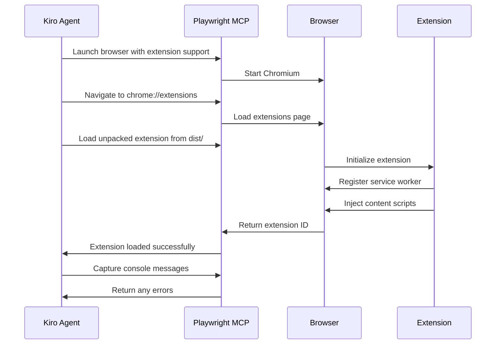
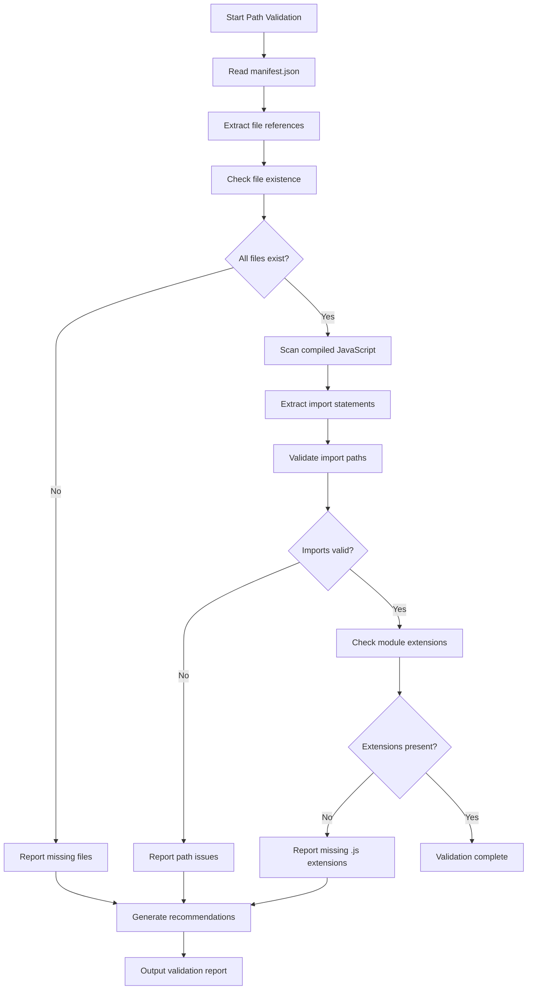
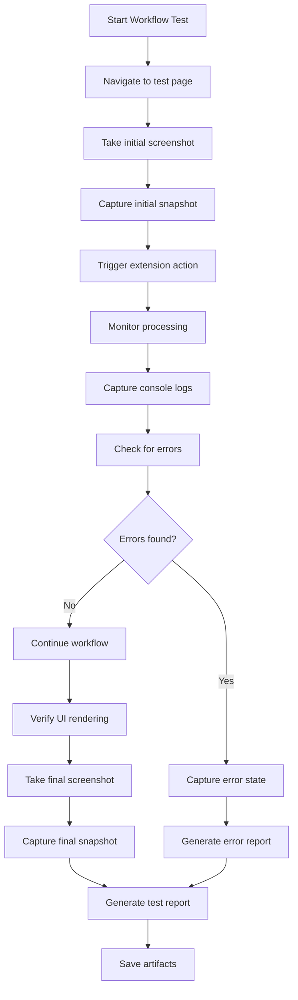

# Design Document

## Overview

This design document outlines the implementation of Playwright MCP-based debugging capabilities for the Language Learning Chrome Extension. The system will provide automated browser testing, visual debugging, and comprehensive extension validation using Playwright's browser automation features through the Model Context Protocol (MCP) server.

The debugging system will focus on identifying and resolving path-related issues in the extension, particularly conflicts between root directory structure and the `/dist` build output directory that may cause module loading failures.

## Architecture

### High-Level Architecture

```
Kiro Agent
    ↓
Playwright MCP Server
    ↓
Chromium Browser (with Extension Loaded)
    ↓
Extension Components
    ├── Service Worker (background/service-worker.js)
    ├── Content Scripts (content/content-script.js)
    ├── Offscreen Document (offscreen/ai-processor.js)
    └── UI Pages (ui/*.html + ui/*.js)
```

### Key Components

1. **Playwright MCP Configuration**: MCP server setup in `mcp-config.json` for browser automation
2. **Extension Loader**: Automated extension loading from `dist/` directory
3. **Path Validator**: Verification of file paths and module imports
4. **Workflow Tester**: End-to-end testing of user workflows
5. **Visual Debugger**: Screenshot and snapshot capture for debugging
6. **Report Generator**: Comprehensive debugging reports with findings

## Components and Interfaces

### 1. Playwright MCP Configuration

**Purpose**: Configure and verify Playwright MCP server connection

**Configuration Structure**:

```json
{
  "mcpServers": {
    "playwright": {
      "command": "npx",
      "args": ["-y", "@modelcontextprotocol/server-playwright"],
      "disabled": false,
      "autoApprove": []
    }
  }
}
```

**Key Functions**:

- `mcp_playwright_browser_navigate`: Navigate to URLs
- `mcp_playwright_browser_snapshot`: Capture accessibility tree
- `mcp_playwright_browser_take_screenshot`: Capture visual state
- `mcp_playwright_browser_click`: Simulate user interactions
- `mcp_playwright_browser_evaluate`: Execute JavaScript in page context
- `mcp_playwright_browser_console_messages`: Retrieve console logs
- `mcp_playwright_browser_network_requests`: Monitor network activity

### 2. Extension Loading Strategy

**Loading Process**:

1. Launch Chromium with extension support
2. Navigate to `chrome://extensions`
3. Enable developer mode
4. Load unpacked extension from `dist/` directory
5. Verify extension ID and active contexts
6. Capture any loading errors

**Path Validation**:

- Verify `manifest.json` exists in `dist/`
- Check all referenced files exist at correct paths
- Validate module import paths in compiled JavaScript
- Confirm icon paths resolve correctly

### 3. Path Issue Detection

**Common Path Issues**:

1. **Absolute vs Relative Imports**: TypeScript may compile imports incorrectly
2. **Module Resolution**: ES2022 modules require explicit `.js` extensions
3. **Manifest Path References**: Paths must be relative to `dist/` root
4. **Web Accessible Resources**: UI and offscreen paths must be accessible
5. **Source Map Paths**: May reference incorrect source locations

**Detection Strategy**:

```javascript
// Check for path issues in compiled files
const pathIssues = {
  missingExtensions: [], // imports without .js extension
  absolutePaths: [], // absolute paths instead of relative
  incorrectDepth: [], // wrong number of ../ in relative paths
  missingFiles: [], // referenced files that don't exist
};
```

### 4. Workflow Testing Scenarios

**Scenario 1: Extension Installation**

- Load extension from `dist/`
- Verify all components initialize
- Check for console errors
- Validate manifest parsing

**Scenario 2: Content Script Injection**

- Navigate to test page
- Verify content script loads
- Check for injection errors
- Test DOM access

**Scenario 3: Article Extraction**

- Navigate to article page
- Click extension action
- Monitor processing flow
- Verify UI opens correctly

**Scenario 4: Module Import Validation**

- Check service worker imports
- Verify content script dependencies
- Test offscreen document modules
- Validate UI component imports

### 5. Visual Debugging System

**Screenshot Strategy**:

- Capture at key workflow points
- Full-page screenshots for layout issues
- Element-specific screenshots for component debugging
- Before/after comparisons for state changes

**Snapshot Strategy**:

- Accessibility tree for structure validation
- Text-based debugging without visual inspection
- Element reference tracking (uid)
- State verification

**Organization**:

```
debug/
  playwright-reports/
    {timestamp}/
      screenshots/
        01-extension-loaded.png
        02-content-script-injected.png
        03-article-processing.png
        04-learning-interface.png
      snapshots/
        01-extension-page.txt
        02-article-page.txt
        03-learning-ui.txt
      console-logs.json
      network-requests.json
      report.md
```

## Data Models

### Extension Context State

```typescript
interface ExtensionState {
  extensionId: string;
  isLoaded: boolean;
  contexts: {
    serviceWorker: ContextStatus;
    contentScripts: ContextStatus[];
    offscreenDocument: ContextStatus;
    uiPages: ContextStatus[];
  };
  errors: ExtensionError[];
  warnings: string[];
}

interface ContextStatus {
  type: 'service_worker' | 'content_script' | 'offscreen' | 'ui';
  url: string;
  isActive: boolean;
  errors: string[];
}

interface ExtensionError {
  type: 'loading' | 'runtime' | 'import' | 'path';
  message: string;
  file?: string;
  line?: number;
  stack?: string;
}
```

### Path Validation Result

```typescript
interface PathValidationResult {
  isValid: boolean;
  issues: PathIssue[];
  recommendations: string[];
}

interface PathIssue {
  type:
    | 'missing_extension'
    | 'absolute_path'
    | 'incorrect_depth'
    | 'missing_file';
  file: string;
  line?: number;
  currentPath: string;
  suggestedPath?: string;
  severity: 'error' | 'warning';
}
```

### Test Scenario Result

```typescript
interface TestScenarioResult {
  scenario: string;
  status: 'passed' | 'failed' | 'skipped';
  duration: number;
  steps: TestStep[];
  screenshots: string[];
  snapshots: string[];
  errors: string[];
}

interface TestStep {
  description: string;
  status: 'passed' | 'failed';
  timestamp: number;
  details?: string;
}
```

## Error Handling

### Extension Loading Errors

**Detection**:

- Monitor console for "Failed to load extension" messages
- Check chrome://extensions page for error badges
- Capture manifest parsing errors
- Identify missing file errors

**Recovery**:

- Provide specific file path corrections
- Suggest manifest.json fixes
- Recommend build configuration changes
- Generate corrected file structure

### Module Import Errors

**Detection**:

- Console errors: "Failed to resolve module specifier"
- Network errors: 404 for .js files
- Service worker registration failures
- Content script injection failures

**Recovery**:

- Identify incorrect import paths
- Suggest correct relative paths
- Recommend TypeScript configuration changes
- Provide automated path correction script

### Runtime Errors

**Detection**:

- Console error messages
- Uncaught exceptions
- Promise rejections
- Network request failures

**Recovery**:

- Provide error context and stack traces
- Suggest code fixes
- Recommend error handling improvements
- Generate debugging reports

## Testing Strategy

### Unit Testing (Not Applicable)

This is a debugging and testing tool, not production code. No unit tests required.

### Integration Testing

**Test 1: Extension Loading**

- Verify extension loads without errors
- Confirm all contexts initialize
- Validate manifest parsing
- Check file path resolution

**Test 2: Path Validation**

- Scan compiled JavaScript for import issues
- Verify all manifest references resolve
- Check web accessible resources
- Validate icon paths

**Test 3: Content Script Injection**

- Test injection on multiple page types
- Verify script execution
- Check for console errors
- Validate DOM access

**Test 4: Article Processing Workflow**

- Navigate to article page
- Trigger extension action
- Monitor processing pipeline
- Verify UI rendering

**Test 5: Visual Debugging**

- Capture screenshots at key points
- Generate accessibility snapshots
- Verify screenshot quality
- Validate snapshot structure

### Manual Testing

**Developer Workflow**:

1. Run Playwright debugging script
2. Review generated reports
3. Examine screenshots and snapshots
4. Apply recommended fixes
5. Re-run validation

**Validation Checklist**:

- [ ] Extension loads without errors
- [ ] All file paths resolve correctly
- [ ] Module imports work in all contexts
- [ ] Content scripts inject successfully
- [ ] Article processing completes
- [ ] UI renders correctly
- [ ] No console errors
- [ ] Network requests succeed

## Implementation Phases

### Phase 1: MCP Configuration and Basic Testing

- Configure Playwright MCP server
- Implement extension loading
- Create basic navigation tests
- Capture initial screenshots

### Phase 2: Path Validation System

- Scan compiled JavaScript for import issues
- Validate manifest path references
- Check file existence
- Generate path correction recommendations

### Phase 3: Workflow Testing

- Implement content script injection tests
- Create article processing workflow tests
- Add user interaction simulation
- Validate UI rendering

### Phase 4: Visual Debugging and Reporting

- Implement screenshot capture system
- Create accessibility snapshot system
- Build debugging report generator
- Organize debugging artifacts

### Phase 5: Error Analysis and Recommendations

- Analyze common error patterns
- Generate actionable recommendations
- Create automated fix suggestions
- Document debugging best practices

## Key Design Decisions

### Decision 1: Use Playwright MCP Instead of Chrome DevTools MCP

**Rationale**: Playwright provides better support for extension testing, including:

- Native extension loading capabilities
- Better screenshot and snapshot features
- More reliable browser automation
- Easier workflow testing

**Trade-offs**: Requires separate MCP server configuration, but provides more comprehensive testing capabilities.

### Decision 2: Focus on Path Issues First

**Rationale**: Path-related issues are the most common cause of extension loading failures and are often difficult to debug manually.

**Approach**: Automated scanning and validation of all path references in compiled code and manifest.

### Decision 3: Generate Visual Debugging Artifacts

**Rationale**: Screenshots and snapshots provide immediate visual feedback and make debugging faster.

**Implementation**: Capture at every key workflow point and organize by scenario.

### Decision 4: Use dist/ Directory as Extension Root

**Rationale**: The `dist/` directory contains the compiled extension ready for loading. All paths in manifest.json are relative to this directory.

**Validation**: Ensure all file references in manifest and compiled code resolve correctly from `dist/` root.

## Diagrams

### Extension Loading Flow



### Path Validation Flow



### Workflow Testing Flow



## Security Considerations

- Extension runs in isolated context with limited permissions
- No sensitive data stored or transmitted
- Debugging artifacts stored locally only
- MCP server runs locally with no external connections

## Performance Considerations

- Browser automation adds overhead to testing
- Screenshot capture can be slow for large pages
- Limit concurrent browser instances to avoid resource exhaustion
- Clean up debugging artifacts periodically

## Future Enhancements

- Automated path correction script
- Performance profiling integration
- Cross-browser testing support
- CI/CD integration for automated testing
- Visual regression testing
- Accessibility compliance checking
