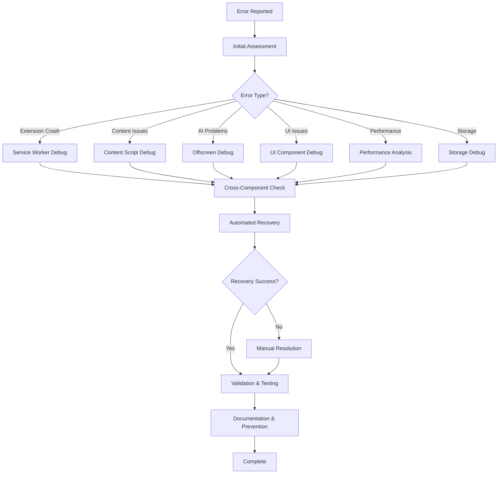

# Chrome Extension Debugging Documentation Index

## 📚 Complete Documentation Suite

This directory contains comprehensive debugging documentation for Chrome extension development using the chrome-devtools MCP and our custom debugging tools.

---

## 🎯 Start Here: Essential Guides

### 1. **LLM Error Fixing Guide** 📖

**File**: `LLM_ERROR_FIXING_GUIDE.md`
**Purpose**: Complete step-by-step guide for LLMs to systematically diagnose and fix Chrome extension errors
**When to use**: Primary reference for any debugging task
**Key features**:

- 8-step systematic debugging process
- Context-specific debugging procedures
- Automated recovery attempts
- Comprehensive validation steps

### 2. **Quick Debug Reference** ⚡

**File**: `QUICK_DEBUG_REFERENCE.md`
**Purpose**: Emergency quick fixes and common debugging scenarios
**When to use**: When you need immediate solutions to common problems
**Key features**:

- Emergency quick fixes
- Common error patterns
- Quick diagnostic commands
- Validation checklists

### 3. **MCP Commands Cheat Sheet** 🛠️

**File**: `MCP_DEBUGGING_COMMANDS_CHEATSHEET.md`
**Purpose**: Complete reference of all chrome-devtools MCP commands
**When to use**: When you need specific command syntax or examples
**Key features**:

- All MCP commands with examples
- Context-specific command sets
- Advanced debugging techniques
- Command templates

---

## 📋 Workflow and Best Practices

### 4. **Debugging Workflow** 🔄

**File**: `DEBUGGING_WORKFLOW.md`
**Purpose**: Systematic debugging workflow and process integration
**When to use**: Understanding the overall debugging process
**Key features**:

- Step-by-step workflow
- Context-specific procedures
- CI/CD integration
- Best practices

### 5. **Debugging Best Practices** ✅

**File**: `DEBUGGING_BEST_PRACTICES.md`
**Purpose**: Best practices for effective Chrome extension debugging
**When to use**: Learning proper debugging techniques and avoiding common mistakes
**Key features**:

- General debugging principles
- MCP-specific best practices
- Context-specific guidelines
- Performance debugging

---

## 🔧 Component-Specific Documentation

### 6. **Service Worker Debugging** ⚙️

**File**: `SERVICE_WORKER_DEBUGGING_SUMMARY.md`
**Purpose**: Complete guide to service worker debugging capabilities
**Key features**:

- Background processing debugging
- Message passing analysis
- Storage operation monitoring
- Lifecycle event tracking

### 7. **UI Component Debugging** 🎨

**File**: `UI_COMPONENT_DEBUGGING_SUMMARY.md`
**Purpose**: User interface and component debugging tools
**Key features**:

- Component rendering validation
- User interaction testing
- State management debugging
- Accessibility testing

### 8. **Storage & Caching Debugging** 💾

**File**: `STORAGE_CACHING_DEBUGGING_SUMMARY.md`
**Purpose**: Storage operations and cache performance debugging
**Key features**:

- Storage operation monitoring
- Cache performance analysis
- Data integrity validation
- Recovery scenario testing

### 9. **Cross-Component Integration** 🔗

**File**: `CROSS_COMPONENT_INTEGRATION_DEBUGGING_SUMMARY.md`
**Purpose**: Integration debugging across extension contexts
**Key features**:

- Message flow analysis
- Data flow validation
- Performance bottleneck detection
- Integration testing

---

## 🏗️ Implementation Details

### Available Debugging Tools

#### Core Debuggers (`debug/contexts/`)

- **ServiceWorkerDebugger** - Background processing and lifecycle
- **ContentScriptDebugger** - DOM interaction and content extraction
- **OffscreenDebugger** - AI processing and memory management
- **UIComponentDebugger** - User interface and interactions
- **StorageCachingDebugger** - Storage and cache operations
- **IntegrationDebugger** - Cross-component communication

#### Utility Tools (`debug/utils/`)

- **PerformanceOptimizationSystem** - Performance analysis and optimization
- **MemoryMonitor** - Memory usage tracking and leak detection
- **CacheSystemDebugger** - Cache performance monitoring
- **DataPersistenceValidator** - Data integrity and recovery testing
- **DebugSessionManager** - Session management and coordination

#### Monitoring Systems (`debug/monitoring/`)

- **ContinuousDebugMonitor** - Real-time monitoring
- **DebugAlertSystem** - Automated alerting
- **DebugWorkflowIntegration** - CI/CD integration

#### Reporting Tools (`debug/reports/`)

- **DebugReportGenerator** - Comprehensive report generation
- **RecommendationSystem** - Actionable recommendations
- **DebugDataAggregator** - Data collection and analysis

---

## 🚀 Quick Start Guide

### For First-Time Users

1. **Read**: `LLM_ERROR_FIXING_GUIDE.md` (complete methodology)
2. **Reference**: `QUICK_DEBUG_REFERENCE.md` (common scenarios)
3. **Commands**: `MCP_DEBUGGING_COMMANDS_CHEATSHEET.md` (syntax reference)

### For Specific Issues

- **Extension crashes**: Start with Service Worker debugging
- **Content not loading**: Use Content Script debugging
- **AI not working**: Check Offscreen debugging
- **UI problems**: Use UI Component debugging
- **Performance issues**: Run Performance optimization
- **Storage problems**: Use Storage & Caching debugging

### For Integration Issues

- **Cross-component problems**: Use Integration debugging
- **Message passing failures**: Check message flow analysis
- **Data synchronization**: Validate data flow integrity

---

## 📊 Debugging Process Overview

---

## 🎯 Usage Scenarios

### Development Debugging

- Use during active development for immediate feedback
- Integrate with development workflow
- Continuous monitoring during testing

### Production Issue Resolution

- Systematic error diagnosis and resolution
- Performance optimization and monitoring
- User-reported issue investigation

### Quality Assurance

- Comprehensive testing validation
- Performance regression detection
- Integration testing verification

### Maintenance and Optimization

- Regular health checks and monitoring
- Performance optimization identification
- Preventive maintenance procedures

---

## 🔍 Finding the Right Tool

### By Error Type

| Error Type         | Primary Tool            | Secondary Tools       |
| ------------------ | ----------------------- | --------------------- |
| Extension Crash    | Service Worker Debugger | Integration Debugger  |
| Content Extraction | Content Script Debugger | Performance Monitor   |
| AI Processing      | Offscreen Debugger      | Memory Monitor        |
| UI Loading         | UI Component Debugger   | Performance Monitor   |
| Storage Issues     | Storage Debugger        | Data Validator        |
| Performance        | Performance Optimizer   | Memory Monitor        |
| Integration        | Integration Debugger    | All Context Debuggers |

### By Context

| Context         | Primary Debugger      | Key Features                              |
| --------------- | --------------------- | ----------------------------------------- |
| Service Worker  | ServiceWorkerDebugger | Background tasks, storage, messages       |
| Content Script  | ContentScriptDebugger | DOM interaction, extraction, highlighting |
| Offscreen       | OffscreenDebugger     | AI processing, memory, fallbacks          |
| UI Components   | UIComponentDebugger   | Rendering, interactions, state            |
| Cross-Component | IntegrationDebugger   | Message flow, data flow, bottlenecks      |

---

## 📈 Debugging Metrics and Success Criteria

### Key Performance Indicators

- **Resolution Time**: Average time to resolve issues
- **Success Rate**: Percentage of issues resolved on first attempt
- **Prevention Rate**: Reduction in recurring issues
- **Tool Usage**: Adoption and effectiveness of debugging tools

### Success Criteria

- ✅ Issue identified within 5 minutes
- ✅ Root cause determined within 15 minutes
- ✅ Resolution implemented within 30 minutes
- ✅ Validation completed within 10 minutes
- ✅ Documentation updated within 5 minutes

---

## 🆘 Support and Resources

### When You Need Help

1. **Check Quick Reference**: Common solutions for typical problems
2. **Review Best Practices**: Ensure you're following proper procedures
3. **Use Command Cheat Sheet**: Verify command syntax and usage
4. **Consult Component Docs**: Deep dive into specific debugging areas

### Escalation Path

1. **Automated Recovery**: Try built-in recovery procedures
2. **Manual Debugging**: Follow systematic debugging guide
3. **Advanced Tools**: Use specialized debugging utilities
4. **Emergency Procedures**: Nuclear options for critical issues

### Knowledge Base

- All debugging sessions are documented
- Common issues and solutions are catalogued
- Best practices are continuously updated
- Tool improvements are tracked and implemented

---

## 🔄 Continuous Improvement

### Documentation Updates

- Regular review and updates based on new findings
- Integration of user feedback and suggestions
- Addition of new debugging scenarios and solutions
- Performance optimization of debugging procedures

### Tool Evolution

- Enhancement of existing debugging capabilities
- Development of new debugging tools as needed
- Integration with emerging technologies and APIs
- Optimization based on usage patterns and feedback

This documentation suite provides comprehensive coverage of Chrome extension debugging using the chrome-devtools MCP and our custom debugging tools. Start with the LLM Error Fixing Guide for systematic debugging, use the Quick Reference for common issues, and consult the specific component documentation for detailed debugging procedures.
