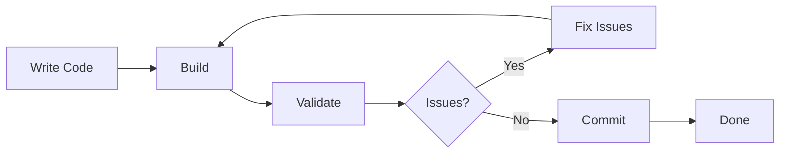

# Playwright Debugging Best Practices

## Overview

This document outlines best practices for using Playwright MCP to debug the Language Learning Chrome Extension. Following these practices will help you debug more efficiently and maintain high code quality.

## General Principles

### 1. Build Before Testing

**Always build the extension before running any tests.**

```bash
# Correct workflow
pnpm build
npx tsx debug/run-extension-validation.ts

# Incorrect - testing without building
npx tsx debug/run-extension-validation.ts  # May test old code!
```

**Why:** Tests run against the compiled code in `dist/`, not your source files. Without building, you're testing outdated code.

### 2. Start with Validation

**Begin every debugging session with extension validation.**

```bash
npx tsx debug/run-extension-validation.ts
```

**Why:** Validation catches the most common issues (loading errors, path problems, manifest issues) quickly and provides a comprehensive overview.

### 3. Use Specific Tests

**Don't always run comprehensive tests during development.**

```bash
# During development - use specific tests
npx tsx debug/test-content-script-injection.ts

# Before release - use comprehensive test
npx tsx debug/run-comprehensive-report-generator.ts
```

**Why:** Specific tests run faster and provide focused feedback. Save comprehensive tests for final validation.

### 4. Review All Artifacts

**Always check screenshots, console logs, and snapshots.**

```bash
# After running tests, review:
ls -la debug/playwright-reports/latest/screenshots/
cat debug/playwright-reports/latest/console-logs.json
cat debug/playwright-reports/latest/report.md
```

**Why:** Visual artifacts reveal issues that text logs might miss. Screenshots show UI problems immediately.

## Development Workflow

### Recommended Development Cycle



**Step-by-step:**

1. **Write code** in `src/`
2. **Build**: `pnpm build`
3. **Validate**: `npx tsx debug/run-extension-validation.ts`
4. **Review report**: Check for errors
5. **Fix issues**: Address problems found
6. **Repeat** until validation passes
7. **Commit**: Push clean code

### Pre-Commit Checklist

Before committing code:

- [ ] `pnpm build` completes without errors
- [ ] `npx tsx debug/run-extension-validation.ts` passes
- [ ] No console errors in validation report
- [ ] All path validations pass
- [ ] Extension loads successfully
- [ ] Core functionality tested

### Pre-Release Checklist

Before releasing:

- [ ] All pre-commit checks pass
- [ ] `npx tsx debug/run-comprehensive-report-generator.ts` passes
- [ ] All test scenarios pass
- [ ] Performance metrics acceptable
- [ ] No memory leaks detected
- [ ] Error handling tested
- [ ] Documentation updated

## Testing Strategy

### Test Selection Matrix

| Scenario                 | Test to Run          | Frequency                    |
| ------------------------ | -------------------- | ---------------------------- |
| After code changes       | Extension Validation | Every build                  |
| Content script changes   | Content Script Test  | After content changes        |
| Processing logic changes | Workflow Test        | After processing changes     |
| UI changes               | UI Test              | After UI changes             |
| Performance concerns     | Performance Test     | Weekly                       |
| Error handling changes   | Error Test           | After error handling changes |
| Before release           | Comprehensive Test   | Before every release         |

### Test Execution Patterns

**Pattern 1: Quick Feedback Loop**

```bash
# For rapid iteration
pnpm build && npx tsx debug/run-extension-validation.ts
```

**Pattern 2: Feature Testing**

```bash
# When working on specific feature
pnpm build
npx tsx debug/test-content-script-injection.ts  # If working on content scripts
npx tsx debug/test-article-processing-workflow.ts  # If working on processing
npx tsx debug/test-user-interaction.ts  # If working on UI
```

**Pattern 3: Comprehensive Validation**

```bash
# Before commits or releases
pnpm build
npx tsx debug/run-comprehensive-report-generator.ts
```

## Code Quality Practices

### 1. Fix Path Issues Immediately

**Don't let path issues accumulate.**

```typescript
// Bad - missing .js extension
import { StorageManager } from './utils/storage-manager';

// Good - explicit .js extension
import { StorageManager } from '../utils/storage-manager.js';
```

**Why:** Path issues prevent extension loading and are easy to fix early but painful to debug later.

### 2. Handle Errors Gracefully

**Always implement proper error handling.**

```typescript
// Bad - no error handling
async function processArticle(content: string) {
  const result = await aiService.process(content);
  return result;
}

// Good - graceful error handling
async function processArticle(content: string) {
  try {
    const result = await aiService.process(content);
    return result;
  } catch (error) {
    console.error('Article processing failed:', error);
    // Implement fallback or user-friendly error
    return { error: 'Processing failed. Please try again.' };
  }
}
```

**Why:** Proper error handling prevents crashes and provides better user experience.

### 3. Test Error Scenarios

**Don't just test happy paths.**

```bash
# Test error handling
npx tsx debug/test-error-handling-edge-cases.ts
```

**Why:** Real users encounter errors. Your extension should handle them gracefully.

### 4. Monitor Performance

**Establish and track performance baselines.**

```bash
# Run performance test
npx tsx debug/run-performance-monitoring.ts

# Save baseline
npx tsx debug/run-performance-monitoring.ts > baseline.json

# Compare later
npx tsx debug/run-performance-monitoring.ts | diff baseline.json -
```

**Why:** Performance regressions are easier to fix when caught early.

## Debugging Efficiency

### 1. Read Reports Thoroughly

**Don't skip sections of the debugging report.**

```bash
# Read the full report
cat debug/playwright-reports/latest/report.md

# Don't just grep for errors - understand context
```

**Why:** Context around errors often reveals root causes.

### 2. Use Visual Debugging

**Screenshots reveal issues faster than logs.**

```bash
# Always check screenshots
ls -la debug/playwright-reports/latest/screenshots/

# Compare before/after states
diff debug/playwright-reports/run1/screenshots/ debug/playwright-reports/run2/screenshots/
```

**Why:** Visual issues are immediately obvious in screenshots.

### 3. Reproduce Issues Consistently

**Ensure issues are reproducible before fixing.**

```bash
# Run test multiple times
for i in {1..3}; do
  pnpm build
  npx tsx debug/run-extension-validation.ts
done
```

**Why:** Intermittent issues need different solutions than consistent ones.

### 4. Fix One Issue at a Time

**Don't try to fix multiple issues simultaneously.**

```bash
# Fix one issue
# Build and test
pnpm build && npx tsx debug/run-extension-validation.ts

# Verify fix worked
# Then move to next issue
```

**Why:** Multiple simultaneous changes make it hard to identify what fixed what.

## Artifact Management

### 1. Keep Reports Organized

**Maintain a clean reports directory.**

```bash
# Archive old reports periodically
mkdir -p debug/playwright-reports/archive/$(date +%Y-%m)
mv debug/playwright-reports/2024-* debug/playwright-reports/archive/2024-10/

# Keep only recent reports
find debug/playwright-reports/ -type d -mtime +30 -exec rm -rf {} \;
```

**Why:** Too many old reports make it hard to find current ones.

### 2. Document Solutions

**Keep a log of issues and solutions.**

```markdown
# debugging-log.md

## 2024-10-30: Module Import Error

**Issue:** Service worker failed to load due to missing .js extension
**Solution:** Added .js to all imports in service-worker.ts
**Test:** npx tsx debug/run-extension-validation.ts
**Result:** ✓ Extension loads successfully
```

**Why:** Future debugging benefits from past solutions.

### 3. Version Control for Reports

**Keep important reports in version control.**

```bash
# Save important reports
cp debug/playwright-reports/latest/report.md docs/debugging/release-v1.0-validation.md

# Commit to git
git add docs/debugging/release-v1.0-validation.md
git commit -m "Add v1.0 validation report"
```

**Why:** Historical reports help track progress and identify regressions.

## Common Pitfalls to Avoid

### 1. Testing Without Building

```bash
# ❌ Wrong
npx tsx debug/run-extension-validation.ts

# ✅ Correct
pnpm build && npx tsx debug/run-extension-validation.ts
```

### 2. Ignoring Console Warnings

```bash
# ❌ Wrong - only checking errors
cat debug/playwright-reports/latest/console-logs.json | grep error

# ✅ Correct - checking warnings too
cat debug/playwright-reports/latest/console-logs.json | grep -E "error|warn"
```

### 3. Not Checking Screenshots

```bash
# ❌ Wrong - only reading text logs
cat debug/playwright-reports/latest/report.md

# ✅ Correct - checking visual artifacts
ls -la debug/playwright-reports/latest/screenshots/
open debug/playwright-reports/latest/screenshots/*.png
```

### 4. Fixing Symptoms Instead of Root Causes

```bash
# ❌ Wrong - quick fix without understanding
# Just commenting out error-throwing code

# ✅ Correct - understanding and fixing root cause
# Read full error context
# Understand why error occurs
# Fix underlying issue
# Verify fix with tests
```

### 5. Not Testing Edge Cases

```bash
# ❌ Wrong - only testing happy path
npx tsx debug/test-article-processing-workflow.ts

# ✅ Correct - testing error scenarios too
npx tsx debug/test-article-processing-workflow.ts
npx tsx debug/test-error-handling-edge-cases.ts
```

## Performance Best Practices

### 1. Measure Before Optimizing

```bash
# Establish baseline
npx tsx debug/run-performance-monitoring.ts > baseline.json

# Make changes
# Measure again
npx tsx debug/run-performance-monitoring.ts > after-optimization.json

# Compare
diff baseline.json after-optimization.json
```

### 2. Focus on Bottlenecks

```bash
# Identify bottlenecks first
npx tsx debug/run-performance-monitoring.ts

# Look for longest duration operations
cat debug/playwright-reports/latest/report.md | grep -A 5 "Performance"

# Optimize the slowest parts first
```

### 3. Test Performance Regularly

```bash
# Weekly performance check
npx tsx debug/run-performance-monitoring.ts

# Track trends over time
# Alert on regressions
```

## Collaboration Best Practices

### 1. Share Debugging Reports

```bash
# Generate comprehensive report
npx tsx debug/run-comprehensive-report-generator.ts

# Share with team
cp -r debug/playwright-reports/latest/ shared/debugging-reports/issue-123/

# Include in bug reports
```

### 2. Document Debugging Sessions

```markdown
# Issue #123: Content Script Not Injecting

## Investigation

- Ran: npx tsx debug/test-content-script-injection.ts
- Found: CSP violation on target page
- Screenshots: debug/playwright-reports/2024-10-30-14-30/screenshots/

## Solution

- Updated content script injection method
- Added CSP-compatible approach

## Verification

- Ran: npx tsx debug/test-content-script-injection.ts
- Result: ✓ All tests pass
```

### 3. Create Reproducible Test Cases

```typescript
// debug/test-issue-123.ts
// Reproducible test case for issue #123

async function testIssue123() {
  // Specific steps to reproduce
  // Expected behavior
  // Actual behavior
  // Screenshots and logs
}
```

## Continuous Improvement

### 1. Review Debugging Patterns

**Regularly review what issues occur most frequently.**

```bash
# Analyze past reports
grep -r "Error:" debug/playwright-reports/*/report.md | sort | uniq -c | sort -rn

# Identify patterns
# Improve code to prevent common issues
```

### 2. Update Documentation

**Keep debugging documentation current.**

```bash
# After solving new issue
# Add to QUICK_DEBUG_SCENARIOS.md
# Update TROUBLESHOOTING_FLOWCHART.md
# Share with team
```

### 3. Automate Common Tasks

**Create scripts for repetitive debugging tasks.**

```bash
# debug/quick-validate.sh
#!/bin/bash
pnpm build
npx tsx debug/run-extension-validation.ts
cat debug/playwright-reports/latest/report.md | grep -E "✓|❌"
```

## Summary

### Key Takeaways

1. **Always build before testing**
2. **Start with validation**
3. **Use specific tests during development**
4. **Review all artifacts (screenshots, logs, reports)**
5. **Fix path issues immediately**
6. **Test error scenarios**
7. **Monitor performance regularly**
8. **Document solutions**
9. **Keep reports organized**
10. **Share knowledge with team**

### Quick Reference Commands

```bash
# Essential workflow
pnpm build
npx tsx debug/run-extension-validation.ts

# Specific testing
npx tsx debug/test-content-script-injection.ts
npx tsx debug/test-article-processing-workflow.ts
npx tsx debug/test-user-interaction.ts

# Performance
npx tsx debug/run-performance-monitoring.ts

# Comprehensive
npx tsx debug/run-comprehensive-report-generator.ts
```

### When in Doubt

1. Build the extension
2. Run validation
3. Read the full report
4. Check screenshots
5. Review console logs
6. Fix one issue at a time
7. Verify fixes work
8. Document the solution

## Additional Resources

- [Playwright Debugging Guide](./PLAYWRIGHT_DEBUGGING_GUIDE.md) - Complete debugging guide
- [Quick Debug Scenarios](./QUICK_DEBUG_SCENARIOS.md) - Common issues and fixes
- [Troubleshooting Flowchart](./TROUBLESHOOTING_FLOWCHART.md) - Visual debugging guides
- [Comprehensive Report Generator README](./reports/COMPREHENSIVE_REPORT_GENERATOR_README.md) - Report generation

---

**Remember:** Good debugging practices lead to better code quality, faster development, and fewer production issues. Invest time in proper debugging workflows and your future self will thank you! 🚀
