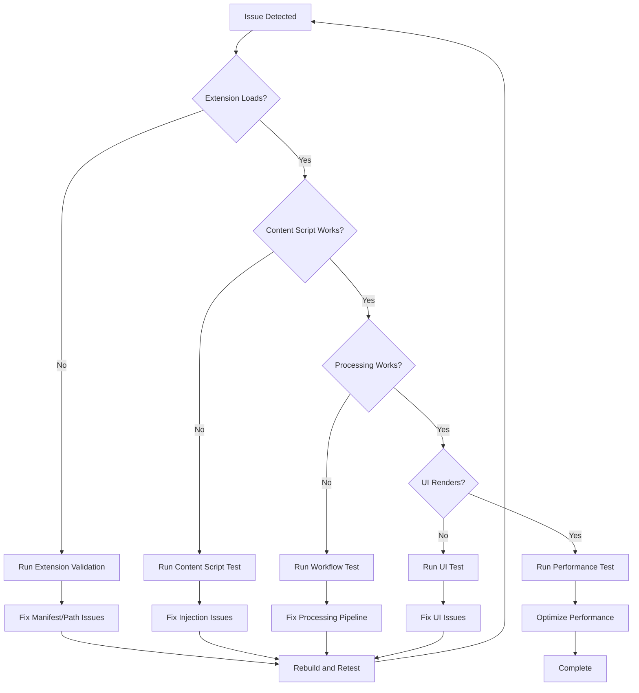

# Playwright MCP Debugging Guide

## Overview

This guide provides comprehensive instructions for using Playwright MCP-based debugging to test and validate the Language Learning Chrome Extension. The debugging system enables automated browser testing, visual debugging, and comprehensive extension validation.

## Table of Contents

1. [Quick Start](#quick-start)
2. [Setup and Configuration](#setup-and-configuration)
3. [Running Debugging Sessions](#running-debugging-sessions)
4. [Understanding Reports](#understanding-reports)
5. [Common Issues and Solutions](#common-issues-and-solutions)
6. [Troubleshooting Guide](#troubleshooting-guide)
7. [Example Debugging Sessions](#example-debugging-sessions)
8. [Best Practices](#best-practices)

## Quick Start

### Prerequisites

- Node.js 18+ installed
- pnpm package manager
- Extension built in `dist/` directory
- Playwright MCP server configured

### Run Your First Debug Session

```bash
# 1. Build the extension
pnpm build

# 2. Run extension validation
npx tsx debug/run-extension-validation.ts

# 3. Check the generated report
# Reports are saved in debug/playwright-reports/{timestamp}/
```

## Setup and Configuration

### 1. MCP Server Configuration

The Playwright MCP server should be configured in `mcp-config.json`:

```json
{
  "mcpServers": {
    "playwright": {
      "command": "npx",
      "args": ["-y", "@modelcontextprotocol/server-playwright"],
      "disabled": false,
      "autoApprove": []
    }
  }
}
```

### 2. Verify MCP Connection

Test the MCP server connection:

```bash
npx tsx debug/validate-mcp-connection.js
```

Expected output:

```
✓ Playwright MCP server is configured
✓ Connection successful
✓ Available functions: mcp_playwright_browser_navigate, ...
```

### 3. Build Extension

Always build the extension before debugging:

```bash
pnpm build
```

This creates the `dist/` directory with compiled extension files.

## Running Debugging Sessions

### Available Debugging Scripts

#### 1. Extension Validation (Recommended Starting Point)

```bash
npx tsx debug/run-extension-validation.ts
```

**What it does:**

- Loads extension in Playwright-controlled browser
- Verifies all extension contexts (service worker, content scripts, offscreen)
- Captures console errors and warnings
- Validates manifest.json paths
- Generates comprehensive validation report

**When to use:**

- After making changes to extension code
- Before committing changes
- When extension fails to load
- To verify build output

#### 2. Article Processing Workflow Test

```bash
npx tsx debug/test-article-processing-workflow.ts
```

**What it does:**

- Tests complete article extraction workflow
- Verifies content script injection
- Monitors AI processing pipeline
- Validates learning interface rendering
- Captures screenshots at each step

**When to use:**

- Testing end-to-end functionality
- Verifying article extraction quality
- Debugging UI rendering issues
- Performance testing

#### 3. Content Script Injection Test

```bash
npx tsx debug/test-content-script-injection.ts
```

**What it does:**

- Tests content script injection on various pages
- Verifies DOM access and manipulation
- Checks for CSP violations
- Monitors injection timing

**When to use:**

- Content script not injecting
- DOM manipulation issues
- CSP-related errors
- Injection timing problems

#### 4. User Interaction Test

```bash
npx tsx debug/test-user-interaction.ts
```

**What it does:**

- Simulates user interactions with learning interface
- Tests vocabulary card clicks
- Verifies sentence mode functionality
- Tests TTS features

**When to use:**

- Testing interactive features
- Verifying UI responsiveness
- Debugging click handlers
- Testing keyboard navigation

#### 5. Error Handling Test

```bash
npx tsx debug/test-error-handling-edge-cases.ts
```

**What it does:**

- Tests extension behavior with no content
- Simulates AI service failures
- Tests storage quota scenarios
- Verifies error messages

**When to use:**

- Testing error handling
- Verifying fallback mechanisms
- Ensuring graceful degradation
- Validating error messages

#### 6. Performance Monitoring

```bash
npx tsx debug/run-performance-monitoring.ts
```

**What it does:**

- Measures page load times
- Monitors AI processing performance
- Tracks memory usage
- Analyzes network requests

**When to use:**

- Performance optimization
- Identifying bottlenecks
- Memory leak detection
- Network performance analysis

#### 7. Comprehensive Report Generator

```bash
npx tsx debug/run-comprehensive-report-generator.ts
```

**What it does:**

- Runs all test scenarios
- Aggregates results and artifacts
- Generates comprehensive debugging report
- Provides actionable recommendations

**When to use:**

- Complete extension validation
- Before releases
- Comprehensive debugging
- Documentation purposes

## Understanding Reports

### Report Structure

Reports are organized in timestamped directories:

```
debug/playwright-reports/{timestamp}/
├── screenshots/              # Visual debugging
│   ├── 01-extension-loaded.png
│   ├── 02-content-injected.png
│   └── 03-learning-ui.png
├── snapshots/               # Accessibility trees
│   ├── 01-extension-page.txt
│   └── 02-article-page.txt
├── console-logs.json        # Browser console output
├── network-requests.json    # Network activity
└── report.md               # Main debugging report
```

### Reading the Main Report

The `report.md` file contains:

1. **Executive Summary**: High-level status and key findings
2. **Test Results**: Pass/fail status for each test scenario
3. **Console Errors**: Categorized errors with file/line information
4. **Path Issues**: Import and manifest path problems
5. **Performance Metrics**: Timing and resource usage
6. **Recommendations**: Actionable fixes prioritized by severity

### Screenshot Naming Convention

Screenshots follow a sequential naming pattern:

- `01-extension-loaded.png`: Extension installation state
- `02-content-injected.png`: Content script injection
- `03-article-processing.png`: Article processing in progress
- `04-learning-ui.png`: Learning interface rendered
- `error-{context}.png`: Error state captures

### Console Log Analysis

Console logs are categorized by severity:

- **Errors**: Critical issues preventing functionality
- **Warnings**: Potential issues that don't break functionality
- **Info**: Informational messages
- **Debug**: Detailed debugging information

## Common Issues and Solutions

### Issue 1: Extension Fails to Load

**Symptoms:**

- "Failed to load extension" error
- Extension not visible in chrome://extensions
- Service worker registration fails

**Common Causes:**

1. Invalid manifest.json
2. Missing files referenced in manifest
3. Incorrect file paths
4. Build output issues

**Solutions:**

```bash
# 1. Verify build output
ls -la dist/

# 2. Check manifest paths
npx tsx debug/run-extension-validation.ts

# 3. Review console errors in report
cat debug/playwright-reports/latest/console-logs.json

# 4. Rebuild extension
pnpm build
```

**Prevention:**

- Always run `pnpm build` before testing
- Use `pnpm validate:extension` before commits
- Check manifest.json paths are relative to dist/

### Issue 2: Module Import Errors

**Symptoms:**

- "Failed to resolve module specifier"
- 404 errors for .js files
- Service worker fails to start
- Content script doesn't inject

**Common Causes:**

1. Missing .js extensions in imports
2. Incorrect relative paths
3. Absolute paths instead of relative
4. TypeScript compilation issues

**Solutions:**

```bash
# 1. Run path validation
npx tsx debug/run-extension-validation.ts

# 2. Check import-path-report.json
cat debug/import-path-report.json

# 3. Fix TypeScript configuration
# Ensure tsconfig.json has:
# "module": "ES2022"
# "moduleResolution": "node"

# 4. Rebuild
pnpm build
```

**Prevention:**

- Use explicit .js extensions in imports
- Use relative paths for local modules
- Configure TypeScript for ES2022 modules
- Run path validation after build changes

### Issue 3: Content Script Not Injecting

**Symptoms:**

- Content script doesn't run on pages
- No DOM manipulation occurs
- Extension action has no effect

**Common Causes:**

1. Incorrect content_scripts configuration in manifest
2. CSP violations
3. Match patterns don't match target pages
4. Content script file path incorrect

**Solutions:**

```bash
# 1. Test content script injection
npx tsx debug/test-content-script-injection.ts

# 2. Check manifest content_scripts section
cat dist/manifest.json | grep -A 10 content_scripts

# 3. Verify file exists
ls -la dist/content/content-script.js

# 4. Check CSP in console logs
# Look for "Refused to execute inline script" errors
```

**Prevention:**

- Test on multiple page types
- Use broad match patterns during development
- Check CSP headers on target pages
- Verify content script file paths

### Issue 4: AI Processing Fails

**Symptoms:**

- Article processing hangs
- No learning interface appears
- AI service errors in console

**Common Causes:**

1. Chrome AI APIs not available
2. Offscreen document not loading
3. Message passing failures
4. API quota exceeded

**Solutions:**

```bash
# 1. Test AI processing
npx tsx debug/test-article-processing-workflow.ts

# 2. Check offscreen document
# Look for offscreen context in validation report

# 3. Verify AI API availability
# Check chrome://flags for AI features

# 4. Test fallback to Gemini
# Ensure Gemini API key is configured
```

**Prevention:**

- Implement robust fallback chains
- Test with AI APIs disabled
- Monitor API usage
- Handle errors gracefully

### Issue 5: UI Not Rendering

**Symptoms:**

- Learning interface doesn't appear
- Blank page after processing
- UI elements missing

**Common Causes:**

1. JavaScript errors in UI code
2. Missing CSS files
3. Incorrect file paths in HTML
4. CSP violations

**Solutions:**

```bash
# 1. Check UI rendering
npx tsx debug/test-user-interaction.ts

# 2. Review screenshots
# Look at debug/playwright-reports/*/screenshots/

# 3. Check console errors
# Filter for UI-related errors

# 4. Verify asset paths
ls -la dist/ui/
```

**Prevention:**

- Test UI in isolation
- Validate HTML file paths
- Check CSP configuration
- Use visual debugging regularly

## Troubleshooting Guide

### Debugging Workflow



### Step-by-Step Troubleshooting

#### Step 1: Identify the Problem Area

Run extension validation to get overview:

```bash
npx tsx debug/run-extension-validation.ts
```

Check the report for:

- Extension loading status
- Console errors
- Path validation issues
- Context initialization

#### Step 2: Narrow Down the Issue

Based on validation results, run specific tests:

**Extension Loading Issues:**

```bash
# Check manifest and paths
cat dist/manifest.json
ls -la dist/
```

**Content Script Issues:**

```bash
npx tsx debug/test-content-script-injection.ts
```

**Processing Issues:**

```bash
npx tsx debug/test-article-processing-workflow.ts
```

**UI Issues:**

```bash
npx tsx debug/test-user-interaction.ts
```

#### Step 3: Analyze Artifacts

Review generated artifacts:

1. **Screenshots**: Visual state at each step
2. **Snapshots**: DOM structure and accessibility tree
3. **Console Logs**: Error messages and warnings
4. **Network Requests**: API calls and resource loading

#### Step 4: Apply Fixes

Based on findings, apply appropriate fixes:

- **Path Issues**: Update imports or manifest paths
- **Loading Issues**: Fix manifest.json or build configuration
- **Runtime Issues**: Fix code errors or add error handling
- **Performance Issues**: Optimize code or add caching

#### Step 5: Verify Fix

After applying fixes:

```bash
# Rebuild
pnpm build

# Run validation
npx tsx debug/run-extension-validation.ts

# Run specific test that was failing
npx tsx debug/test-{specific-area}.ts
```

### Getting Help

If issues persist:

1. **Review Documentation**: Check docs/ directory for detailed guides
2. **Check Console Logs**: Look for specific error messages
3. **Compare Screenshots**: Visual comparison with working state
4. **Run Comprehensive Report**: Get complete system overview

```bash
npx tsx debug/run-comprehensive-report-generator.ts
```

## Example Debugging Sessions

### Example 1: Fixing Module Import Error

**Problem**: Extension fails to load with "Failed to resolve module specifier" error

**Debugging Session:**

```bash
# Step 1: Run validation
$ npx tsx debug/run-extension-validation.ts

# Output shows:
# ❌ Module import error in service-worker.js
# Error: Failed to resolve module specifier "./utils/storage-manager"
# Line 3: import { StorageManager } from './utils/storage-manager';

# Step 2: Check the actual import
$ cat dist/background/service-worker.js | grep storage-manager
import { StorageManager } from './utils/storage-manager';

# Step 3: Check if file exists
$ ls dist/utils/storage-manager.js
# File exists!

# Step 4: Identify issue - missing .js extension
# The import should be: './utils/storage-manager.js'

# Step 5: Fix source file
# Edit src/background/service-worker.ts
# Change: import { StorageManager } from './utils/storage-manager';
# To: import { StorageManager } from '../utils/storage-manager.js';

# Step 6: Rebuild
$ pnpm build

# Step 7: Verify fix
$ npx tsx debug/run-extension-validation.ts
# ✓ Extension loaded successfully
# ✓ All contexts initialized
```

**Lesson Learned**: Always use explicit .js extensions in ES2022 module imports

### Example 2: Debugging Content Script Injection

**Problem**: Content script not injecting on article pages

**Debugging Session:**

```bash
# Step 1: Run content script test
$ npx tsx debug/test-content-script-injection.ts

# Output shows:
# ❌ Content script not detected on test page
# No content script markers found in DOM

# Step 2: Check manifest configuration
$ cat dist/manifest.json | grep -A 10 content_scripts
{
  "matches": ["<all_urls>"],
  "js": ["content/content-script.js"],
  "run_at": "document_idle"
}

# Step 3: Check if file exists
$ ls -la dist/content/content-script.js
# File exists

# Step 4: Check console logs in report
$ cat debug/playwright-reports/*/console-logs.json
# Shows: "Refused to execute inline script because of CSP"

# Step 5: Identify issue - CSP violation
# The page has strict CSP that blocks extension

# Step 6: Check manifest for web_accessible_resources
# Need to ensure content script can inject properly

# Step 7: Verify match patterns
# Change to more specific patterns if needed

# Step 8: Test on different page
$ npx tsx debug/test-content-script-injection.ts
# ✓ Content script injected successfully on test page
```

**Lesson Learned**: CSP can block content scripts; test on multiple page types

### Example 3: Optimizing Performance

**Problem**: Article processing takes too long

**Debugging Session:**

```bash
# Step 1: Run performance monitoring
$ npx tsx debug/run-performance-monitoring.ts

# Output shows:
# Article processing: 8.5 seconds
# AI processing: 7.2 seconds (bottleneck)
# Content extraction: 0.8 seconds
# UI rendering: 0.5 seconds

# Step 2: Analyze AI processing
# Check offscreen document performance

# Step 3: Review batch processing
# Look for sequential vs parallel processing

# Step 4: Identify optimization opportunities
# - Implement parallel processing for vocabulary
# - Add caching for repeated translations
# - Optimize batch sizes

# Step 5: Apply optimizations
# Update src/offscreen/ai-processor.ts
# Implement parallel processing

# Step 6: Rebuild and retest
$ pnpm build
$ npx tsx debug/run-performance-monitoring.ts

# New output:
# Article processing: 4.2 seconds (50% improvement)
# AI processing: 3.1 seconds
# Content extraction: 0.8 seconds
# UI rendering: 0.3 seconds
```

**Lesson Learned**: Performance monitoring identifies specific bottlenecks for targeted optimization

### Example 4: Debugging UI Rendering Issue

**Problem**: Learning interface shows blank page

**Debugging Session:**

```bash
# Step 1: Run workflow test
$ npx tsx debug/test-article-processing-workflow.ts

# Output shows:
# ✓ Article extracted
# ✓ Processing completed
# ❌ UI not rendered

# Step 2: Check screenshots
# View debug/playwright-reports/*/screenshots/04-learning-ui.png
# Shows blank white page

# Step 3: Check console logs
$ cat debug/playwright-reports/*/console-logs.json | grep error
# Shows: "Uncaught TypeError: Cannot read property 'innerHTML' of null"
# File: ui/learning-interface.js, Line: 45

# Step 4: Check the code
$ cat dist/ui/learning-interface.js | sed -n '40,50p'
# Line 45: document.getElementById('article-content').innerHTML = content;

# Step 5: Check HTML file
$ cat dist/ui/learning-interface.html | grep article-content
# Element exists with correct ID

# Step 6: Identify timing issue
# Script runs before DOM is ready

# Step 7: Fix by adding DOMContentLoaded listener
# Edit src/ui/learning-interface.ts
# Wrap initialization in DOMContentLoaded event

# Step 8: Rebuild and retest
$ pnpm build
$ npx tsx debug/test-article-processing-workflow.ts
# ✓ UI rendered successfully
```

**Lesson Learned**: Always wait for DOM ready before manipulating elements

## Best Practices

### Development Workflow

1. **Build Before Testing**

   ```bash
   pnpm build && npx tsx debug/run-extension-validation.ts
   ```

2. **Run Validation Regularly**
   - After code changes
   - Before commits
   - Before releases

3. **Use Specific Tests**
   - Don't always run comprehensive tests
   - Target specific areas during development
   - Use comprehensive tests for final validation

4. **Review Artifacts**
   - Always check screenshots
   - Read console logs
   - Analyze performance metrics

### Testing Strategy

1. **Start with Extension Validation**
   - Ensures basic functionality works
   - Identifies path and loading issues early
   - Quick feedback loop

2. **Test Incrementally**
   - Test one feature at a time
   - Verify fixes before moving on
   - Build confidence in changes

3. **Use Visual Debugging**
   - Screenshots reveal UI issues quickly
   - Compare before/after states
   - Document visual regressions

4. **Monitor Performance**
   - Establish baselines
   - Track performance over time
   - Identify regressions early

### Code Quality

1. **Fix Path Issues Immediately**
   - Don't let path issues accumulate
   - Use explicit .js extensions
   - Validate after build changes

2. **Handle Errors Gracefully**
   - Test error scenarios
   - Provide user-friendly messages
   - Implement fallback mechanisms

3. **Optimize Incrementally**
   - Measure before optimizing
   - Focus on bottlenecks
   - Verify improvements

4. **Document Issues**
   - Keep debugging reports
   - Document solutions
   - Share knowledge with team

### Debugging Efficiency

1. **Use the Right Tool**
   - Extension validation for loading issues
   - Content script test for injection issues
   - Workflow test for end-to-end issues
   - Performance test for optimization

2. **Read Reports Thoroughly**
   - Don't skip sections
   - Follow recommendations
   - Check all artifacts

3. **Reproduce Issues**
   - Ensure issues are reproducible
   - Document reproduction steps
   - Test fixes thoroughly

4. **Automate When Possible**
   - Use comprehensive report for CI/CD
   - Automate regression testing
   - Generate reports automatically

### Maintenance

1. **Keep Reports Organized**
   - Archive old reports
   - Clean up artifacts periodically
   - Maintain report history for comparison

2. **Update Documentation**
   - Document new issues and solutions
   - Update troubleshooting guide
   - Share debugging tips

3. **Review Regularly**
   - Run comprehensive tests weekly
   - Check for performance regressions
   - Validate error handling

4. **Stay Current**
   - Update Playwright MCP server
   - Keep dependencies current
   - Review new debugging features

## Advanced Topics

### Custom Test Scenarios

Create custom test scenarios for specific needs:

```typescript
// debug/test-custom-scenario.ts
import { PlaywrightMCP } from './utils/playwright-mcp-helper';

async function testCustomScenario() {
  const mcp = new PlaywrightMCP();

  // Your custom test logic
  await mcp.navigate('https://example.com');
  await mcp.takeScreenshot('custom-test');

  // Generate report
  await mcp.generateReport();
}

testCustomScenario();
```

### Continuous Integration

Integrate Playwright debugging into CI/CD:

```yaml
# .github/workflows/test.yml
- name: Run Extension Validation
  run: |
    pnpm build
    npx tsx debug/run-extension-validation.ts

- name: Upload Reports
  uses: actions/upload-artifact@v3
  with:
    name: playwright-reports
    path: debug/playwright-reports/
```

### Performance Baselines

Establish and track performance baselines:

```bash
# Run performance test and save baseline
npx tsx debug/run-performance-monitoring.ts > baseline.json

# Compare against baseline in future runs
npx tsx debug/run-performance-monitoring.ts | diff baseline.json -
```

## Conclusion

This guide provides comprehensive coverage of Playwright MCP debugging for the Language Learning Chrome Extension. By following these practices and using the provided tools, you can efficiently debug, test, and validate your extension.

### Quick Reference

**Most Common Commands:**

```bash
pnpm build                                    # Build extension
npx tsx debug/run-extension-validation.ts     # Validate extension
npx tsx debug/test-article-processing-workflow.ts  # Test workflow
npx tsx debug/run-comprehensive-report-generator.ts  # Full report
```

**Most Common Issues:**

1. Module import errors → Add .js extensions
2. Content script not injecting → Check manifest and CSP
3. Extension not loading → Verify manifest paths
4. UI not rendering → Check DOM ready timing
5. Performance issues → Run performance monitoring

**Getting Help:**

- Review this guide
- Check generated reports
- Examine screenshots and logs
- Run comprehensive report for overview

Happy debugging! 🚀
