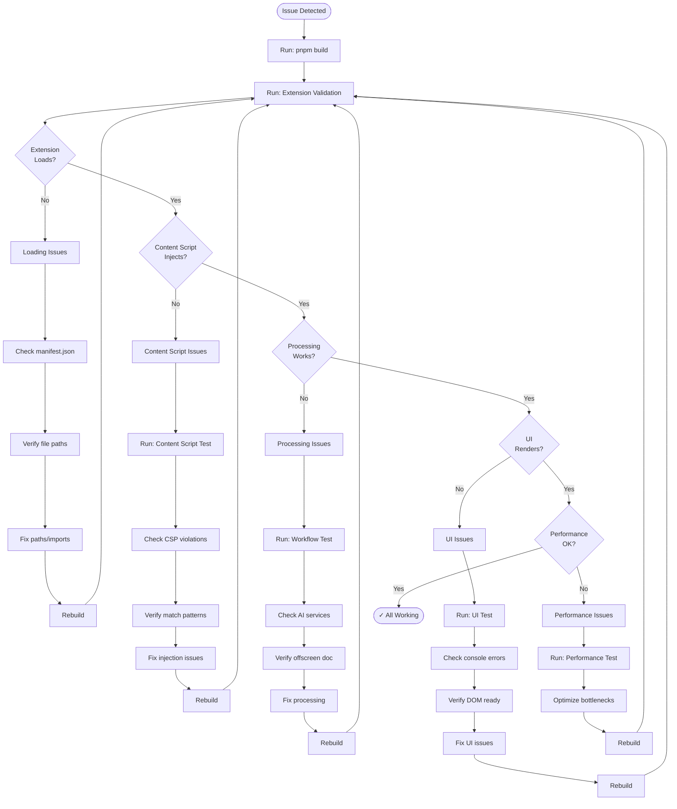
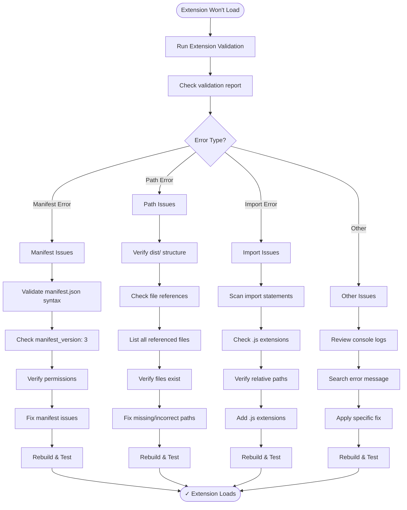
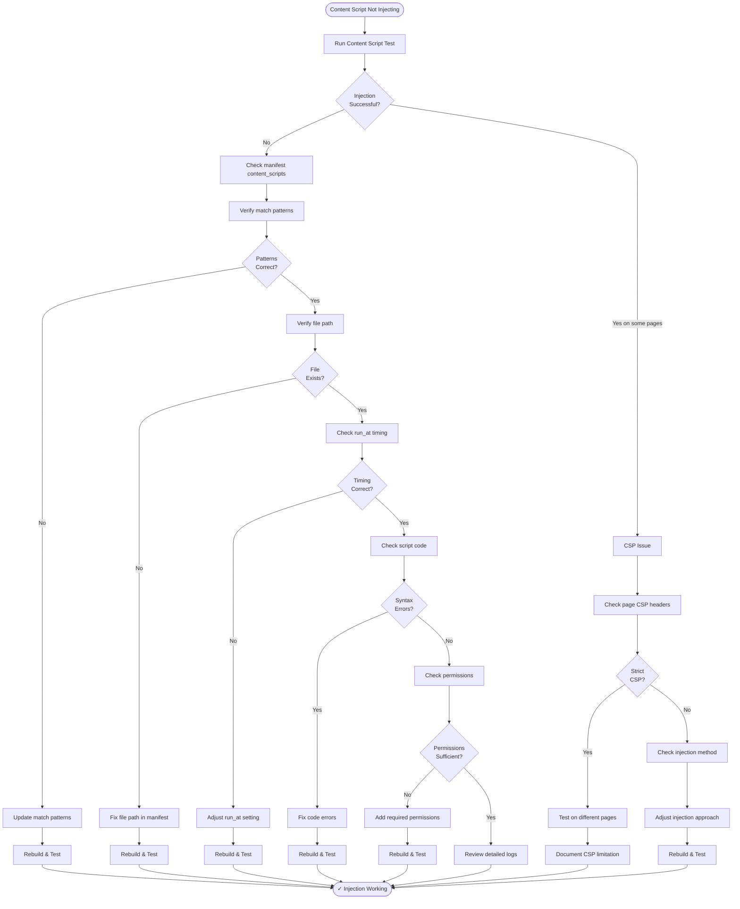
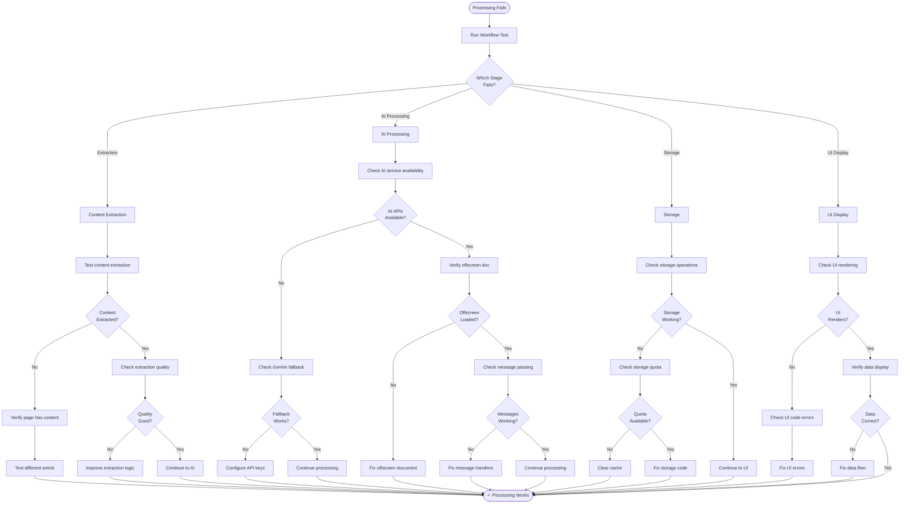
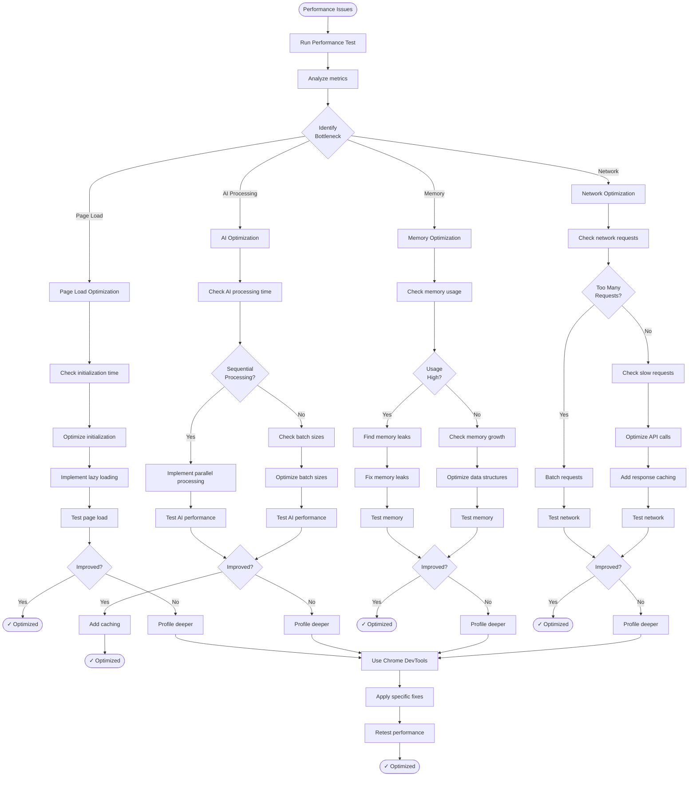
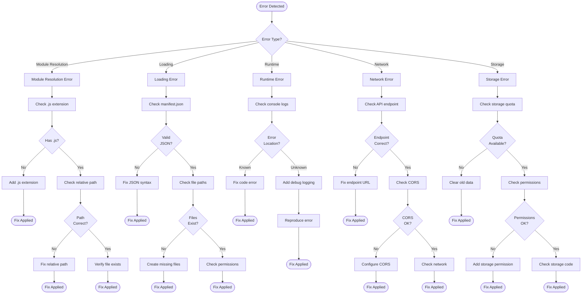
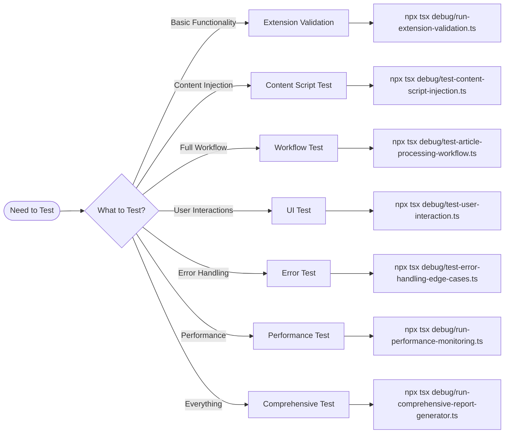

# Playwright Debugging Troubleshooting Flowchart

## Visual Troubleshooting Guide

This document provides visual flowcharts and decision trees for debugging the Language Learning Chrome Extension using Playwright MCP.

## Main Troubleshooting Flow



## Extension Loading Troubleshooting



## Content Script Injection Troubleshooting



## Article Processing Troubleshooting



## Performance Optimization Flow



## Error Message Decision Tree



## Quick Decision Guide

### When to Use Each Test



## Debugging Priority Matrix

| Issue Severity       | Impact   | Priority | Action              |
| -------------------- | -------- | -------- | ------------------- |
| Extension won't load | Critical | P0       | Fix immediately     |
| Module import errors | Critical | P0       | Fix immediately     |
| Content script fails | High     | P1       | Fix within 1 day    |
| Processing fails     | High     | P1       | Fix within 1 day    |
| UI not rendering     | High     | P1       | Fix within 1 day    |
| Performance issues   | Medium   | P2       | Fix within 1 week   |
| Minor UI glitches    | Low      | P3       | Fix when convenient |
| Documentation gaps   | Low      | P3       | Fix when convenient |

## Testing Frequency Recommendations

| Test Type            | Frequency      | Trigger                |
| -------------------- | -------------- | ---------------------- |
| Extension Validation | Every build    | After code changes     |
| Content Script Test  | Daily          | Content script changes |
| Workflow Test        | Daily          | Core logic changes     |
| UI Test              | As needed      | UI changes             |
| Error Test           | Weekly         | Error handling changes |
| Performance Test     | Weekly         | Performance concerns   |
| Comprehensive Test   | Before release | Release preparation    |

## Common Patterns

### Pattern 1: Build → Validate → Fix → Repeat

```
1. pnpm build
2. npx tsx debug/run-extension-validation.ts
3. Review report
4. Fix issues
5. Go to step 1
```

### Pattern 2: Specific Issue → Specific Test

```
Content script issue?
  → npx tsx debug/test-content-script-injection.ts

Processing issue?
  → npx tsx debug/test-article-processing-workflow.ts

UI issue?
  → npx tsx debug/test-user-interaction.ts

Performance issue?
  → npx tsx debug/run-performance-monitoring.ts
```

### Pattern 3: Unknown Issue → Comprehensive Test

```
Not sure what's wrong?
  → npx tsx debug/run-comprehensive-report-generator.ts
  → Review comprehensive report
  → Identify specific area
  → Run specific test
  → Fix issue
```

## Summary

Use these flowcharts to:

1. Quickly identify the right debugging approach
2. Follow systematic troubleshooting steps
3. Make informed decisions about fixes
4. Prioritize issues effectively
5. Choose appropriate tests

For detailed instructions, see [PLAYWRIGHT_DEBUGGING_GUIDE.md](./PLAYWRIGHT_DEBUGGING_GUIDE.md).
