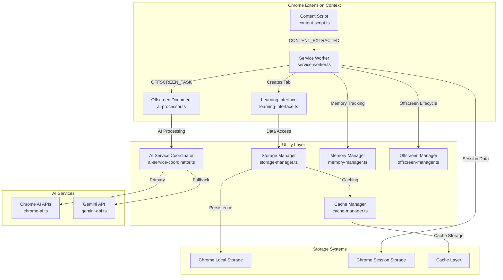
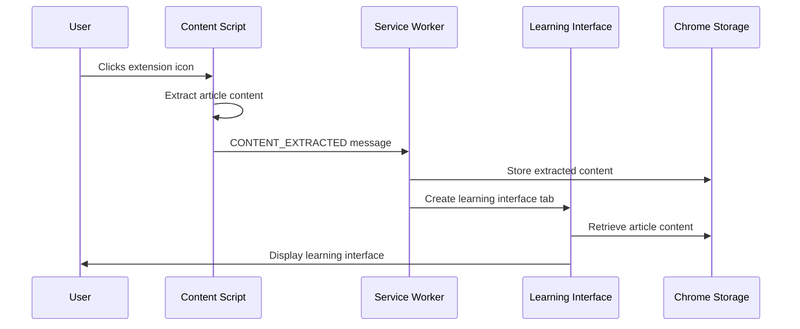
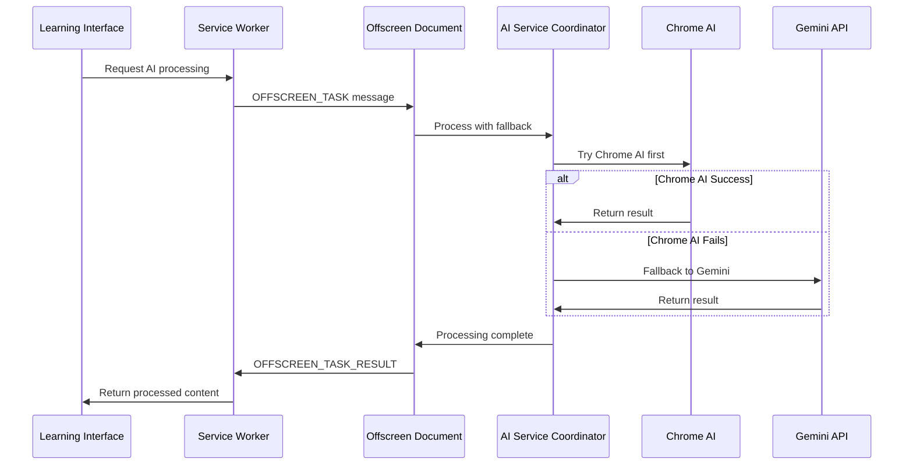
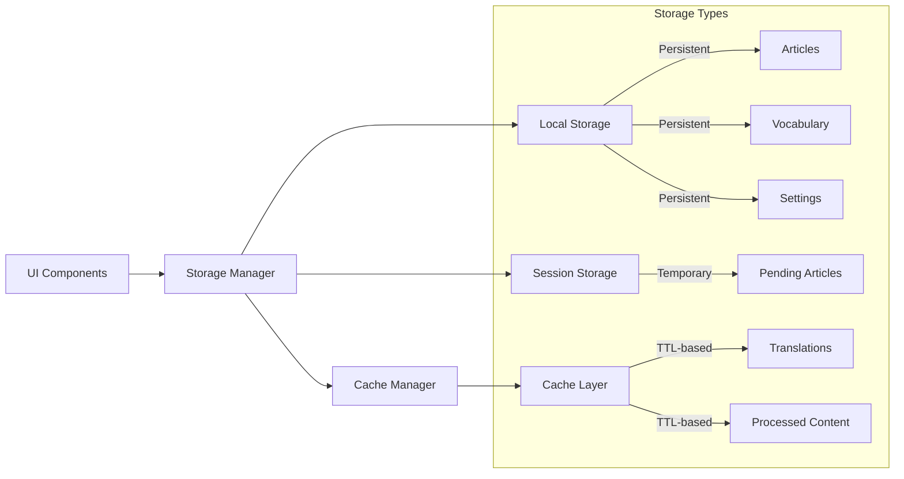
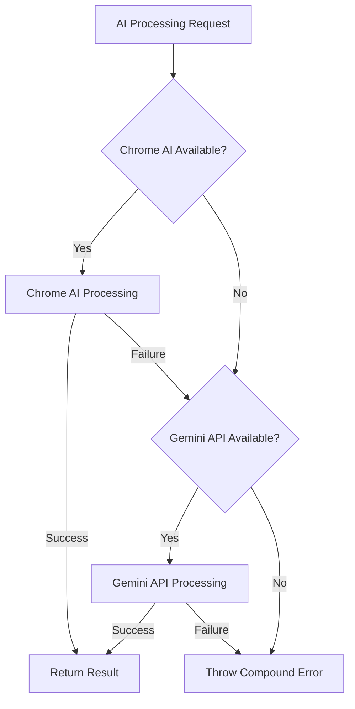
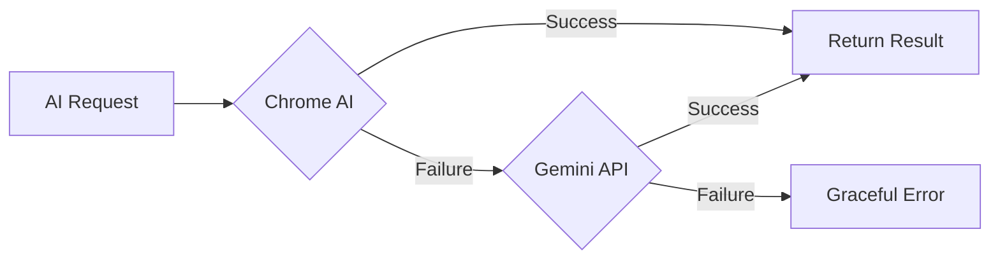

# Technical Architecture

## System Overview

The Language Learning Chrome Extension uses a Manifest V3 architecture with service worker background processing, content script injection, and offscreen documents for AI processing. The system follows a modular design with clear separation of concerns and comprehensive error handling.

## Architecture Diagram



## Core Components

### 1. Service Worker (`src/background/service-worker.ts`)

**Purpose**: Extension lifecycle management and message routing

**Key Features**:

- Extension icon click handling with tab validation
- Learning interface tab creation and management
- System capability detection for Chrome AI APIs
- Memory management integration via `memory-manager.ts`
- Offscreen document lifecycle management via `offscreen-manager.ts`

**Message Handling**:

- `CONTENT_EXTRACTED`: Processes extracted article content
- `CHECK_SYSTEM_CAPABILITIES`: Returns AI service availability
- `OPEN_LEARNING_INTERFACE`: Creates new learning interface tab

**Chrome Extension Limitations**:

- No DOM access in service worker context
- No `window` or `document` objects available
- Limited to Chrome extension APIs only
- Service worker may be terminated by Chrome

### 2. Content Script (`src/content/content-script.ts`)

**Purpose**: Web page content extraction and user feedback

**Content Extraction Strategy**:

1. Primary: `<article>` element detection
2. Secondary: `<main>` element detection
3. Fallback: Common content selectors (`.article-content`, `.post-content`, etc.)
4. Validation: Minimum 100 characters and 500+ character containers

**Features**:

- Multi-strategy title extraction (h1, title classes, document.title)
- Content sanitization (removes ads, navigation, social elements)
- Visual user feedback with success/error notifications
- Automatic content extraction on script injection

**Chrome Extension Context**:

- Full DOM access to current page
- Isolated from page scripts for security
- Chrome messaging API for service worker communication

### 3. Offscreen Document (`src/offscreen/ai-processor.ts`)

**Purpose**: AI processing without service worker timeout limitations

**AI Processing Tasks**:

- `language_detection`: Text language identification
- `summarization`: Content summarization with options
- `translation`: Text translation between languages
- `vocabulary_analysis`: Word difficulty and context analysis
- `content_rewriting`: Difficulty-based content adaptation

**Service Integration**:

- Primary: Chrome Built-in AI APIs via `chrome-ai.ts`
- Fallback: Gemini API via `gemini-api.ts`
- Automatic fallback chain with error handling

**Advantages Over Service Worker**:

- No 30-second timeout limitation
- Persistent context for AI sessions
- DOM access for complex processing
- Better resource management for heavy tasks

### 4. UI Components (`src/ui/`)

**Learning Interface (`learning-interface.ts`)**:

- Card-based article display system
- Vocabulary and sentence highlighting modes
- Navigation between article parts
- Settings integration and user preferences

**Settings Interface (`settings.ts`)**:

- User preference management
- API key configuration for Gemini
- Language and difficulty settings
- Keyboard shortcut customization

**Setup Wizard (`setup-wizard.ts`)**:

- First-time user onboarding
- System capability detection
- Initial preference configuration

**Highlight Manager (`highlight-manager.ts`)**:

- Text selection and highlighting logic
- Vocabulary and sentence card creation
- Overlap detection and management

## Data Flow Architecture

### 1. Content Extraction Flow



**Detailed Steps**:

1. User clicks extension icon on article page
2. Service worker injects content script via `chrome.scripting.executeScript`
3. Content script extracts content using multi-strategy approach
4. Content script sends `CONTENT_EXTRACTED` message to service worker
5. Service worker stores content in session storage with tab-specific key
6. Service worker creates new tab with learning interface
7. Learning interface retrieves content from storage and renders

### 2. AI Processing Flow



**AI Processing Pipeline**:

1. **Language Detection**: Identify article language using Chrome AI or Gemini
2. **Content Summarization**: Process and subdivide content based on length
3. **Difficulty Adaptation**: Rewrite content based on user difficulty level (1-10)
4. **Vocabulary Analysis**: Extract and analyze vocabulary with difficulty scoring
5. **Translation**: Translate vocabulary and sentences to native language
6. **Caching**: Store results in cache manager for future use

### 3. Storage and Caching Flow



**Storage Strategy**:

- **Local Storage**: Persistent user data (articles, vocabulary, settings)
- **Session Storage**: Temporary processing state and tab-specific data
- **Cache Layer**: TTL-based caching for AI results and translations
- **Versioned Schema**: Migration support with `CURRENT_SCHEMA_VERSION`

## Storage Architecture

### Storage Schema (Current Version: 1.0.0)

```typescript
interface StorageSchema {
  schema_version: string;
  user_settings: UserSettings;
  articles: Record<string, ProcessedArticle>;
  vocabulary: Record<string, VocabularyItem>;
  sentences: Record<string, SentenceItem>;
  processing_queue: ProcessingTask[];
  statistics: {
    articlesProcessed: number;
    vocabularyLearned: number;
    sentencesHighlighted: number;
    lastActivity: string; // ISO date string
  };
}
```

### Data Models

**ProcessedArticle**:

```typescript
interface ProcessedArticle {
  id: string;
  url: string;
  title: string;
  originalLanguage: string;
  processedAt: Date;
  parts: ArticlePart[];
  processingStatus: 'processing' | 'completed' | 'failed';
  cacheExpires: Date;
}
```

**VocabularyItem**:

```typescript
interface VocabularyItem {
  id: string;
  word: string;
  phrase?: string;
  translation: string;
  context: string;
  exampleSentences: string[];
  articleId: string;
  partId: string;
  createdAt: Date;
  lastReviewed: Date;
  reviewCount: number;
  difficulty: number; // 1-10 scale
}
```

**UserSettings**:

```typescript
interface UserSettings {
  nativeLanguage: string;
  learningLanguage: string;
  difficultyLevel: number; // 1-10
  autoHighlight: boolean;
  darkMode: boolean;
  fontSize: number;
  apiKeys: {
    gemini?: string;
    jinaReader?: string;
  };
  keyboardShortcuts?: KeyboardShortcuts;
}
```

### Storage Management Features

**Quota Management**:

- Warning threshold: 80% of Chrome storage quota
- Critical threshold: 95% of Chrome storage quota
- Automatic cleanup of expired articles (30+ days old)
- Vocabulary limit: 1000 most recently reviewed items
- Sentence limit: 1000 most recent items

**Data Validation**:

- Schema version validation with migration support
- Type validation for all stored data structures
- Sanitization of user input before storage
- Integrity checks on data retrieval

**Performance Optimizations**:

- Batch storage operations for efficiency
- Intelligent caching with TTL-based expiration
- Memory usage estimation and monitoring
- Progressive cleanup to prevent quota exhaustion

## AI Service Integration

### Chrome Built-in AI APIs (`src/utils/chrome-ai.ts`)

**Available Services**:

- **ChromeLanguageDetector**: Identifies text language with confidence scoring
- **ChromeSummarizer**: Content summarization with length and format options
- **ChromeRewriter**: Difficulty-based content adaptation (1-10 scale)
- **ChromeTranslator**: Text translation between language pairs
- **ChromeVocabularyAnalyzer**: Word difficulty analysis and context extraction

**Service Availability Detection**:

```typescript
// System capability checking in service worker
async function checkSystemCapabilities(): Promise<SystemCapabilities> {
  const capabilities = {
    hasChromeAI: false,
    hasLanguageDetector: false,
    hasSummarizer: false,
    hasRewriter: false,
    hasTranslator: false,
    hasPromptAPI: false,
  };

  if ('ai' in self) {
    capabilities.hasChromeAI = true;
    const ai = (self as any).ai;
    capabilities.hasSummarizer = 'summarizer' in ai;
    capabilities.hasRewriter = 'rewriter' in ai;
    capabilities.hasPromptAPI = 'languageModel' in ai;
  }

  capabilities.hasLanguageDetector = typeof LanguageDetector !== 'undefined';
  capabilities.hasTranslator = typeof Translator !== 'undefined';

  return capabilities;
}
```

### AI Service Coordinator (`src/utils/ai-service-coordinator.ts`)

**Fallback Chain Implementation**:

```typescript
async processWithFallback<T>(task: AITask, data: unknown): Promise<T> {
  await this.updateServiceStatus();
  const errors: AIError[] = [];

  // Try Chrome AI first
  if (this.serviceStatus.chromeAI) {
    try {
      return await this.processChromeAI<T>(task, data);
    } catch (error) {
      const aiError = this.normalizeError(error);
      errors.push(aiError);
      if (!aiError.retryable) {
        this.serviceStatus.chromeAI = false;
      }
    }
  }

  // Fallback to Gemini API
  if (this.serviceStatus.geminiAPI && this.geminiClient) {
    try {
      return await this.processGeminiAPI<T>(task, data);
    } catch (error) {
      const aiError = this.normalizeError(error);
      errors.push(aiError);
      if (!aiError.retryable) {
        this.serviceStatus.geminiAPI = false;
      }
    }
  }

  throw this.createCompoundError(task, errors);
}
```

**Error Classification and Recovery**:

```typescript
interface AIError {
  type:
    | 'api_unavailable'
    | 'network'
    | 'rate_limit'
    | 'invalid_input'
    | 'processing_failed';
  message: string;
  retryable: boolean;
  originalError?: Error;
}
```

### Gemini API Integration (`src/utils/gemini-api.ts`)

**Fallback Service Features**:

- User-provided API key configuration
- Same interface as Chrome AI services
- Automatic retry logic with exponential backoff
- Rate limiting and quota management
- Secure API key storage in Chrome storage

**Service Coordination Flow**:



## Message Passing System

### Message Types and Interfaces

```typescript
// Core message types used throughout the system
type MessageType =
  | 'EXTRACT_CONTENT'
  | 'CONTENT_EXTRACTED'
  | 'PROCESS_ARTICLE'
  | 'OFFSCREEN_TASK'
  | 'OFFSCREEN_TASK_RESULT'
  | 'OFFSCREEN_READY'
  | 'CHECK_SYSTEM_CAPABILITIES'
  | 'OPEN_LEARNING_INTERFACE';

interface Message<T = unknown> {
  type: MessageType;
  payload?: T;
  requestId?: string;
}

interface MessageResponse<T = unknown> {
  success: boolean;
  data?: T;
  error?: string;
  requestId?: string;
}
```

### Communication Patterns

**Content Script → Service Worker**:

```typescript
// Automatic content extraction on script injection
const extractedContent = extractContent();
if (extractedContent) {
  chrome.runtime
    .sendMessage({
      type: 'CONTENT_EXTRACTED',
      data: extractedContent,
    })
    .then(response => {
      if (response?.success) {
        showSuccessNotification();
      }
    });
}
```

**Service Worker → Offscreen Document**:

```typescript
// AI processing task delegation
chrome.runtime.sendMessage({
  type: 'OFFSCREEN_TASK',
  taskId: generateTaskId(),
  taskType: 'language_detection',
  data: { text: content },
});
```

**Offscreen Document → AI Services**:

```typescript
// AI processing with fallback chain
async processTask(taskId: string, taskType: string, data: any) {
  try {
    const result = await this.chromeAI.detectLanguage(data.text);
    chrome.runtime.sendMessage({
      type: 'OFFSCREEN_TASK_RESULT',
      taskId,
      result
    });
  } catch (error) {
    // Fallback to Gemini API
    const result = await this.geminiAPI.detectLanguage(data.text);
    chrome.runtime.sendMessage({
      type: 'OFFSCREEN_TASK_RESULT',
      taskId,
      result
    });
  }
}
```

**UI Components → Storage Manager**:

```typescript
// Typed storage operations through StorageManager
const storageManager = getStorageManager();
await storageManager.saveArticle(processedArticle);
const vocabulary = await storageManager.getAllVocabulary();
```

### Chrome Extension Context Boundaries

**Service Worker Context**:

- ✅ Chrome extension APIs (storage, tabs, scripting)
- ✅ Message passing with other components
- ✅ Background processing coordination
- ❌ DOM access or manipulation
- ❌ Window or document objects
- ❌ Direct AI API calls (delegated to offscreen)

**Content Script Context**:

- ✅ Full DOM access to current page
- ✅ Page content extraction and manipulation
- ✅ Chrome messaging APIs
- ✅ User interaction handling
- ❌ Access to extension pages or other tabs
- ❌ Chrome storage APIs (must use messaging)

**Offscreen Document Context**:

- ✅ Chrome AI APIs and external API calls
- ✅ DOM access for processing
- ✅ Persistent context for AI sessions
- ✅ Heavy computational tasks
- ❌ Access to other tabs or extension pages
- ❌ Direct user interaction

**UI Component Context**:

- ✅ Full DOM access within extension pages
- ✅ Chrome storage APIs
- ✅ User interface rendering and interaction
- ✅ Extension page navigation
- ❌ Access to web page content
- ❌ Cross-origin requests (must use background)

## Performance Optimizations

### 1. Memory Management (`src/utils/memory-manager.ts`)

**Tab Lifecycle Management**:

- Automatic tab registration and cleanup
- Memory usage monitoring per tab
- Resource cleanup on tab closure
- Prevention of memory leaks in long-running sessions

**Resource Monitoring**:

```typescript
interface MemoryUsage {
  totalBytes: number;
  articleBytes: number;
  vocabularyBytes: number;
  sentenceBytes: number;
}
```

### 2. Caching Strategy (`src/utils/cache-manager.ts`)

**Multi-Layer Caching**:

- **Article Cache**: Processed articles with URL and language keys
- **Translation Cache**: Vocabulary translations with language pair keys
- **Processed Content Cache**: AI results with content hash and parameters
- **TTL-based Expiration**: 24-hour default with configurable expiration

**Cache Performance Metrics**:

```typescript
interface CacheMetrics {
  operations: number;
  averageLatency: number;
  hitRate: number;
  missRate: number;
  totalTime: number;
}
```

### 3. Batch Processing (`src/utils/batch-processor.ts`)

**AI Service Batching**:

- Translation batching: Up to 20 words per API call
- Vocabulary analysis: Batch processing for efficiency
- Content chunking: Large articles split for processing
- Progressive results: Stream results as they become available

### 4. Storage Optimizations (`src/utils/storage-manager.ts`)

**Quota Management**:

- Storage usage monitoring with warning thresholds
- Automatic cleanup of expired data (30+ days)
- Intelligent data archiving and compression
- Export/import functionality for data portability

**Performance Features**:

- Bulk storage operations for efficiency
- Versioned schema with migration support
- Data validation and sanitization
- Memory usage estimation and tracking

### 5. Offscreen Document Management (`src/utils/offscreen-manager.ts`)

**Lifecycle Optimization**:

- On-demand offscreen document creation
- Automatic cleanup after processing
- Resource pooling for multiple concurrent tasks
- Memory usage monitoring and cleanup

## Error Handling Architecture

### Centralized Error Handling (`src/utils/error-handler.ts`)

**Error Classification System**:

```typescript
type ErrorType =
  | 'network'
  | 'api_unavailable'
  | 'rate_limit'
  | 'invalid_input'
  | 'processing_failed';

interface AIError {
  type: ErrorType;
  message: string;
  retryable: boolean;
  originalError?: Error;
}
```

**Error Recovery Strategies**:

1. **Retry Logic with Exponential Backoff**:

```typescript
class RetryHandler {
  async execute<T>(
    operation: () => Promise<T>,
    shouldRetry: (error: AIError) => boolean = e => e.retryable
  ): Promise<T> {
    for (let attempt = 1; attempt <= this.maxRetries; attempt++) {
      try {
        return await operation();
      } catch (error) {
        if (!shouldRetry(error) || attempt === this.maxRetries) {
          throw error;
        }
        await this.exponentialBackoff(attempt);
      }
    }
  }
}
```

2. **Service Fallback Chain**:



3. **Graceful Degradation**:

- Partial functionality when AI services fail
- Cached results when fresh processing unavailable
- User-friendly error messages with recovery suggestions
- Offline mode with limited functionality

### User Feedback System

**Visual Notifications**:

```typescript
// Content script notifications
function showSuccessNotification(): void {
  const notification = createNotification(
    '✓ Article extracted successfully',
    'success'
  );
  document.body.appendChild(notification);
  setTimeout(() => notification.remove(), 3000);
}

function showErrorNotification(message: string): void {
  const notification = createNotification(`✗ ${message}`, 'error');
  document.body.appendChild(notification);
  setTimeout(() => notification.remove(), 5000);
}
```

**Error Recovery Actions**:

- Automatic retry for transient errors
- Manual retry buttons for user-initiated recovery
- Alternative processing methods when primary fails
- Clear guidance on resolving configuration issues

## Security Architecture

### Content Security Policy (CSP)

**Manifest V3 Security Model**:

- Strict CSP with no inline scripts or `eval()`
- Extension APIs only - limited external resource access
- Isolated content script execution contexts
- Secure message passing between components

### Data Protection and Privacy

**Privacy-First Design**:

- **Local Processing**: Chrome AI APIs process data locally
- **No Telemetry**: Zero usage tracking or data collection
- **User-Controlled Data**: All data stored locally in Chrome storage
- **Data Portability**: Export/import functionality for user control

**Content Sanitization**:

```typescript
// Content extraction with XSS prevention
function extractTextContent(element: Element): string {
  const clone = element.cloneNode(true) as Element;

  // Remove potentially dangerous elements
  const unwantedSelectors = [
    'script',
    'style',
    'nav',
    'header',
    'footer',
    'aside',
    '.advertisement',
    '.ad',
    '.social-share',
    '.comments',
  ];

  unwantedSelectors.forEach(selector => {
    clone.querySelectorAll(selector).forEach(el => el.remove());
  });

  return clone.textContent?.replace(/\s+/g, ' ').trim() || '';
}
```

### API Key Management

**Secure Storage Pattern**:

```typescript
interface UserSettings {
  apiKeys: {
    gemini?: string; // Encrypted in Chrome storage
    jinaReader?: string; // Optional external service key
  };
}
```

**Security Features**:

- User-provided API keys stored in Chrome's secure storage
- API key validation before use
- HTTPS-only communication with external services
- No API keys transmitted to extension servers
- Key rotation support through settings interface

### Chrome Extension Security Boundaries

**Context Isolation**:

- Service worker: No DOM access, Chrome APIs only
- Content scripts: Isolated from page scripts, limited Chrome APIs
- Offscreen documents: Isolated processing context
- UI components: Extension page context with full Chrome API access

**Permission Model**:

```json
{
  "permissions": [
    "storage", // Local data storage
    "activeTab", // Current tab access only
    "scripting", // Content script injection
    "offscreen" // AI processing context
  ],
  "host_permissions": [
    "https://*/*" // HTTPS sites only for content extraction
  ]
}
```

## Scalability and Performance Monitoring

### Multi-Tab Architecture

**Independent Tab Management**:

- Each learning interface tab operates independently
- Tab-specific session storage with automatic cleanup
- Memory manager tracks and manages resources per tab
- Concurrent AI processing across multiple tabs

**Resource Isolation**:

```typescript
// Memory manager tracks resources per tab
class MemoryManager {
  private tabResources = new Map<number, TabResources>();

  registerTab(tabId: number): void {
    this.tabResources.set(tabId, {
      memoryUsage: 0,
      cacheSize: 0,
      aiSessions: new Set(),
      lastActivity: Date.now(),
    });
  }

  cleanupTab(tabId: number): void {
    const resources = this.tabResources.get(tabId);
    if (resources) {
      resources.aiSessions.forEach(session => session.destroy());
      this.tabResources.delete(tabId);
    }
  }
}
```

### Performance Monitoring

**System Metrics Collection**:

```typescript
interface SystemMetrics {
  // Memory usage tracking
  memoryUsage: {
    totalBytes: number;
    articleBytes: number;
    vocabularyBytes: number;
    sentenceBytes: number;
  };

  // Cache performance
  cacheMetrics: {
    hitRate: number;
    missRate: number;
    averageLatency: number;
    operations: number;
  };

  // AI service performance
  aiMetrics: {
    chromeAIAvailability: boolean;
    geminiAPIAvailability: boolean;
    averageProcessingTime: number;
    errorRate: number;
  };
}
```

**Adaptive Performance Optimization**:

- Dynamic batch size adjustment based on system performance
- Intelligent caching based on usage patterns
- Progressive loading for large articles
- Background processing prioritization

## Extension Lifecycle Management

### Installation and Initialization

**Installation Flow**:

```typescript
chrome.runtime.onInstalled.addListener(async details => {
  if (details.reason === 'install') {
    // 1. Check system capabilities
    const capabilities = await checkSystemCapabilities();
    console.log('System capabilities:', capabilities);

    // 2. Initialize default settings
    await chrome.storage.local.set({
      settings: {
        nativeLanguage: 'en',
        learningLanguage: 'es',
        difficultyLevel: 5,
        autoHighlight: false,
        darkMode: false,
        fontSize: 16,
        apiKeys: {},
      },
    });

    // 3. Initialize memory and offscreen management
    await initializeMemoryManagement();
    await initializeOffscreenManagement();
  }
});
```

### Runtime Management

**Service Worker Lifecycle**:

- Automatic activation on extension icon clicks
- Memory management initialization on startup
- Offscreen document lifecycle management
- Resource cleanup on suspension

**Tab Management**:

```typescript
// Automatic tab cleanup when tabs are closed
chrome.tabs.onRemoved.addListener(async tabId => {
  await memoryManager.cleanupTab(tabId);
  await storageManager.cleanupTabData(tabId);
});
```

### Update and Migration

**Schema Migration Support**:

```typescript
// Storage manager handles version migrations
export const CURRENT_SCHEMA_VERSION = '1.0.0';

async function migrateSchema(
  fromVersion: string,
  toVersion: string
): Promise<void> {
  // Migration logic for schema updates
  if (fromVersion !== toVersion) {
    console.warn(`Migrating from ${fromVersion} to ${toVersion}`);
    // Perform necessary data transformations
  }
}
```

**Update Handling**:

- Automatic schema migration on version updates
- Preservation of user data and settings
- New feature availability detection
- Graceful handling of deprecated features

## Development Patterns and Architecture Principles

### Singleton Pattern for Resource Management

**Storage Manager**:

```typescript
let storageManagerInstance: StorageManager | null = null;

export function getStorageManager(cacheManager?: CacheManager): StorageManager {
  if (!storageManagerInstance) {
    storageManagerInstance = new StorageManager(cacheManager);
  }
  return storageManagerInstance;
}
```

**Cache Manager**:

```typescript
let cacheManagerInstance: CacheManager | null = null;

export function getCacheManager(config?: Partial<CacheConfig>): CacheManager {
  if (!cacheManagerInstance) {
    cacheManagerInstance = new CacheManager(config);
  }
  return cacheManagerInstance;
}
```

### Service Coordination Pattern

**AI Service Coordinator**:

```typescript
export class AIServiceCoordinator implements AIProcessor, AIServiceManager {
  private chromeLanguageDetector: ChromeLanguageDetector;
  private chromeSummarizer: ChromeSummarizer;
  private chromeRewriter: ChromeRewriter;
  private chromeTranslator: ChromeTranslator;
  private chromeVocabularyAnalyzer: ChromeVocabularyAnalyzer;
  private geminiClient: GeminiAPIClient | null = null;

  async processWithFallback<T>(task: AITask, data: unknown): Promise<T> {
    // Implements fallback chain pattern
  }
}
```

### Resource Cleanup Pattern

**Automatic Resource Management**:

```typescript
// Service worker cleanup on suspension
chrome.runtime.onSuspend.addListener(async () => {
  console.log('Extension suspending, cleaning up resources...');
  await shutdownMemoryManagement();
  await shutdownOffscreenManagement();
});

// Offscreen document cleanup
window.addEventListener('beforeunload', () => {
  if (processor) {
    processor.cleanup();
  }
});
```

### Type-Safe Message Passing

**Strongly Typed Messages**:

```typescript
type MessageType =
  | 'CONTENT_EXTRACTED'
  | 'OFFSCREEN_TASK'
  | 'CHECK_SYSTEM_CAPABILITIES';

interface Message<T = unknown> {
  type: MessageType;
  payload?: T;
  requestId?: string;
}

interface MessageResponse<T = unknown> {
  success: boolean;
  data?: T;
  error?: string;
  requestId?: string;
}
```

## Testing Architecture

### Test Framework and Setup

**Vitest Configuration** (`vitest.config.ts`):

- **Test Runner**: Vitest with jsdom environment
- **Coverage**: V8 provider with HTML/JSON reports
- **Global Setup**: Chrome API mocking in `tests/setup.ts`
- **TypeScript**: Full TypeScript support with strict mode

**Chrome API Mocking** (`tests/setup/chrome-mock.ts`):

```typescript
// Global Chrome API simulation
global.chrome = {
  storage: {
    local: {
      get: vi.fn(),
      set: vi.fn(),
      remove: vi.fn(),
      clear: vi.fn(),
      getBytesInUse: vi.fn(),
      QUOTA_BYTES: 5242880,
    },
    session: {
      get: vi.fn(),
      set: vi.fn(),
      remove: vi.fn(),
    },
  },
  runtime: {
    sendMessage: vi.fn(),
    onMessage: { addListener: vi.fn() },
    getURL: vi.fn(),
  },
  tabs: {
    create: vi.fn(),
    onRemoved: { addListener: vi.fn() },
  },
};
```

### Test Categories and Coverage

**Unit Tests**:

- Individual utility function testing
- Component isolation testing
- Error handling validation
- Data validation and sanitization

**Integration Tests**:

- Cross-component communication testing
- Storage and cache integration
- AI service coordination testing
- Message passing validation

**System Tests**:

- Extension lifecycle testing
- Memory management validation
- Performance benchmarking
- Error recovery testing

**User Acceptance Tests**:

- End-to-end workflow simulation
- User interface interaction testing
- Content extraction validation
- Learning interface functionality

### Test Isolation and Reliability

**Mock Strategy**:

- **Deterministic AI Responses**: Configurable mock responses for consistent testing
- **Storage Simulation**: In-memory storage with quota simulation
- **Network Mocking**: Controlled external API responses
- **DOM Environment**: jsdom for UI component testing

**Test Cleanup**:

```typescript
afterEach(() => {
  vi.clearAllMocks();
  // Reset singleton instances for clean test state
  resetCacheManagerInstance();
  // Clear any test data
});
```

**Performance Testing**:

- Cache performance benchmarking
- Memory usage validation
- Processing time measurement
- Concurrent operation testing

## Related Documentation

- **[Extension Structure](extension-structure.md)** - Chrome Extension Manifest V3 implementation details
- **[Trigger Mechanism](trigger-mechanism.md)** - User interaction flow and click-based activation
- **[API Reference](../api/README.md)** - Chrome AI integration and service details
- **[Development Guide](../development/README.md)** - Setup and contribution guidelines
- **[Testing Guide](../testing/README.md)** - Test architecture and strategies
- **[User Guide](../user-guide/README.md)** - End-user feature documentation

This architecture provides a comprehensive, maintainable, and scalable foundation for the Language Learning Chrome Extension, with robust error handling, performance optimization, and security considerations built into every layer.
