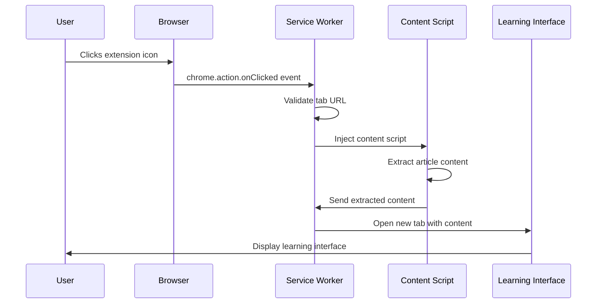

# Chrome Extension Trigger Mechanism

## Overview

The Language Learning Chrome Extension uses a **user-initiated, click-based trigger mechanism** rather than automatic page processing. This design choice prioritizes user control, privacy, and performance.

## Why the Action is Empty

The `manifest.json` contains an empty action object:

```json
{
  "action": {}
}
```

This configuration means:

- **No popup interface** is defined
- **No default title or icon** specified beyond the main extension icon
- **Click events** are handled programmatically via `chrome.action.onClicked`

## Trigger Flow

### 1. User Interaction Required

```
User visits webpage → User clicks extension icon → Processing begins
```

**NOT:**

```
User visits webpage → Automatic processing (❌ This doesn't happen)
```

### 2. Complete Trigger Sequence



## Implementation Details

### Service Worker Click Handler

```typescript
// Listen for extension icon clicks
chrome.action.onClicked.addListener(async (tab): Promise<void> => {
  if (!tab.id) {
    console.error('No tab ID available');
    return;
  }

  try {
    // Validate tab URL - skip restricted pages
    if (
      !tab.url ||
      tab.url.startsWith('chrome://') ||
      tab.url.startsWith('chrome-extension://')
    ) {
      console.warn('Cannot process chrome:// or extension pages');
      return;
    }

    // Process the current tab
    await processCurrentTab(tab.id);
  } catch (error) {
    console.error('Error processing tab:', error);
  }
});
```

### Dynamic Content Script Injection

```typescript
async function processCurrentTab(tabId: number): Promise<void> {
  try {
    // Inject content script on demand
    await chrome.scripting.executeScript({
      target: { tabId },
      files: ['dist/content/content-script.js'],
    });

    console.log('Content script injected successfully');
  } catch (error) {
    console.error('Failed to inject content script:', error);
    throw error;
  }
}
```

### Content Script Auto-Execution

Once injected, the content script immediately attempts extraction:

```typescript
// Auto-execute when script is injected
const extractedContent = extractContent();
if (extractedContent) {
  sendContentToBackground(extractedContent);
} else {
  showErrorNotification('Could not find article content on this page');
}
```

## User Experience Flow

### Successful Processing

1. **User Action**: Click extension icon on article page
2. **Visual Feedback**: Brief notification appears on page
3. **Processing**: Content extraction and AI processing occurs
4. **Result**: New tab opens with learning interface
5. **Notification**: Success message shows on original page

### Failed Processing

1. **User Action**: Click extension icon
2. **Validation**: Extension checks if page is processable
3. **Error Cases**:
   - Chrome internal pages (`chrome://`)
   - Extension pages
   - Pages without sufficient content
   - Network or processing errors
4. **User Feedback**: Error notification appears on page

## Advantages of Click-Based Triggering

### Privacy Benefits

- **User Consent**: Processing only occurs with explicit user action
- **No Background Scanning**: Extension doesn't automatically analyze browsing
- **Selective Processing**: Users choose which articles to process
- **Data Control**: No automatic data collection or storage

### Performance Benefits

- **Resource Efficiency**: No CPU/memory usage until requested
- **Battery Preservation**: No background processing on mobile devices
- **Network Conservation**: API calls only when needed
- **Storage Management**: Content only stored when user wants it

### User Control Benefits

- **Intentional Learning**: Users actively choose learning content
- **Workflow Integration**: Fits into user's reading and learning routine
- **Distraction-Free**: No automatic interruptions or processing
- **Predictable Behavior**: Clear cause-and-effect interaction model

## Alternative Trigger Mechanisms (Not Used)

### Content Script Auto-Injection

```json
// NOT USED - Would auto-inject on all pages
"content_scripts": [{
  "matches": ["<all_urls>"],
  "js": ["content/content-script.js"],
  "run_at": "document_idle"
}]
```

**Why not used:**

- Would consume resources on every page load
- Privacy concerns with automatic content analysis
- Performance impact on browsing experience
- User has no control over when processing occurs

### Popup Interface

```json
// NOT USED - Would show popup on click
"action": {
  "default_popup": "ui/popup/popup.html"
}
```

**Why not used:**

- Adds extra step in user workflow
- Popup UI would need to handle article detection
- Less streamlined user experience
- Additional UI complexity for simple trigger action

### Context Menu Integration

```json
// NOT USED - Would add right-click menu option
"permissions": ["contextMenus"]
```

**Why not used:**

- Less discoverable than toolbar icon
- Context menus are less intuitive for this use case
- Toolbar icon provides better visual presence
- Right-click workflow doesn't match reading behavior

## Error Handling and Edge Cases

### Invalid Page Types

```typescript
// Pages that cannot be processed
const invalidUrlPatterns = [
  'chrome://', // Chrome internal pages
  'chrome-extension://', // Extension pages
  'moz-extension://', // Firefox extension pages (future compatibility)
  'edge://', // Edge internal pages
  'about:', // Browser about pages
  'file://', // Local files (security restrictions)
];
```

### Content Validation

```typescript
// Minimum content requirements
function validateContent(content: ExtractedContent): boolean {
  return (
    content.content.length >= 100 && // Minimum text length
    content.wordCount >= 20 && // Minimum word count
    content.title.trim().length > 0 && // Must have title
    !isNavigationOrMenuContent(content.content) // Not navigation text
  );
}
```

### User Feedback System

```typescript
// Visual notifications for user feedback
function showNotification(message: string, type: 'success' | 'error'): void {
  const notification = document.createElement('div');
  notification.textContent = message;
  notification.className = `extension-notification ${type}`;

  // Auto-remove after timeout
  setTimeout(() => notification.remove(), type === 'error' ? 5000 : 3000);

  document.body.appendChild(notification);
}
```

## Testing the Trigger Mechanism

### Manual Testing Steps

1. **Install Extension**: Load in developer mode
2. **Navigate to Article**: Visit news site or blog post
3. **Click Icon**: Click extension icon in toolbar
4. **Verify Processing**: Check for notification and new tab
5. **Test Edge Cases**: Try on chrome:// pages, empty pages, etc.

### Automated Testing

```typescript
// Test click handler registration
describe('Extension Trigger Mechanism', () => {
  test('registers click handler on startup', () => {
    expect(chrome.action.onClicked.hasListeners()).toBe(true);
  });

  test('validates tab URLs correctly', async () => {
    const invalidTab = { id: 1, url: 'chrome://settings/' };
    const result = await processTab(invalidTab);
    expect(result).toBe(false);
  });

  test('injects content script on valid pages', async () => {
    const validTab = { id: 1, url: 'https://example.com/article' };
    await processTab(validTab);
    expect(chrome.scripting.executeScript).toHaveBeenCalled();
  });
});
```

## Future Considerations

### Potential Enhancements

1. **Keyboard Shortcuts**: Add Alt+L or similar for power users
2. **Context Menu**: Optional right-click integration for specific text
3. **Auto-Detection**: Smart detection of article pages with user confirmation
4. **Batch Processing**: Process multiple tabs with user consent

### Accessibility Improvements

1. **Screen Reader Support**: Ensure click handler is accessible
2. **Keyboard Navigation**: Support for keyboard-only users
3. **High Contrast**: Visual feedback works in high contrast mode
4. **Voice Commands**: Integration with browser voice commands

This trigger mechanism design ensures the Language Learning Extension remains user-controlled, privacy-focused, and performance-efficient while providing a streamlined learning experience.
