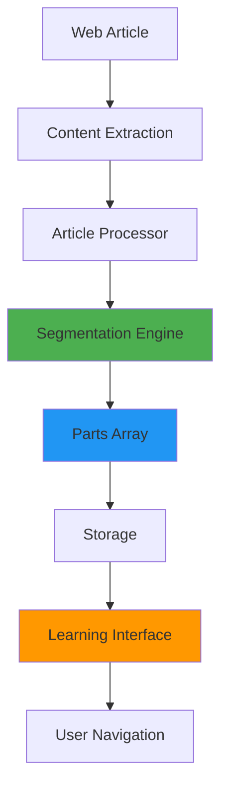
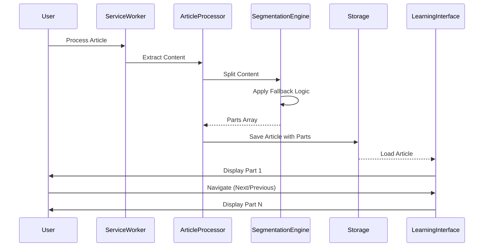
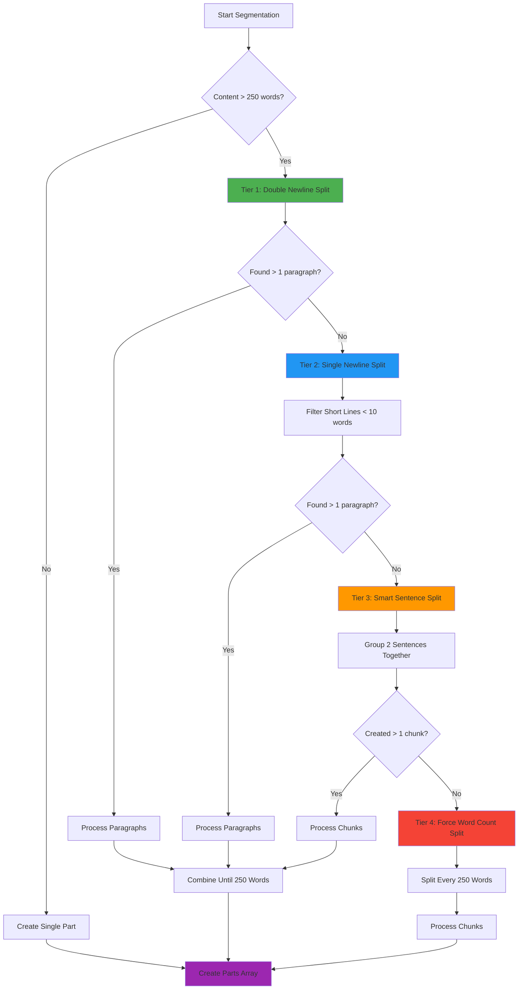
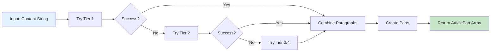
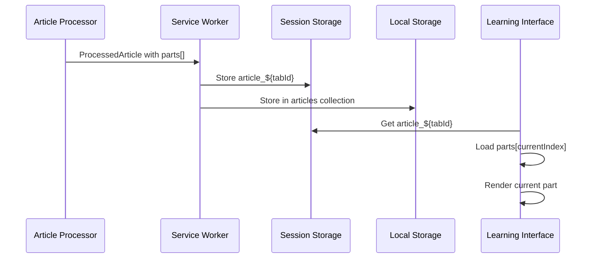

# Article Segmentation System

## Overview

The Article Segmentation System automatically divides long articles into smaller, manageable parts to improve readability and learning experience. This document explains the complete segmentation logic, architecture, and future improvement opportunities.

## Table of Contents

1. [System Architecture](#system-architecture)
2. [Segmentation Algorithm](#segmentation-algorithm)
3. [Implementation Details](#implementation-details)
4. [Data Flow](#data-flow)
5. [Related Files](#related-files)
6. [Future Improvements](#future-improvements)

---

## System Architecture

### High-Level Overview



### Component Interaction



---

## Segmentation Algorithm

### Configuration

**Current Settings:**

- **Target Words Per Part**: 250 words
- **Minimum Paragraph Length**: 10 words
- **Sentences Per Chunk**: 2 sentences (when using sentence fallback)

### 4-Tier Fallback System

The segmentation engine uses a hierarchical fallback approach to handle different content formats:



### Tier Details

#### **Tier 1: Double Newline Split** (Preferred)

- **Pattern**: `\n\n+` (two or more newlines)
- **Use Case**: Well-formatted articles with clear paragraph breaks
- **Advantage**: Preserves natural paragraph structure
- **Example**:

  ```
  Paragraph 1 text here.

  Paragraph 2 text here.

  Paragraph 3 text here.
  ```

#### **Tier 2: Single Newline Split** (Common Fallback)

- **Pattern**: `\n` (single newline)
- **Filter**: Removes lines with < 10 words (headers, metadata)
- **Use Case**: Articles without double newlines but with line breaks
- **Advantage**: Filters out navigation elements and short lines
- **Example**:
  ```
  Paragraph 1 text here.
  Paragraph 2 text here.
  Paragraph 3 text here.
  ```

#### **Tier 3: Smart Sentence Split** (Intelligent Fallback)

- **Pattern**: `[.!?]+\s+(?=[A-Z])` (sentence boundaries)
- **Grouping**: 2 sentences per chunk
- **Use Case**: Content without any line breaks
- **Advantage**: Preserves punctuation, creates natural reading chunks
- **Example**:
  ```
  Sentence one. Sentence two. Sentence three. Sentence four.
  → Chunk 1: "Sentence one. Sentence two."
  → Chunk 2: "Sentence three. Sentence four."
  ```

#### **Tier 4: Force Word Count Split** (Last Resort)

- **Method**: Split by word count (250 words)
- **Use Case**: All other methods failed
- **Advantage**: Guarantees segmentation for any content
- **Disadvantage**: May break mid-sentence

---

## Implementation Details

### Core Function: `splitContentIntoParts()`

**Location**: `src/utils/article-processor.ts`

**Signature**:

```typescript
function splitContentIntoParts(
  content: string,
  articleId: string
): ArticlePart[];
```

**Algorithm Flow**:



**Key Logic**:

1. **Paragraph Combination**:

   ```typescript
   for (const paragraph of paragraphs) {
     const paragraphWords = countWords(paragraph);

     if (currentWordCount + paragraphWords > MAX_WORDS_PER_PART && currentPart.length > 0) {
       // Create new part
       parts.push(createArticlePart(...));
       currentPart = '';
       currentWordCount = 0;
     }

     currentPart += (currentPart ? '\n\n' : '') + paragraph;
     currentWordCount += paragraphWords;
   }
   ```

2. **Part Creation**:
   ```typescript
   function createArticlePart(
     content: string,
     originalContent: string,
     articleId: string,
     partIndex: number
   ): ArticlePart {
     return {
       id: `${articleId}_part_${partIndex + 1}`,
       content,
       originalContent,
       vocabulary: [],
       sentences: [],
       partIndex,
     };
   }
   ```

### Helper Functions

#### `smartSentenceSplit(content: string): string[]`

**Purpose**: Intelligently split content by sentences while preserving punctuation

**Algorithm**:

1. Use regex to find sentence boundaries: `([.!?]+)\s+(?=[A-Z])`
2. Extract sentences with punctuation intact
3. Group sentences (2 per chunk)
4. Return array of chunks

#### `forceSplitByWordCount(content: string, maxWords: number): string[]`

**Purpose**: Force split content when all other methods fail

**Algorithm**:

1. Split content into words
2. Group words into chunks of `maxWords`
3. Join words back into strings
4. Return array of chunks

#### `countWords(text: string): number`

**Purpose**: Count words in text

**Algorithm**:

```typescript
return text
  .trim()
  .split(/\s+/)
  .filter(word => word.length > 0).length;
```

---

## Data Flow

### Article Processing Pipeline

```mermaid
graph LR
    A[Raw HTML] --> B[Content Extraction]
    B --> C[ExtractedContent Object]
    C --> D[processArticle]
    D --> E[splitContentIntoParts]
    E --> F[ArticlePart Array]
    F --> G[ProcessedArticle Object]
    G --> H[Chrome Storage]
    H --> I[Learning Interface]

    style E fill:#4CAF50
    style F fill:#2196F3
```



### Data Structures

#### **ExtractedContent**

```typescript
interface ExtractedContent {
  title: string;
  content: string; // Raw article text
  url: string;
  language?: string;
  wordCount: number;
  paragraphCount: number;
}
```

#### **ArticlePart**

```typescript
interface ArticlePart {
  id: string; // e.g., "article_123_part_1"
  content: string; // Segmented content
  originalContent: string;
  vocabulary: string[]; // Vocabulary IDs in this part
  sentences: string[]; // Sentence IDs in this part
  partIndex: number; // 0-based index
}
```

#### **ProcessedArticle**

```typescript
interface ProcessedArticle {
  id: string;
  url: string;
  title: string;
  originalLanguage: string;
  processedAt: Date;
  parts: ArticlePart[]; // Array of segmented parts
  processingStatus: 'processing' | 'completed' | 'failed';
  cacheExpires: Date;
}
```

### Storage Flow



---

## Related Files

### Core Implementation

| File Path                          | Purpose                          | Key Functions                                                                |
| ---------------------------------- | -------------------------------- | ---------------------------------------------------------------------------- |
| `src/utils/article-processor.ts`   | Main segmentation logic          | `splitContentIntoParts()`, `smartSentenceSplit()`, `forceSplitByWordCount()` |
| `src/background/service-worker.ts` | Article processing orchestration | `processArticle()`, `openLearningInterface()`                                |
| `src/ui/learning-interface.ts`     | UI rendering and navigation      | `loadArticle()`, `renderArticlePart()`, `updateNavigation()`                 |
| `src/types/index.ts`               | Type definitions                 | `ArticlePart`, `ProcessedArticle`, `ExtractedContent`                        |

### Supporting Files

| File Path                        | Purpose                           |
| -------------------------------- | --------------------------------- |
| `src/ui/learning-interface.html` | Navigation UI structure           |
| `src/ui/learning-interface.css`  | Navigation styling and animations |
| `src/utils/storage-manager.ts`   | Article storage and retrieval     |
| `src/ui/highlight-manager.ts`    | Part-specific highlighting        |

### Configuration

| Setting             | Location                   | Current Value |
| ------------------- | -------------------------- | ------------- |
| Max Words Per Part  | `article-processor.ts:189` | 250           |
| Min Paragraph Words | `article-processor.ts:221` | 10            |
| Sentences Per Chunk | `article-processor.ts:327` | 2             |

---

## Future Improvements

### 1. **Adaptive Segmentation** 🎯

**Problem**: Fixed 250-word limit doesn't account for content complexity or user preferences.

**Solution**: Implement dynamic segmentation based on:

- User reading level (beginner, intermediate, advanced)
- Content difficulty (vocabulary complexity)
- User preferences (configurable in settings)

**Implementation**:

```typescript
interface SegmentationConfig {
  targetWordsPerPart: number; // User-configurable
  adaptToComplexity: boolean; // Adjust based on content
  respectStructure: boolean; // Prioritize semantic breaks
}
```

**Benefits**:

- Personalized reading experience
- Better for different learning styles
- Adapts to article complexity

---

### 2. **Semantic-Aware Segmentation** 🧠

**Problem**: Current system doesn't understand content structure (headings, sections, topics).

**Solution**: Use NLP or heading detection to split at semantic boundaries.

**Implementation**:

```typescript
function detectSemanticBoundaries(content: string): number[] {
  // Detect:
  // - Heading patterns (## Title, **Bold Title**)
  // - Topic changes (using keyword analysis)
  // - Section markers (numbers, bullets)
  return boundaryIndices;
}
```

**Benefits**:

- More natural reading flow
- Keeps related content together
- Better comprehension

---

### 3. **Visual Preview System** 👁️

**Problem**: Users can't see what's in other parts without navigating.

**Solution**: Add part preview on hover or in a sidebar.

**Implementation**:

```typescript
interface PartPreview {
  partIndex: number;
  firstSentence: string;
  wordCount: number;
  vocabularyCount: number;
  hasUserHighlights: boolean;
}
```

**UI Mockup**:

```
┌─────────────────────────────────┐
│ Part 1: "Federal agencies..."  │ ← Current
│ Part 2: "SpaceX currently..."  │ ← Preview on hover
│ Part 3: "However, citing..."   │
└─────────────────────────────────┘
```

**Benefits**:

- Better navigation
- Quick content scanning
- Improved user orientation

---

### 4. **Smart Part Titles** 📝

**Problem**: Parts are only numbered, no indication of content.

**Solution**: Auto-generate descriptive titles for each part.

**Implementation**:

```typescript
async function generatePartTitle(content: string): Promise<string> {
  // Use Chrome AI Summarizer API
  const summary = await summarizer.summarize(content, {
    type: 'key-points',
    length: 'short',
  });
  return extractFirstPhrase(summary);
}
```

**Example**:

```
Part 1: "NASA's Moon Landing Plans"
Part 2: "SpaceX Contract Details"
Part 3: "Competition from China"
```

**Benefits**:

- Easier navigation
- Better content overview
- Improved user experience

---

### 5. **Progress Persistence** 💾

**Problem**: Navigation state only saved for 1 hour.

**Solution**: Implement long-term progress tracking.

**Implementation**:

```typescript
interface ReadingProgress {
  articleId: string;
  currentPart: number;
  partsCompleted: number[];
  lastReadAt: Date;
  totalReadingTime: number;
}
```

**Features**:

- Resume reading from last position
- Track completed parts
- Show reading progress (e.g., "60% complete")
- Reading time statistics

**Benefits**:

- Better user experience
- Progress tracking
- Reading analytics

---

### 6. **Intelligent Re-segmentation** 🔄

**Problem**: Old articles don't have parts structure.

**Solution**: Implement automatic migration and re-segmentation.

**Implementation**:

```typescript
async function migrateOldArticles(): Promise<void> {
  const articles = await getAllArticles();

  for (const article of articles) {
    if (!article.parts || article.parts.length === 0) {
      // Re-segment using current algorithm
      article.parts = splitContentIntoParts(article.content, article.id);
      await saveArticle(article);
    }
  }
}
```

**Benefits**:

- Backward compatibility
- Consistent experience
- No data loss

---

### 7. **Multi-Language Optimization** 🌍

**Problem**: Segmentation logic optimized for English.

**Solution**: Language-specific segmentation rules.

**Implementation**:

```typescript
interface LanguageSegmentationRules {
  sentencePattern: RegExp;
  paragraphPattern: RegExp;
  wordCountMultiplier: number; // Adjust for language density
}

const LANGUAGE_RULES: Record<string, LanguageSegmentationRules> = {
  zh: {
    /* Chinese rules */
  },
  ja: {
    /* Japanese rules */
  },
  ar: {
    /* Arabic rules */
  },
  // ...
};
```

**Benefits**:

- Better support for non-English content
- More accurate segmentation
- Improved readability

---

### 8. **Performance Optimization** ⚡

**Problem**: Large articles (10,000+ words) may cause performance issues.

**Solution**: Implement lazy loading and caching.

**Implementation**:

```typescript
// Only load current part + adjacent parts
async function loadPartWithContext(partIndex: number): Promise<void> {
  const partsToLoad = [
    partIndex - 1, // Previous
    partIndex, // Current
    partIndex + 1, // Next
  ].filter(i => i >= 0 && i < totalParts);

  await loadParts(partsToLoad);
}
```

**Benefits**:

- Faster initial load
- Reduced memory usage
- Better performance for long articles

---

### 9. **User Feedback Integration** 📊

**Problem**: No way to know if segmentation is working well for users.

**Solution**: Add feedback mechanism and analytics.

**Implementation**:

```typescript
interface SegmentationFeedback {
  articleId: string;
  partIndex: number;
  feedback: 'too_long' | 'too_short' | 'just_right' | 'bad_break';
  timestamp: Date;
}
```

**UI**:

```
Was this section length good for you?
[Too Long] [Just Right] [Too Short]
```

**Benefits**:

- Data-driven improvements
- User-centric design
- Continuous optimization

---

### 10. **Jump to Part Feature** 🎯

**Problem**: Can only navigate sequentially (Previous/Next).

**Solution**: Add quick navigation to any part.

**Implementation**:

```typescript
// Dropdown or grid view
<select onChange={jumpToPart}>
  <option value="0">Part 1: NASA's Plans</option>
  <option value="1">Part 2: SpaceX Contract</option>
  <option value="2">Part 3: Competition</option>
</select>
```

**Benefits**:

- Faster navigation
- Better for review
- Improved accessibility

---

## Summary

The Article Segmentation System provides a robust, multi-tiered approach to dividing long articles into manageable parts. The current implementation successfully handles various content formats through intelligent fallback mechanisms, ensuring every article can be segmented regardless of its original formatting.

### Key Strengths

✅ 4-tier fallback system handles all content types  
✅ Preserves punctuation and natural reading flow  
✅ Configurable target length (currently 250 words)  
✅ Filters out navigation elements and metadata  
✅ Comprehensive diagnostic logging

### Areas for Growth

🔄 Semantic-aware segmentation  
🔄 User-configurable preferences  
🔄 Long-term progress tracking  
🔄 Multi-language optimization  
🔄 Performance improvements for very long articles

The future improvements outlined above will enhance the system's intelligence, personalization, and user experience while maintaining the solid foundation already in place.

---

**Last Updated**: 2025-01-04  
**Version**: 1.0  
**Maintainer**: Development Team
