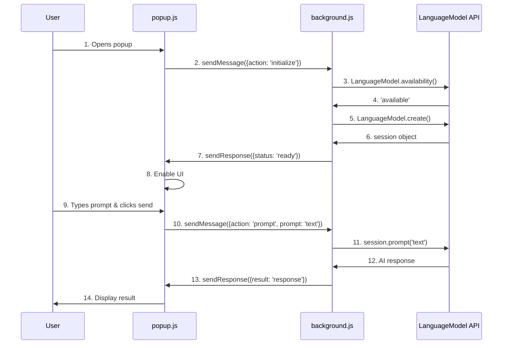

# AI Code Analysis Guide

This guide explains how each code snippet works in the Chrome Prompt API extension.
成功的MVP

## Table of Contents

- [Background Service Worker](#background-service-worker)
- [Popup UI](#popup-ui)
- [Content Script](#content-script)
- [Message Flow](#message-flow)

---

## Background Service Worker

**File:** `background.js`

### Purpose

The background service worker is the only component with access to the LanguageModel API. It manages the AI session and processes all AI requests.

### Code Breakdown

#### 1. Session Management

```javascript
let session = null;
```

- Stores the AI session globally
- Persists across multiple requests
- Only one session needed for the entire extension lifecycle

#### 2. Initialize AI API

```javascript
async function initializeAPI() {
  try {
    if (typeof LanguageModel === 'undefined') {
      throw new Error('LanguageModel API not found. Enable required flags.');
    }
```

**What it does:**

- Checks if LanguageModel API exists
- Throws error if flags aren't enabled in Chrome

```javascript
const availability = await LanguageModel.availability();
```

**What it does:**

- Checks model status
- Returns: `'no'`, `'downloadable'`, `'after-download'`, or `'available'`

```javascript
if (availability === 'no') {
  throw new Error('Model not available. Check hardware requirements.');
}
```

**What it does:**

- Hardware doesn't meet requirements
- Model cannot be used on this device

```javascript
if (availability === 'downloadable') {
  await LanguageModel.create();
  await new Promise(resolve => setTimeout(resolve, 5000));
  return initializeAPI();
}
```

**What it does:**

- Model not downloaded yet
- Triggers download by calling `create()`
- Waits 5 seconds
- Recursively calls itself to check again

```javascript
if (availability === 'after-download') {
  await new Promise(resolve => setTimeout(resolve, 5000));
  return initializeAPI();
}
```

**What it does:**

- Model is currently downloading
- Waits 5 seconds
- Recursively checks again until ready

```javascript
session = await LanguageModel.create();
return { status: 'ready' };
```

**What it does:**

- Model is available
- Creates AI session
- Returns success status

```javascript
  } catch (error) {
    return { status: 'error', message: error.message };
  }
}
```

**What it does:**

- Catches any errors
- Returns error status with message

#### 3. Send Prompt to AI

```javascript
async function sendPrompt(prompt) {
  if (!session) {
    throw new Error('Session not initialized');
  }
  return await session.prompt(prompt);
}
```

**What it does:**

- Validates session exists
- Sends prompt to AI
- Returns AI response

#### 4. Message Listener

```javascript
chrome.runtime.onMessage.addListener((request, sender, sendResponse) => {
```

**What it does:**

- Listens for messages from popup or content scripts
- `request` = message data
- `sender` = who sent the message
- `sendResponse` = callback to send response back

```javascript
if (request.action === 'initialize') {
  initializeAPI().then(sendResponse);
  return true;
}
```

**What it does:**

- Handles initialization requests
- Calls `initializeAPI()`
- Sends result back via `sendResponse`
- `return true` keeps message channel open for async response

```javascript
  if (request.action === 'prompt') {
    sendPrompt(request.prompt)
      .then(result => sendResponse({ result }))
      .catch(error => sendResponse({ error: error.message }));
    return true;
  }
});
```

**What it does:**

- Handles prompt requests
- Calls `sendPrompt()` with user's text
- Sends AI result back on success
- Sends error message on failure
- `return true` keeps channel open

---

## Popup UI

**File:** `popup.js`

### Purpose

Provides the user interface for interacting with the AI. Sends messages to background worker and displays results.

### Code Breakdown

#### 1. DOM Elements

```javascript
const statusEl = document.getElementById('status');
const promptInput = document.getElementById('prompt');
const submitBtn = document.getElementById('submitBtn');
const outputEl = document.getElementById('output');
const outputContent = document.getElementById('outputContent');
```

**What it does:**

- Gets references to HTML elements
- Used to update UI dynamically

#### 2. Update Status Display

```javascript
function updateStatus(type, message) {
  statusEl.className = `status ${type}`;
  const spinner =
    type === 'checking' || type === 'loading'
      ? '<div class="spinner"></div>'
      : '';
  statusEl.innerHTML = `${spinner}<span>${message}</span>`;
}
```

**What it does:**

- Updates status bar appearance
- `type` = 'checking', 'ready', 'error', or 'loading'
- Shows spinner for checking/loading states
- Updates message text

#### 3. Initialize API

```javascript
async function initializeAPI() {
  updateStatus('checking', 'Checking model availability...');

  chrome.runtime.sendMessage({ action: 'initialize' }, response => {
```

**What it does:**

- Shows "checking" status
- Sends 'initialize' message to background worker
- Waits for response

```javascript
    if (response?.status === 'ready') {
      updateStatus('ready', '✓ Ready! Gemini Nano is available.');
      promptInput.disabled = false;
      submitBtn.disabled = false;
      promptInput.focus();
```

**What it does:**

- AI is ready
- Shows success status
- Enables input and button
- Focuses on text input

```javascript
    } else if (response?.status === 'error') {
      updateStatus('error', `Error: ${response.message}`);
```

**What it does:**

- Error occurred
- Shows error message

```javascript
    } else {
      updateStatus('checking', 'Initializing...');
      setTimeout(initializeAPI, 5000);
    }
```

**What it does:**

- Still initializing (downloading model)
- Waits 5 seconds
- Tries again

#### 4. Send Prompt

```javascript
async function sendPrompt() {
  const prompt = promptInput.value.trim();

  if (!prompt) {
    alert('Please enter a prompt');
    return;
  }
```

**What it does:**

- Gets text from input
- Validates it's not empty
- Shows alert if empty

```javascript
updateStatus('loading', 'Generating response...');
submitBtn.disabled = true;
outputEl.classList.remove('show');
```

**What it does:**

- Shows loading status
- Disables button to prevent double-clicks
- Hides previous output

```javascript
  chrome.runtime.sendMessage({ action: 'prompt', prompt }, response => {
```

**What it does:**

- Sends prompt to background worker
- Waits for AI response

```javascript
    if (response?.error) {
      updateStatus('error', `Error: ${response.error}`);
      outputContent.textContent = `Error: ${response.error}`;
      outputEl.classList.add('show');
```

**What it does:**

- Error occurred
- Shows error in status and output area

```javascript
    } else {
      outputContent.textContent = response.result;
      outputEl.classList.add('show');
      updateStatus('ready', '✓ Response generated successfully!');
    }
    submitBtn.disabled = false;
  });
}
```

**What it does:**

- Success
- Displays AI response
- Shows success status
- Re-enables button

#### 5. Event Listeners

```javascript
submitBtn.addEventListener('click', sendPrompt);
```

**What it does:**

- Sends prompt when button clicked

```javascript
promptInput.addEventListener('keydown', e => {
  if (e.ctrlKey && e.key === 'Enter') {
    sendPrompt();
  }
});
```

**What it does:**

- Sends prompt when Ctrl+Enter pressed
- Keyboard shortcut for convenience

```javascript
document.querySelectorAll('.example-item').forEach(item => {
  item.addEventListener('click', () => {
    promptInput.value = item.dataset.prompt;
    promptInput.focus();
  });
});
```

**What it does:**

- Fills input with example text when clicked
- Focuses input for editing

```javascript
initializeAPI();
```

**What it does:**

- Starts initialization when popup opens

---

## Content Script

**File:** `content.js`

### Purpose

Runs on web pages. Currently acts as a relay between popup and background (not actively used in current implementation).

### Code Breakdown

```javascript
chrome.runtime.onMessage.addListener((request, sender, sendResponse) => {
  chrome.runtime.sendMessage(request, sendResponse);
  return true;
});
```

**What it does:**

- Listens for messages
- Forwards them to background worker
- Returns response back to sender
- `return true` keeps channel open

**Note:** This is not currently used because popup communicates directly with background worker.

### Potential Use Case

If you wanted to analyze webpage content:

```javascript
// Extract text from current page
const pageText = document.body.innerText.slice(0, 1000);

// Send to background for AI processing
chrome.runtime.sendMessage(
  { action: 'prompt', prompt: `Summarize: ${pageText}` },
  response => {
    // Display result on page
    const div = document.createElement('div');
    div.textContent = response.result;
    document.body.prepend(div);
  }
);
```

---

## Message Flow

### Popup → Background → AI



### Key Points

1. **Background worker is the bridge to AI**
   - Only component with LanguageModel access
   - Manages session lifecycle
   - Processes all AI requests

2. **Popup is the UI layer**
   - Collects user input
   - Sends messages to background
   - Displays results

3. **Content script is optional**
   - Only needed for webpage interaction
   - Can extract page content
   - Can inject results into pages

4. **Message passing is asynchronous**
   - Always use `return true` in listeners
   - Use callbacks or promises
   - Handle errors gracefully

---

## Common Patterns

### Pattern 1: Request-Response

```javascript
// Sender
chrome.runtime.sendMessage({ action: 'doSomething' }, response => {
  console.log(response);
});

// Receiver
chrome.runtime.onMessage.addListener((request, sender, sendResponse) => {
  if (request.action === 'doSomething') {
    sendResponse({ result: 'done' });
  }
});
```

### Pattern 2: Async Request-Response

```javascript
// Sender (same as above)
chrome.runtime.sendMessage({ action: 'doAsync' }, response => {
  console.log(response);
});

// Receiver
chrome.runtime.onMessage.addListener((request, sender, sendResponse) => {
  if (request.action === 'doAsync') {
    doAsyncWork().then(result => {
      sendResponse({ result });
    });
    return true; // IMPORTANT: Keeps channel open
  }
});
```

### Pattern 3: Error Handling

```javascript
chrome.runtime.sendMessage({ action: 'risky' }, response => {
  if (response?.error) {
    console.error('Error:', response.error);
  } else {
    console.log('Success:', response.result);
  }
});

chrome.runtime.onMessage.addListener((request, sender, sendResponse) => {
  if (request.action === 'risky') {
    doRiskyWork()
      .then(result => sendResponse({ result }))
      .catch(error => sendResponse({ error: error.message }));
    return true;
  }
});
```

---

## Debugging Tips

### 1. Check Background Worker Console

```
chrome://extensions/ → Extension Details → Service Worker → Inspect
```

- See background.js logs
- Check for errors
- Monitor AI session creation

### 2. Check Popup Console

```
Right-click extension icon → Inspect popup
```

- See popup.js logs
- Check message sending
- Monitor UI updates

### 3. Check Content Script Console

```
Open webpage → F12 → Console
```

- See content.js logs (if running on page)
- Check DOM manipulation
- Monitor page interactions

### 4. Common Issues

**"Receiving end does not exist"**

- Trying to send message to non-existent receiver
- Content script not loaded on page
- Background worker not running

**"Session not initialized"**

- Trying to use AI before initialization complete
- Check initialization flow
- Wait for 'ready' status

**"LanguageModel is not defined"**

- Flags not enabled
- Wrong Chrome version
- Not in service worker context

---

## Summary

| Component         | Purpose          | Has AI Access          | Can Access DOM      |
| ----------------- | ---------------- | ---------------------- | ------------------- |
| **background.js** | AI processing    | ✅ Yes                 | ❌ No               |
| **popup.js**      | User interface   | ❌ No (via background) | ✅ Yes (popup only) |
| **content.js**    | Page interaction | ❌ No (via background) | ✅ Yes (web pages)  |

popup.js 應該可以 AI access

content.js不行

**Message Flow:**

- Popup collects input → sends to background
- Background processes with AI → sends response
- Popup displays result to user
