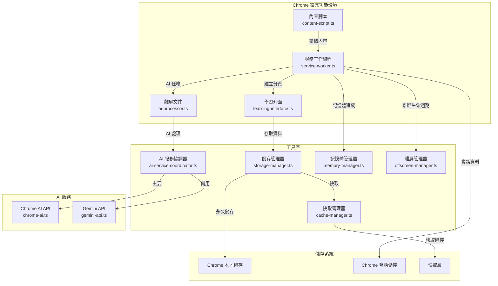
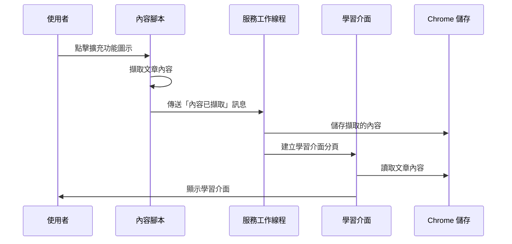
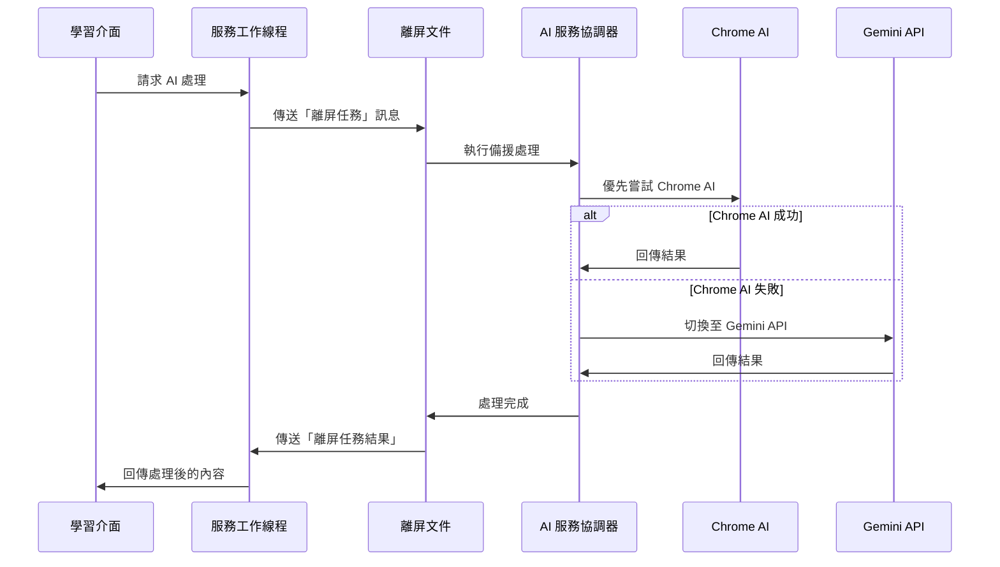

# Chrome 擴充功能架構深度解析：從零到一的教學

## 1. 前言

歡迎來到我們的 Chrome 擴充功能架構教學！本文件將帶您深入了解「Vocabeey」這款語言學習擴充功能的內部設計與運作原理。我們將以教學的口吻，解析 `docs/architecture/README.md` 中的技術細節，讓您不只看懂，更能學會如何設計一個高效、穩定且安全的擴充功能。

## 2. 系統核心總覽

在我們深入探討每個元件之前，讓我們先來看看整個系統的架構圖。這張圖是我們擴充功能的藍圖，它展示了各個模組如何協同工作。

### 架構圖

**圖解說明：**

- **Chrome 擴充功能環境**：這是我們擴充功能的核心，包含了與瀏覽器直接互動的四個主要部分。
- **工具層**：這是一系列的管理器，負責處理儲存、快取、AI 服務協調等後勤工作。
- **AI 服務**：這是我們擴充功能的「大腦」，負責處理所有與人工智慧相關的任務。
- **儲存系統**：這是我們的資料庫，負責儲存使用者資料、設定和快取。

接下來，我們將逐一解析這些元件。

## 3. 核心元件詳解

### 3.1. Service Worker (服務工作線程)

- **檔案位置**：`src/background/service-worker.ts`
- **核心職責**：擴充功能的「總指揮官」，負責管理整個擴充功能的生命週期和訊息傳遞。

**主要功能**：

- **事件監聽**：監聽使用者點擊擴充功能圖示的事件。
- **分頁管理**：建立和管理新的學習介面分頁。
- **能力檢測**：檢查使用者的 Chrome 瀏覽器是否支援內建的 AI 功能。
- **資源管理**：透過 `memory-manager.ts` 和 `offscreen-manager.ts` 來管理記憶體和離屏文件。

**為什麼需要 Service Worker？**

在 Manifest V3 架構中，Service Worker 取代了過去的背景頁面 (Background Page)，成為擴充功能的核心。它的好處是只在需要時運行，可以節省系統資源。但這也帶來了挑戰：它沒有 DOM 存取權限，且可能隨時被 Chrome 終止。因此，我們需要將需要 DOM 操作或長時間運行的任務，交給其他元件處理。

### 3.2. Content Script (內容腳本)

- **檔案位置**：`src/content/content-script.ts`
- **核心職責**：擴充功能在網頁上的「眼和手」，負責讀取和操作網頁內容。

**主要功能**：

- **內容擷取**：使用多種策略（例如，尋找 `<article>` 或 `<main>` 標籤）來擷取網頁的主要內容。
- **內容清理**：移除廣告、導覽列、社群分享按鈕等不需要的元素。
- **使用者回饋**：在頁面上顯示成功或失敗的通知。

**為什麼需要 Content Script？**

因為 Service Worker 無法直接存取網頁的 DOM，所以我們需要 Content Script 來作為橋樑。它可以讀取網頁的文字內容，然後傳送給 Service Worker 進行後續處理。

### 3.3. Offscreen Document (離屏文件)

- **檔案位置**：`src/offscreen/ai-processor.ts`
- **核心職責**：一個在背景運行的隱藏頁面，專門用來執行耗時的 AI 任務。

**主要功能**：

- **AI 處理**：執行語言偵測、摘要、翻譯、單字分析等 AI 任務。
- **服務整合**：主要使用 Chrome 內建的 AI API，如果失敗或無法使用，則會自動切換到 Gemini API 作為備用方案。

**為什麼需要 Offscreen Document？**

Service Worker 有 30 秒的執行時間限制，對於耗時的 AI 任務來說遠遠不夠。Offscreen Document 提供了一個沒有時間限制的執行環境，讓我們可以從容地完成 AI 處理，而不用擔心被 Chrome 中斷。

### 3.4. UI Components (使用者介面元件)

- **檔案位置**：`src/ui/`
- **核心職責**：提供使用者與擴充功能互動的介面。

**主要元件**：

- **`learning-interface.ts`**：學習介面，以卡片的形式展示文章內容，並提供單字和句子的突顯功能。
- **`settings.ts`**：設定介面，讓使用者可以管理個人偏好、設定 API 金鑰等。
- **`setup-wizard.ts`**：首次使用的設定精靈，引導使用者完成初始設定。
- **`highlight-manager.ts`**：突顯管理器，負責處理文字選取和突顯的邏輯。

## 4. 資料流架構

了解了核心元件後，讓我們來看看資料是如何在這些元件之間流動的。

### 4.1. 內容擷取流程

**流程解析**：

1.  使用者在想要學習的頁面上點擊擴充功能圖示。
2.  Service Worker 收到點擊事件，並將 Content Script 注入到頁面中。
3.  Content Script 擷取頁面內容，並傳送給 Service Worker。
4.  Service Worker 將內容儲存在 `session` 儲存空間中。
5.  Service Worker 開啟一個新的分頁，載入學習介面。
6.  學習介面從儲存空間中讀取內容，並顯示給使用者。

### 4.2. AI 處理流程

**流程解析**：

1.  使用者在學習介面中，點擊了需要 AI 處理的功能（例如，翻譯單字）。
2.  學習介面傳送訊息給 Service Worker，請求 AI 處理。
3.  Service Worker 將任務轉發給 Offscreen Document。
4.  Offscreen Document 中的 AI 服務協調器 (ASC) 會優先嘗試使用 Chrome 內建的 AI 服務。
5.  如果 Chrome AI 失敗，ASC 會自動切換到 Gemini API。
6.  處理完成後，結果會沿著原路徑返回，最終顯示在學習介面上。

## 5. 總結

透過本教學，您應該對「Vocabeey」的架構有了更深入的了解。我們採用了 Manifest V3 的模組化設計，將不同的功能拆分到不同的元件中，並透過訊息傳遞來協調它們的工作。這種設計不僅提高了程式碼的可維護性，也確保了擴充功能的效能和安全性。

希望本教學能對您的擴充功能開發之旅有所幫助！
