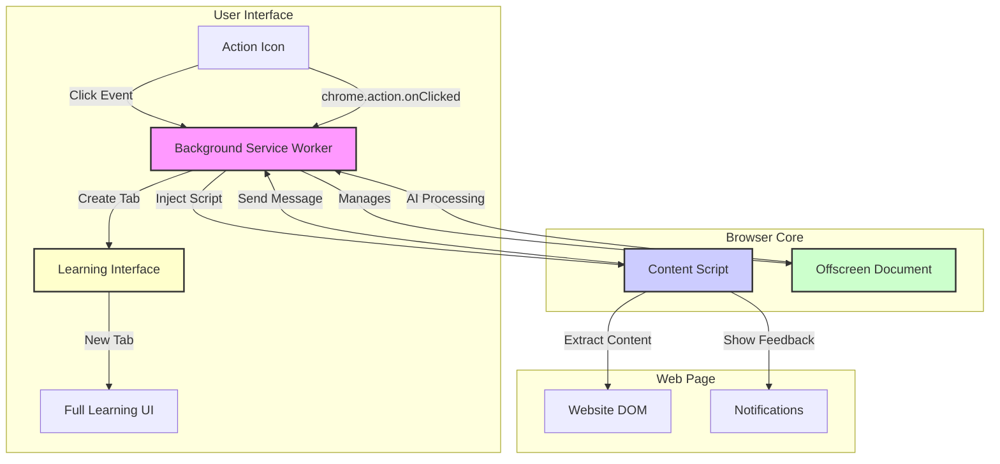
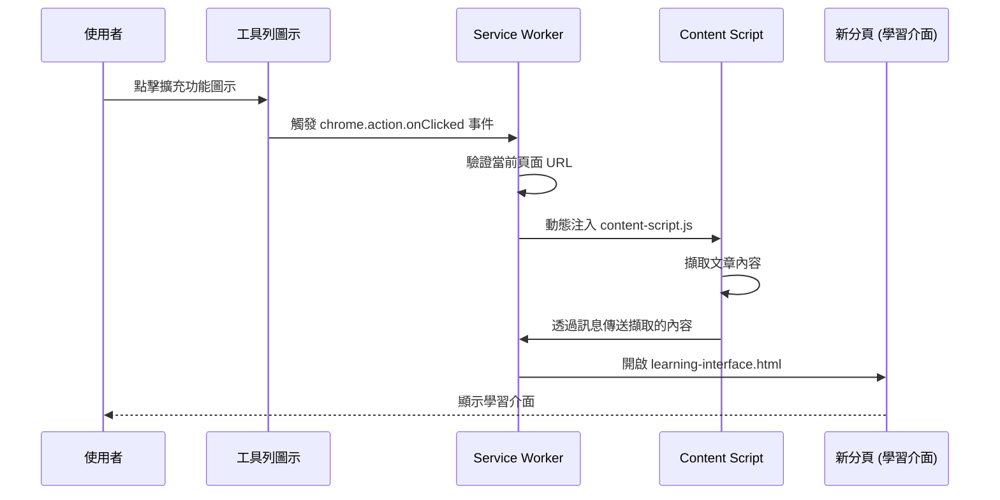
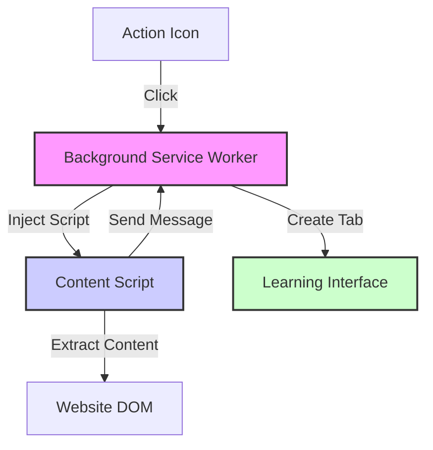

# Chrome 擴充功能核心：`manifest.json` 教學文件

## 1. 前言

`manifest.json` 是 Chrome 擴充功能中最重要的檔案，您可以將它視為整個擴充功能的「設定檔」或「身分證」。它使用 JSON 格式，定義了擴充功能的名稱、版本、權限、腳本、圖示等所有關鍵資訊。Chrome 瀏覽器會依賴此檔案來了解您的擴充功能該如何運作、需要哪些權限，以及如何在瀏覽器中呈現。

本文件將詳細解說目前專案中 `manifest.json` 的各個欄位，並透過範例和圖表幫助您理解。

## 2. `manifest.json` 欄位詳解

以下是我們專案中 `manifest.json` 檔案的內容，我們將逐一解析每個欄位的用途。

```json
{
  "manifest_version": 3,
  "name": "Vocabeey",
  "version": "1.0.0",
  "description": "Interactive language learning extension using Chrome's built-in AI APIs",
  "permissions": ["storage", "activeTab", "scripting", "offscreen", "tabs"],
  "host_permissions": ["<all_urls>"],
  "background": {
    "service_worker": "background/service-worker.js",
    "type": "module"
  },
  "content_scripts": [
    {
      "matches": ["<all_urls>"],
      "js": ["content/content-script.js"],
      "run_at": "document_idle"
    }
  ],
  "action": {},
  "web_accessible_resources": [
    {
      "resources": ["ui/*", "offscreen/*"],
      "matches": ["<all_urls>"]
    }
  ],
  "content_security_policy": {
    "extension_pages": "script-src 'self'; object-src 'self'"
  }
}
```

---

### `manifest_version`

- **值：** `3`
- **解說：** 此欄位定義了 manifest 檔案格式的版本。Manifest V3 (MV3) 是目前最新的版本，相較於 V2 提供了更好的安全性、效能和隱私保護。所有新的擴充功能都應使用 V3。

### `name`

- **值：** `"Vocabeey"`
- **解說：** 擴充功能的名稱，會顯示在 Chrome 應用程式商店、擴充功能管理頁面以及各種提示訊息中。

### `version`

- **值：** `"1.0.0"`
- **解說：** 擴充功能的版本號。當您更新擴充功能並上傳到 Chrome 應用程式商店時，必須增加此版本號。

### `description`

- **值：** `"Interactive language learning extension using Chrome's built-in AI APIs"`
- **解說：** 對擴充功能的簡短描述，幫助使用者了解其功能。

### `permissions`

- **值：** `["storage", "activeTab", "scripting", "offscreen", "tabs"]`
- **解說：** 聲明擴充功能需要存取的 Chrome API 權限。
  - `storage`: 允許擴充功能使用 `chrome.storage` API 來儲存使用者資料。
  - `activeTab`: 允許在使用者與擴充功能互動時，暫時存取當前分頁的資訊。
  - `scripting`: 允許擴充功能在分頁中注入和執行腳本。
  - `offscreen`: 允許擴充功能建立和管理 Offscreen 文件，用於執行 DOM 相關的背景任務。
  - `tabs`: 允許擴充功能存取瀏覽器分頁的資訊，例如 URL、標題等。

### `host_permissions`

- **值：** `["<all_urls>"]`
- **解說：** 聲明擴充功能可以存取哪些網站的權限。`<all_urls>` 表示此擴充功能可以讀取和修改所有網站的頁面內容，這是 `content_scripts` 能夠在所有頁面執行的基礎。

### `background`

- **值：** `{"service_worker": "background/service-worker.js", "type": "module"}`
- **解說：** 定義擴充功能的背景腳本。在 MV3 中，背景腳本以 Service Worker 的形式運行。
  - `service_worker`: 指定 Service Worker 腳本檔案的路徑。
  - `type`: `"module"` 表示此腳本是一個 ES 模組，您可以在其中使用 `import` 和 `export` 語法。

### `content_scripts`

- **值：** `[...]`
- **解說：** 內容腳本（Content Scripts）的配置。**重要注意**：雖然這裡定義了內容腳本，但在我們的專案中，內容腳本是**動態注入**的，而非自動注入。
  - `matches`: 指定內容腳本要注入到哪些頁面。`<all_urls>` 表示所有頁面。
  - `js`: 要注入的 JavaScript 檔案列表。
  - `run_at`: 指定腳本注入的時機。`document_idle` 表示在瀏覽器完成頁面載入後，於較空閒的時機注入。
    **實際運作方式**：我們的 Service Worker 使用 `chrome.scripting.executeScript` 來**按需注入**內容腳本，只有在使用者點擊擴充功能圖示時才會執行，而不是在每個符合 `matches` 條件的頁面上自動執行。這種設計提供了更好的效能和隱私保護。

### `action`

- **值：** `{}`
- **解說：** 定義擴充功能在 Chrome 工具列上的圖示行為。在我們的專案中，刻意設定為空物件 `{}`，這表示：
  - **不使用彈出式視窗**：點擊圖示不會顯示 popup
  - **觸發點擊事件**：取而代之的是觸發 `chrome.action.onClicked` 事件
  - **程式化控制**：Service Worker 可以根據當前頁面狀態決定執行什麼動作

  這種設計讓我們能夠實現**使用者主導的內容處理流程**：使用者點擊圖示 → 擴充功能分析當前頁面 → 擷取文章內容 → 開啟學習介面。

### `web_accessible_resources`

- **值：** `[...]`
- **解說：** 聲明哪些擴充功能內的資源（如 HTML、CSS、圖片）可以被網頁或其他擴充功能存取。
  - `resources`: 可被存取的資源路徑列表。`"ui/*"` 和 `"offscreen/*"` 表示 `ui` 和 `offscreen` 資料夾下的所有檔案都可以被外部存取。
  - `matches`: 允許哪些網站存取這些資源。

### `content_security_policy`

- **值：** `{"extension_pages": "script-src 'self'; object-src 'self'"}`
- **解說：** 內容安全策略 (CSP) 用於限制擴充功能頁面可以載入和執行的資源，以防止跨網站指令碼（XSS）攻擊。
  - `extension_pages`: 指定擴充功能內部頁面（如 popup、options page）的策略。
  - `script-src 'self'`: 只允許執行來自擴充功能本身（同源）的腳本。
  - `object-src 'self'`: 只允許載入來自擴充功能本身的 `<object>`、`<embed>` 或 `<applet>` 元素。

## 3. 擴充功能架構圖

以下是我們語言學習助手的實際架構圖，反映了點擊觸發的設計：



**圖解：**

- **Action Icon**: 使用者在工具列上看到的圖示，點擊後觸發處理流程
- **Background Service Worker**: 擴充功能的核心控制器，處理點擊事件和協調各元件
- **Content Script**: 動態注入到網頁中，負責擷取文章內容
- **Learning Interface**: 在新分頁中開啟的完整學習介面
- **Offscreen Document**: 處理 AI 相關的重度運算任務
- **Website DOM**: 被分析和擷取內容的實際網頁
- **Notifications**: 在原頁面顯示的即時狀態回饋

## 4. 點擊觸發機制詳解

我們的語言學習助手使用了一種特殊的**點擊觸發機制**，這與傳統的彈出式擴充功能不同。以下是完整的觸發流程：

### 4.1 觸發流程圖



### 4.2 程式碼實作重點

**Service Worker 中的點擊監聽器：**

```javascript
// 監聽擴充功能圖示點擊事件
chrome.action.onClicked.addListener(async tab => {
  // 驗證頁面是否可處理
  if (!tab.url || tab.url.startsWith('chrome://')) {
    console.warn('無法處理 chrome:// 頁面');
    return;
  }

  // 動態注入內容腳本
  await chrome.scripting.executeScript({
    target: { tabId: tab.id },
    files: ['dist/content/content-script.js'],
  });
});
```

**Content Script 自動執行：**

```javascript
// 腳本注入後立即執行內容擷取
const extractedContent = extractContent();
if (extractedContent) {
  // 將擷取的內容傳送給 Service Worker
  chrome.runtime.sendMessage({
    type: 'CONTENT_EXTRACTED',
    data: extractedContent,
  });
}
```

### 4.3 設計優勢

1. **隱私保護**：只有在使用者明確點擊時才處理頁面內容
2. **效能最佳化**：不會在每個頁面自動執行腳本
3. **使用者控制**：使用者完全控制何時啟動學習功能
4. **無干擾體驗**：不會自動彈出介面打斷閱讀

## 5. 總結

`manifest.json` 是串連起擴充功能所有元件的藍圖。正確地設定此檔案是開發功能穩定、安全且高效的 Chrome 擴充功能的基礎。每當您需要新增功能、請求新權限或引入新的腳本時，都必須回到此檔案進行對應的修改。

在我們的語言學習助手中，空的 `action` 物件配合程式化的點擊處理，實現了一個以使用者為中心、注重隱私的內容處理流程。

## 6. Q&A

### Q1: 為什麼 `action` 欄位是空的？這代表什麼？

**A1:** 在這個專案中，`action` 欄位為空 `{}` 是一個**刻意的設計選擇**，而非開發初期的暫時配置。空的 `action` 物件表示：

- **沒有彈出式視窗 (popup)**：點擊圖示不會顯示彈出式介面
- **觸發點擊事件**：取而代之的是觸發 `chrome.action.onClicked` 事件
- **程式化控制**：Service Worker 可以透過程式邏輯來決定點擊後的行為

這種設計讓擴充功能能夠根據當前頁面的內容和狀態，動態決定要執行什麼動作，而不是總是顯示相同的彈出式介面。在我們的語言學習助手中，點擊圖示會觸發內容擷取和學習介面的開啟，這比靜態的彈出式視窗更符合使用者的工作流程。

### Q2: `host_permissions` 和 `permissions` 有什麼不同？為什麼需要分開設定？

**A2:** 這是 Manifest V3 的一個重要改變，旨在提高透明度和使用者控制權。

- **`permissions`**: 用於聲明擴充功能需要使用的 Chrome API，例如 `storage` (存取儲存空間) 或 `tabs` (管理分頁)。這些是擴充功能「能做什麼」的授權。
- **`host_permissions`**: 則是用於聲明擴充功能想要在哪一些網站上執行操作，例如讀取或修改頁面內容。這關乎「在哪裡做」的授權。
  將兩者分開，可以讓使用者在安裝時更清楚地看到擴充功能會存取哪些網站的資料，從而做出更明智的授權決定，提升了安全性與隱私保護。

### Q3: 為什麼 `content_scripts` 的 `run_at` 設定為 `document_idle`？

**A3:** `run_at` 決定了內容腳本注入頁面的時機。`document_idle` 是 Chrome 官方推薦的預設值，它代表腳本會在頁面主要資源（HTML, CSS, JS）都載入完成後，且系統較為空閒時才注入。這樣做有幾個好處：

1.  **避免影響頁面載入速度：** 不會因為注入腳本而拖慢使用者瀏覽的網站。
2.  **確保 DOM 完整性：** 腳本執行時，頁面的 DOM 結構已經穩定，可以避免因元素尚未生成而導致的操作失敗。
    除非您有特殊需求，必須在頁面渲染完成前就執行腳本（例如 `document_start`），否則 `document_idle` 是最安全且效能最好的選擇。

### Q4: `web_accessible_resources` 的用途是什麼？為什麼 `ui` 和 `offscreen` 資料夾需要被設定？

**A4:** `web_accessible_resources` 聲明了哪些擴充功能內部檔案可以被網頁直接存取。在我們的專案中：

- **`ui/*`**: 如果我們未來需要在頁面上顯示一些來自擴充功能的 UI 元素（例如，一個自訂的對話框或按鈕），這些 UI 的 HTML, CSS, 或圖片檔案需要被網頁載入，因此必須在此聲明。
- **`offscreen/*`**: `offscreen` 文件是一個在背景運行的 HTML 頁面，它本身也可能需要載入一些資源。更重要的是，為了讓 Service Worker 能夠建立並與 `offscreen` 文件溝通，這個路徑也必須是可存取的。
  簡單來說，這個設定是為了打破擴充功能與網頁之間的隔離牆，讓特定的內部資源能夠在網頁的上下文中被使用。

### Q5: Action icon 會被呈現在畫面的哪裡?

**A5:** Action icon 會顯示在 Chrome 瀏覽器的工具列 (Toolbar) 上，通常位於網址列的右側。使用者可以點擊這個圖示來與擴充功能互動，例如打開一個彈出式視窗 (Popup) 或觸發一個背景動作。

### Q6: 在這個專案中，是否是透過點選action icon來觸發打開UI的?

**A6:** **是的**，但不是透過傳統的彈出式視窗方式。雖然 `action` 欄位是空的 `{}`，但這個專案使用了更複雜的觸發機制：

1. **點擊圖示** → 觸發 `chrome.action.onClicked` 事件
2. **Service Worker 響應** → 驗證當前頁面並注入內容腳本
3. **內容擷取** → 分析頁面並擷取文章內容
4. **開啟新分頁** → 在新分頁中顯示學習介面

這種設計的優點是：

- **使用者控制**：只有在使用者明確點擊時才處理頁面
- **隱私保護**：不會自動掃描所有瀏覽的頁面
- **更好的體驗**：直接開啟全功能的學習介面，而非小小的彈出視窗

### Q7: 根據3. 擴充功能架構圖，看起來是透過點選action button觸發的，這邊是否有所矛盾?

**A7:** 您的觀察很準確！讓我澄清這個架構圖的實際含義：

**架構圖需要更新**：目前的圖表顯示「Action Icon -> Popup UI」，但這不符合我們專案的實際實作。正確的流程應該是：



**實際的觸發流程**：

1. **點擊 Action Icon** → 觸發 Service Worker 的 `chrome.action.onClicked` 事件
2. **Service Worker** → 驗證頁面並動態注入 Content Script
3. **Content Script** → 擷取頁面內容並回傳給 Service Worker
4. **Service Worker** → 開啟新分頁顯示學習介面

所以不是矛盾，而是原本的架構圖過於簡化了。我們的專案使用了**點擊觸發的程式化流程**，而非傳統的彈出式介面。

### Q8: 請分析這個codespace告訴我實際上UI是如何被觸發的

**A8:** 根據目前的程式碼分析，這個專案使用了一個精心設計的**點擊觸發機制**，完全不同於傳統的彈出式擴充功能。以下是詳細的觸發流程：

#### 完整觸發流程：

1. **使用者點擊 Action Icon**
   - 使用者在瀏覽器工具列上點擊擴充功能圖示
   - 由於 `action: {}` 是空的，不會顯示彈出視窗

2. **Service Worker 響應點擊事件**

   ```javascript
   chrome.action.onClicked.addListener(async tab => {
     // 驗證頁面 URL（排除 chrome:// 等內部頁面）
     if (!tab.url || tab.url.startsWith('chrome://')) {
       console.warn('無法處理此類型頁面');
       return;
     }
     // 處理當前分頁
     await processCurrentTab(tab.id);
   });
   ```

3. **動態注入內容腳本**

   ```javascript
   await chrome.scripting.executeScript({
     target: { tabId },
     files: ['dist/content/content-script.js'],
   });
   ```

4. **內容腳本自動執行**
   - 腳本注入後立即執行 `extractContent()` 函數
   - 使用多重策略擷取文章內容（`<article>`、`<main>`、常見選擇器等）
   - 驗證內容品質（最少100字元、20個單字等）

5. **內容傳送與儲存**

   ```javascript
   chrome.runtime.sendMessage({
     type: 'CONTENT_EXTRACTED',
     data: extractedContent,
   });
   ```

6. **開啟學習介面**
   - Service Worker 收到內容後，將其儲存到 `chrome.storage.session`
   - 使用 `chrome.tabs.create` 開啟新分頁
   - 新分頁載入 `learning-interface.html`

7. **學習介面顯示**
   - 學習介面從 session storage 讀取文章內容
   - 呈現互動式學習功能（詞彙標記、句子翻譯等）

#### 使用者體驗特色：

- **即時回饋**：在原頁面顯示成功/失敗通知
- **全功能介面**：在新分頁中開啟完整的學習環境
- **隱私保護**：只有在使用者明確點擊時才處理內容
- **無干擾**：不會自動處理頁面或彈出介面

#### 與傳統彈出式擴充功能的差異：

| 傳統彈出式        | 我們的設計                   |
| ----------------- | ---------------------------- |
| 點擊 → 顯示小視窗 | 點擊 → 分析頁面 → 開啟新分頁 |
| 功能受限於小空間  | 完整的學習介面               |
| 靜態介面          | 動態內容處理                 |
| 總是顯示相同內容  | 根據頁面內容客製化           |

這種設計讓擴充功能能夠提供更豐富的學習體驗，同時保持使用者的完全控制權。
