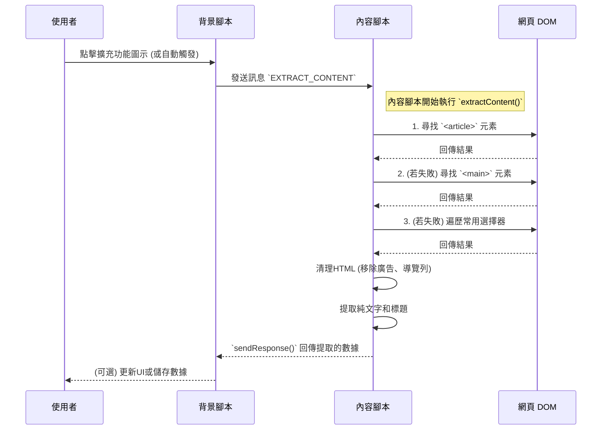

# 實戰學習：深入解析 `content-script.ts`

歡迎來到我們的實戰學習系列！在本章中，我們將深入探討 `content-script.ts` 的內部運作機制。內容腳本（Content Script）是 Chrome 擴充功能中與網頁直接互動的橋樑，它讓我們能夠讀取和操作頁面的 DOM。

`content-script.ts` 的主要任務是：從當前頁面智能地提取文章標題和內文，清理掉不需要的元素（如廣告、導覽列），然後將乾淨的數據發送給背景腳本（`background-script`）進行後續處理。

## 核心職責

1.  **注入頁面**：當使用者瀏覽符合條件的網頁時，此腳本會被自動注入到頁面環境中。
2.  **內容提取**：使用多種策略（`Strategy`）來尋找並提取最可能是主要文章的區塊。
3.  **數據清理**：移除 `script`, `nav`, `ads` 等無關元素，並整理文字格式。
4.  **訊息通訊**：與背景腳本（`background-script`）雙向通訊，發送提取的內容或接收指令。
5.  **UI回饋**：在頁面上顯示成功或失敗的通知，提供即時的用戶體驗。

## 工作流程視覺化

為了更好地理解其工作流程，讓我們先來看一個 Mermaid 圖，它展示了從使用者觸發到內容提取完成的完整順序。



## 程式碼亮點解析

### 1. 內容提取策略 (`extractContent`)

這是此腳本最核心的功能。為了應對不同網站的 HTML 結構，它採用了循序漸進的策略來定位主要內容。

**範例程式碼：**

```typescript
function extractContent(): ExtractedContent | null {
  // Strategy 1: Look for article element
  let mainContent: Element | null = document.querySelector('article');

  // Strategy 2: Look for main element
  if (!mainContent) {
    mainContent = document.querySelector('main');
  }

  // Strategy 3: Look for common content containers
  if (!mainContent) {
    const contentSelectors = [
      '[role="main"]',
      '.article-content',
      '.post-content',
      // ... more selectors
    ];

    for (const selector of contentSelectors) {
      const element = document.querySelector(selector);
      // 確保元素存在且文字長度足夠，避免選到無關的空容器
      if (element && element.textContent && element.textContent.length > 500) {
        mainContent = element;
        break;
      }
    }
  }
  // ... 後續處理
}
```

這種多策略的方法大大提高了內容提取的成功率和準確性。

### 2. 數據清理 (`extractTextContent`)

提取到主要區塊後，我們需要清理掉其中的「雜訊」。此函式會克隆（`clone`）DOM 元素，然後移除所有不需要的部分。

**範例程式碼：**

```typescript
function extractTextContent(element: Element): string {
  // 克隆元素以避免修改原始頁面
  const clone = element.cloneNode(true) as Element;

  // 定義要移除的元素選擇器
  const unwantedSelectors = [
    'script',
    'style',
    'nav',
    'header',
    'footer',
    'aside',
    '.advertisement',
    '.ad',
    '.social-share',
    '.comments',
  ];

  unwantedSelectors.forEach(selector => {
    clone.querySelectorAll(selector).forEach(el => el.remove());
  });

  // 提取純文字並清理多餘的空白
  let text = clone.textContent || '';
  text = text.replace(/\s+/g, ' ').trim();

  return text;
}
```

### 3. 訊息監聽與回覆 (`chrome.runtime.onMessage`)

內容腳本透過監聽器來接收來自擴充功能其他部分（主要是背景腳本）的指令。

```mermaid
graph TD
    A[監聽 `chrome.runtime.onMessage`] --> B{收到訊息};
    B -- 訊息類型為 `EXTRACT_CONTENT` --> C[執行 `extractContent()`];
    C --> D{內容是否成功提取？};
    D -- 是 --> E[透過 `sendResponse` 回傳成功狀態和數據];
    D -- 否 --> F[透過 `sendResponse` 回傳失敗狀態和錯誤訊息];
    B -- 其他訊息類型 --> G[忽略];
```

**範例程式碼：**

```typescript
chrome.runtime.onMessage.addListener((message, _sender, sendResponse) => {
  if (message.type === 'EXTRACT_CONTENT') {
    const content = extractContent();
    if (content) {
      // 成功，回傳數據
      sendResponse({ success: true, data: content });
    } else {
      // 失敗，回傳錯誤
      sendResponse({ success: false, error: 'Failed to extract content' });
    }
    // `return true` 表示我們將會非同步地呼叫 sendResponse
    return true;
  }
  return false;
});
```

### 4. UI 回饋 (`showSuccessNotification`)

為了提升使用者體驗，當提取完成或失敗時，腳本會動態生成一個 `<div>` 元素作為通知，並在幾秒後自動移除。

**範例程式碼：**

```typescript
function createNotification(
  message: string,
  type: 'success' | 'error'
): HTMLDivElement {
  const notification = document.createElement('div');
  notification.textContent = message;
  // 使用 CSS Text 來快速設定樣式
  notification.style.cssText = `
    position: fixed;
    top: 20px;
    right: 20px;
    padding: 12px 20px;
    background-color: ${type === 'success' ? '#4CAF50' : '#f44336'};
    color: white;
    border-radius: 4px;
    box-shadow: 0 2px 8px rgba(0,0,0,0.2);
    z-index: 999999;
    font-family: sans-serif;
    font-size: 14px;
  `;
  return notification;
}
```

這種直接在頁面注入 DOM 的方式是內容腳本最直接也最強大的能力之一。

## 總結

`content-script.ts` 是我們擴充功能中負責與網頁「溝通」的關鍵部分。透過本篇教學，你應當對其如何智能地提取內容、清理數據以及與背景腳本協同工作有了更深入的了解。

試著修改看看 `contentSelectors` 或 `unwantedSelectors` 來優化對特定網站的支援吧！
