# Content Flow Analysis: Webpage to AI

This document visualizes how content flows from a webpage through the Chrome extension to AI processing.

## Content Flow Architecture

```mermaid
sequenceDiagram
    participant Webpage as 📄 Webpage
    participant ContentScript as 📝 Content Script
    participant ServiceWorker as ⚙️ Service Worker
    participant ArticleProcessor as 🔄 Article Processor
    participant OffscreenDoc as 🖥️ Offscreen Document
    participant ChromeAI as 🤖 Chrome AI APIs
    participant GeminiAPI as 🌟 Gemini API (Fallback)
    participant LearningUI as 🎓 Learning Interface

    Note over Webpage,LearningUI: User clicks extension icon

    ServiceWorker->>ContentScript: Inject content-script.js

    Note over ContentScript: Extract content using DOM strategies
    ContentScript->>ContentScript: 1. Try <article> element
    ContentScript->>ContentScript: 2. Try <main> element
    ContentScript->>ContentScript: 3. Try common selectors
    ContentScript->>ContentScript: Clean & validate content

    ContentScript->>ServiceWorker: CONTENT_EXTRACTED message
    Note right of ContentScript: ExtractedContent {<br/>title, content, url,<br/>wordCount, paragraphCount}

    ServiceWorker->>ArticleProcessor: processArticle(extracted)

    Note over ArticleProcessor: Content Processing Pipeline
    ArticleProcessor->>ServiceWorker: Request language detection
    ServiceWorker->>OffscreenDoc: OFFSCREEN_TASK (language_detection)

    OffscreenDoc->>ChromeAI: detectLanguage(text)
    alt Chrome AI Available
        ChromeAI-->>OffscreenDoc: Language code (e.g., "es")
    else Chrome AI Unavailable
        OffscreenDoc->>GeminiAPI: detectLanguage(text)
        GeminiAPI-->>OffscreenDoc: Language code
    end

    OffscreenDoc->>ServiceWorker: OFFSCREEN_TASK_RESULT
    ServiceWorker-->>ArticleProcessor: Language detected

    ArticleProcessor->>ArticleProcessor: Split content into parts<br/>(max 500 words/part)
    ArticleProcessor->>ArticleProcessor: Generate article ID
    ArticleProcessor->>ArticleProcessor: Create ArticlePart objects

    ArticleProcessor-->>ServiceWorker: ProcessedArticle
    Note right of ArticleProcessor: ProcessedArticle {<br/>id, url, title,<br/>originalLanguage,<br/>parts[], processingStatus}

    ServiceWorker->>ServiceWorker: Store in session storage
    ServiceWorker->>LearningUI: Open learning-interface.html

    Note over LearningUI: User interacts with content

    LearningUI->>ServiceWorker: Request translation
    ServiceWorker->>OffscreenDoc: OFFSCREEN_TASK (translation)

    OffscreenDoc->>ChromeAI: translateText(text, source, target)
    alt Chrome AI Available
        ChromeAI-->>OffscreenDoc: Translated text
    else Chrome AI Unavailable
        OffscreenDoc->>GeminiAPI: translateText(text, source, target)
        GeminiAPI-->>OffscreenDoc: Translated text
    end

    OffscreenDoc->>ServiceWorker: OFFSCREEN_TASK_RESULT
    ServiceWorker-->>LearningUI: Translation result

    LearningUI->>ServiceWorker: Request vocabulary analysis
    ServiceWorker->>OffscreenDoc: OFFSCREEN_TASK (vocabulary_analysis)

    OffscreenDoc->>ChromeAI: analyzeVocabulary(words, context)
    alt Chrome AI Available
        ChromeAI-->>OffscreenDoc: Vocabulary analysis
    else Chrome AI Unavailable
        OffscreenDoc->>GeminiAPI: analyzeVocabulary(words, context)
        GeminiAPI-->>OffscreenDoc: Vocabulary analysis
    end

    OffscreenDoc->>ServiceWorker: OFFSCREEN_TASK_RESULT
    ServiceWorker-->>LearningUI: Vocabulary data
```



## Content Extraction Pipeline


## AI Processing Architecture


## Data Structures

### ExtractedContent

```typescript
{
  title: string;           // Article title
  content: string;         // Raw text content
  url: string;            // Source URL
  language?: string;      // Optional detected language
  wordCount: number;      // Total words
  paragraphCount: number; // Total paragraphs
}
```

### ProcessedArticle

```typescript
{
  id: string;                    // Unique article ID
  url: string;                   // Source URL
  title: string;                 // Article title
  originalLanguage: string;      // Detected language
  processedAt: Date;             // Processing timestamp
  parts: ArticlePart[];          // Content split into parts
  processingStatus: string;      // "completed"
  cacheExpires: Date;            // Cache expiration (24h)
}
```

### ArticlePart

```typescript
{
  id: string; // Part ID (article_id_part_N)
  content: string; // Part content (max 500 words)
  originalContent: string; // Original content
  vocabulary: []; // Vocabulary items
  sentences: []; // Sentence items
  partIndex: number; // Part index
}
```

## Key Components

### 1. Content Script (`content-script.ts`)

- **Role**: Extract content from webpage DOM
- **Strategies**:
  1. Article element
  2. Main element
  3. Common content selectors
- **Output**: `ExtractedContent` object

### 2. Service Worker (`service-worker.ts`)

- **Role**: Coordinate between components
- **Functions**:
  - Inject content scripts
  - Route messages
  - Manage offscreen documents
  - Handle translation requests directly
  - Store processed articles

### 3. Article Processor (`article-processor.ts`)

- **Role**: Transform extracted content into structured format
- **Functions**:
  - Language detection
  - Content splitting (500 words/part)
  - Generate unique IDs
  - Create article parts

### 4. Offscreen Document (`ai-processor.ts`)

- **Role**: Execute AI processing tasks
- **Tasks**:
  - Language detection
  - Summarization
  - Translation
  - Vocabulary analysis
  - Content rewriting
- **Fallback**: Chrome AI → Gemini API

### 5. Chrome AI Wrapper (`chrome-ai.ts`)

- **Role**: Interface with Chrome's built-in AI APIs
- **APIs Used**:
  - Language Detector API
  - Summarizer API
  - Rewriter API
  - Translator API
  - Prompt API (Gemini Nano)

## Message Flow


## Storage Flow


## Performance Optimizations

1. **Content Splitting**: Max 500 words per part for better UX
2. **Caching**: 24-hour cache for processed articles
3. **Session Storage**: Temporary storage for pending articles
4. **Memory Management**: Tab tracking and cleanup
5. **Fallback Chain**: Chrome AI → Gemini API for reliability

---

## Q&A

### Q: Where does the AI code being placed?

**A: AI code is strategically placed across three locations:**

1. **Offscreen Document** (`src/offscreen/ai-processor.ts`)
   - **Primary AI execution environment**
   - Runs AI processing tasks in isolated context
   - Handles: language detection, summarization, translation, vocabulary analysis, content rewriting
   - Uses `OffscreenAIProcessor` class to coordinate AI operations

2. **Chrome AI Wrapper** (`src/utils/chrome-ai.ts`)
   - **Chrome AI APIs integration layer**
   - Provides interfaces to Chrome's built-in AI:
     - `ChromeLanguageDetector`
     - `ChromeSummarizer`
     - `ChromeRewriter`
     - `ChromeTranslator`
     - `ChromePromptAPI` (Gemini Nano)
   - Includes caching and error handling

3. **Service Worker** (`src/background/service-worker.ts`)
   - **Direct translation handling**
   - `handleTranslateText()` function uses Chrome AI directly
   - Bypasses offscreen document for faster translation
   - Falls back to Gemini API if Chrome AI unavailable

4. **Gemini API Client** (`src/utils/gemini-api.ts`)
   - **Fallback AI provider**
   - Used when Chrome AI APIs are unavailable
   - Provides same capabilities via external API

**Why this architecture?**

- **Offscreen Document**: Chrome AI APIs require DOM context, can't run in service worker
- **Service Worker**: Handles coordination and some direct AI calls
- **Separation**: Clean separation between Chrome AI and Gemini API implementations
- **Fallback**: Ensures functionality even without Chrome AI support

### Q: How does content pass from webpage to offscreen document?

**A: Content flows through the Service Worker as central coordinator:**

```
Webpage → Content Script → Service Worker → Offscreen Document
```

**Step-by-step:**

1. **Content Script** extracts content from webpage DOM
   - Sends `CONTENT_EXTRACTED` message to Service Worker

2. **Service Worker** receives the extracted content
   - Calls `processArticle()` from Article Processor

3. **Article Processor** needs AI processing (e.g., language detection)
   - Service Worker sends `OFFSCREEN_TASK` message to Offscreen Document

4. **Offscreen Document** receives the task
   - Processes with Chrome AI APIs
   - Sends `OFFSCREEN_TASK_RESULT` back to Service Worker

**Key point**: Content never goes directly from webpage to offscreen document. The Service Worker always acts as the message router between all components.
